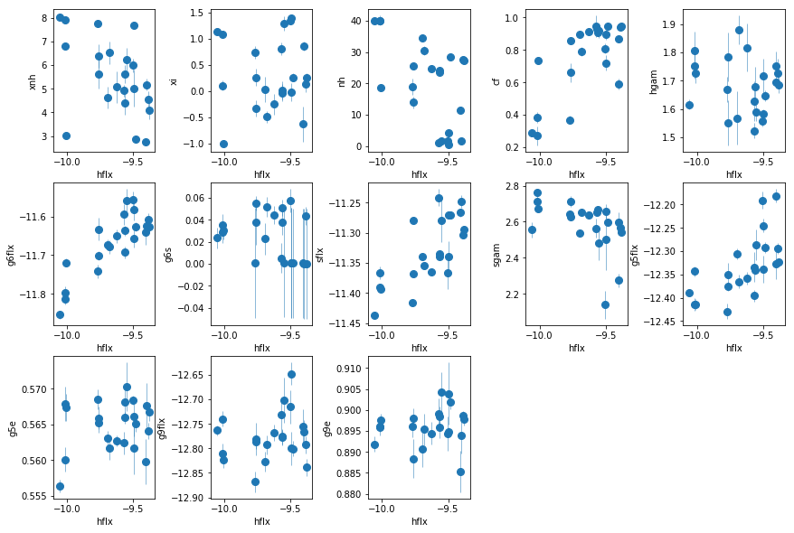

### Content
- Unfolded spectra
- Exploring the hard band:
    - Fe K edge energy: `fit_2` (6-10 keV).
    - Fe K edge: Neutral vs ionized: `fit_2a`, `fit_2b`.
    - Extend fit of neutral absorption down to 4 keV, `fit_2c`.
    - Add high xi absorber, `fit_2d`
    - Curvature in residuals, model with:
        - Low xi WA, `fit_2e`
        - Broad gausian, `fit_2f`
    - Extend analysis to 2.5 keV, `fit_2g`
    - Add a powerlaw (PC/Scattering), `fit_2h`
        - Test a WA instead of the extra powerlaw, `fit_2h1`
    - Use xillver instead of lines for K$\alpha$ & K$\beta$, `fit_2i`, from `fit_2h`
        - Test again a WA instead of the extra powerlaw, `fit_2i1` 
    
- Broadband Characterization of the Spectra
- Soft variability: Evidence for Warm absorber
- Hard Spectrum: The need for Partial Covering


```python
import sys,os
base_dir = '/u/home/abzoghbi/data/ngc4151/spec_analysis'
sys.path.append(base_dir)
from spec_helpers import *
%load_ext autoreload
%autoreload 2
```


```python
### Read useful data from data notebook
data_dir = 'data/xmm'
spec_dir = 'data/xmm_spec'
os.chdir('%s/%s'%(base_dir, data_dir))
data = np.load('log/data.npz')
spec_obsids = data['spec_obsids']
obsids = data['obsids']
spec_data = data['spec_data']
spec_ids = [i+1 for i,o in enumerate(obsids) if o in spec_obsids]
```

---

### Plot The spectra
- plot the unfolded spectra from all the 22 datasets.


```python
os.chdir('%s/%s'%(base_dir, spec_dir))
os.system('mkdir -p results/explore')
nspec = len(spec_obsids)
tcl = 'source %s/fit.tcl\nsetpl ener\n'%base_dir
for ispec in spec_ids:
    tcl += ('da spec_%d.grp\n'
            'ign 0.0-.3,10.-**\n'
            'az_plot_unfold u tmp_%d pn_%d\n')%((ispec,)*3)
with open('tmp.xcm', 'w') as fp: fp.write(tcl)
cmd = 'xspec - tmp.xcm > tmp.log 2>&1'
subp.call(['/bin/bash', '-i', '-c', cmd])
os.system('cat tmp_*plot > results/explore/spec_unfold.plot')
os.system('rm tmp_*plot tmp.???')
```


    0


---

### `fit_2`: Iron Edge at 7 keV: Model with zedge


```python
os.chdir('%s/%s'%(base_dir, spec_dir))
fit_2 = fit_xspec_model('fit_2', spec_ids, base_dir)
```


```python
# plot edge energy and tau #
fig = plt.figure(figsize=(8,4))
ax = plt.subplot(221)
plt.errorbar(spec_ids, fit_2[:,0,0], fit_2[:,0,1], fmt='o', ms=8, alpha=0.8)
ax.set_ylabel(r'$E_{edge}$')
plt.plot([0,25], [7.1]*2)
ax.set_ylim([6.9,7.5])
ax = plt.subplot(223)
plt.errorbar(spec_ids, fit_2[:,1,0], fit_2[:,1,1], fmt='o', ms=8, alpha=0.8)
ax.set_ylabel(r'$\tau$')

ax = plt.subplot(222)
ax.set_ylim([6.9,7.5])
plt.errorbar(fit_2[:,2,0], fit_2[:,0,0], fit_2[:,0,1], xerr=fit_2[:,2,1], fmt='o', ms=8, alpha=0.8)

ax = plt.subplot(224)
plt.errorbar(fit_2[:,2,0], fit_2[:,1,0], fit_2[:,1,1], xerr=fit_2[:,2,1], fmt='o', ms=8, alpha=0.8)

plt.tight_layout(pad=0)
```


```python
bins = np.linspace(6.9, 7.5, 10)
hist_2 = plt.hist(fit_2[:,0,0], bins)
```


> **The edge energy is consistent with neutral except for a few cases where the enrgy is ~7.3, suggesting some ionized absorption**


```python
# write the energy values and histogram #
text = 'descriptor iobs edge_e,+,- pflx,+,-\n'
text += '\n'.join(['{} {} {} {} {} {} {}'.format(*z) for z in zip(spec_ids, 
        fit_2[:,0,0], fit_2[:,0,2], -fit_2[:,0,3], fit_2[:,2,0], fit_2[:,2,2], -fit_2[:,2,3])])
#print(text)
text += '\ndescriptor h_x,+- h_y\n'
text += '\n'.join(['{} {} {}'.format(*z) for z in zip(
    (hist_2[1][1:]+hist_2[1][:-1])/2, (hist_2[1][1:]-hist_2[1][:-1])/2, hist_2[0])])
with open('results/explore/edge_en_hist.plot', 'w') as fp: fp.write(text)
```

<br />

---
---

### `fit_2a/fit_2b`: Iron Edge at 7 keV: Neutral vs ionized
Compare `ztbabs` to `zxipcf`


```python
os.chdir('%s/%s'%(base_dir, spec_dir))
fit_xspec_model('fit_2ab', spec_ids, base_dir, read_fit=0)
```


```python
# check the fit results; we need only the stats #
fit_2_n = np.array([open('fits/fit_2a__%d.log'%ispec).readlines()[1].split()[1:] 
                   for ispec in spec_ids], np.double)
fit_2_x = np.array([open('fits/fit_2b__%d.log'%ispec).readlines()[1].split()[1:] 
                   for ispec in spec_ids], np.double)

f_indiv = ftest(fit_2_x[:,0], fit_2_x[:,1], fit_2_n[:,0], fit_2_n[:,1])
f_tot = ftest(fit_2_x[:,0].sum(), fit_2_x[:,1].sum(), fit_2_n[:,0].sum(), fit_2_n[:,1].sum())

fmt  = '{:8} {:8.5} {:6} {:8.5} {:6} {:8.5} {:8.5}'
text = fmt.format('id', 'c2_1', 'nd_1', 'c2_2', 'nd_2', 'fstat', 'fpval') + '\n'
text += '\n'.join([fmt.format(spec_ids[i],
    fit_2_n[i,0], fit_2_n[i,1], fit_2_x[i,0], fit_2_x[i,1], f_indiv[0][i], f_indiv[2][i])
                 for i in range(nspec)])
text += '\n' + fmt.format('tot', fit_2_n[:,0].sum(), fit_2_n[:,1].sum(), fit_2_x[:,0].sum(), 
                   fit_2_x[:,1].sum(), f_tot[0], f_tot[2])
print(text)
```

    id       c2_1     nd_1   c2_2     nd_2   fstat    fpval   
           1   39.776   32.0   38.983   31.0  0.63109  0.43299
           2   42.275   32.0   46.771   31.0  -2.9804      1.0
           3   35.349   29.0   36.661   28.0  -1.0017      1.0
           4    46.81   34.0   36.691   33.0   9.1007 0.0048918
           5   45.121   34.0   39.061   33.0   5.1198 0.030361
           6   72.595   34.0   57.052   33.0   8.9906 0.0051278
           7   43.768   30.0    59.04   29.0  -7.5012      1.0
           8   73.714   31.0   66.445   30.0    3.282 0.080068
          10   21.512   27.0   21.274   26.0  0.29136  0.59394
          11   28.828   28.0   26.062   27.0   2.8657    0.102
          12   49.198   28.0   31.032   27.0   15.805 0.00047212
          13   37.175   27.0   29.015   26.0   7.3119 0.011917
          15   51.398   28.0   47.517   27.0   2.2051  0.14913
          16   42.163   28.0   48.015   27.0  -3.2907      1.0
          17   31.878   28.0   53.876   27.0  -11.024      1.0
          18   34.723   28.0    42.31   27.0  -4.8414      1.0
          19   36.986   28.0   63.343   27.0  -11.235      1.0
          20   36.511   29.0   57.889   28.0   -10.34      1.0
          21   44.092   30.0   80.577   29.0  -13.131      1.0
          22   63.807   30.0    109.4   29.0  -12.086      1.0
          23   138.86   30.0    179.4   29.0  -6.5529      1.0
          24   100.84   30.0   159.65   29.0  -10.682      1.0
    tot        1117.4  655.0   1330.1  633.0  -4.6008      1.0


```python
## plot the residuals for the neutral vs ionized absorber ##
extra_cmd ='del 2; del 3; del 4; freez [az_free]; thaw 4 8; new 12=0.12*8;fit'
write_resid(base_dir, spec_ids, '2a', extra_cmd, -1, avg_bin=False, outdir='results/explore')
extra_cmd ='del 2; del 3; del 4; freez [az_free]; thaw 6 10; new 14=0.12*10;fit'
write_resid(base_dir, spec_ids, '2b', extra_cmd, -1, avg_bin=False, outdir='results/explore')
```

> **Neutral absorber gives superior fit in about half the cases. In the other half, the improvement is only marginal (pvalue > 0.0027), except for obs-12 where p=0.00047**

---
The spectra in `fit_2a,2b` rise at the lower boundary (6 keV), so we extend it to 4 keV

### `fit_2c`: Extend Nuetral absorber (`fit_2a`) to 4 keV


```python
os.chdir('%s/%s'%(base_dir, spec_dir))
fit_2c = fit_xspec_model('fit_2c', spec_ids, base_dir)
```


```python
# plot the result #
par_names = ['nh', 'pflx', 'gam', 'gflx', 'gsig']
fit = fit_2c
fig = plt.figure(figsize=(12,3))
idx = [0,2,3,4]; iref = 1
for i,ix in enumerate(idx):
    ax = plt.subplot(1,len(idx),i+1)
    plt.errorbar(fit[:,iref,0], fit[:,ix,0], fit[:,ix,1], xerr=fit[:,iref,1], 
                 fmt='o', ms=8, lw=0.5)
    ax.set_xlabel(par_names[iref]); ax.set_ylabel(par_names[ix])
plt.tight_layout(pad=0)
```


```python
# write the residuals #
extra_cmd ='del 2; del 3; del 4; freez [az_free]; thaw 4 8; new 12=0.12*8;fit'
write_resid(base_dir, spec_ids, '2c', extra_cmd, -1, avg_bin=True, outdir='results/explore')
```

> **The fit is does a good job for the low flux observations. For high fluxes, there an absorption line that is stronger for higher flux at ~6.7 keV, that is clear in the total residuals too**

### `fit_2d`: Add a high $\xi$ absorberon top of the neutral
We use `zxipcf` (standard XSTAR table)


```python
os.chdir('%s/%s'%(base_dir, spec_dir))
fit_2d = fit_xspec_model('fit_2d', spec_ids, base_dir)
```


```python
# plot the result #
par_names = ['xnh', 'xi', 'nh', 'pflx', 'gam', 'gflx', 'gsig']
fit = fit_2d
fig = plt.figure(figsize=(12,3))
idx = [0,1,2,4,5,6]; iref = 3
for i,ix in enumerate(idx):
    ax = plt.subplot(1,len(idx),i+1)
    plt.errorbar(fit[:,iref,0], fit[:,ix,0], fit[:,ix,1], xerr=fit[:,iref,1], 
                 fmt='o', ms=8, lw=0.5)
    ax.set_xlabel(par_names[iref]); ax.set_ylabel(par_names[ix])
plt.tight_layout(pad=0)
```


```python
# write the residuals #
extra_cmd ='del 3; del 4; del 5; freez [az_free]; thaw 8 12; new 16=0.12*12;fit'
write_resid(base_dir, spec_ids, '2d', extra_cmd, -1, avg_bin=True, outdir='results/explore')
```

> **It appears like the high ionization absorber is present at high fluxes only. Investigate in detail later**
> **This model describes the data resonably well (p<0.002) except for two cases, 2, 8, 23, and 24. The average residuals show a broad curvature. We test two models: a low-xi WA or a broad gaussian emission line**

### `fit_2e`: Test adding a low $\xi$ to `fit_2d`


```python
os.chdir('%s/%s'%(base_dir, spec_dir))
fit_2e = fit_xspec_model('fit_2e', spec_ids, base_dir)
```


```python
# plot the result #
par_names = ['xnh_l', 'xi_l', 'xnh_h', 'xi_h', 'nh', 'pflx', 'gam', 'gflx', 'gsig']
fit = fit_2e
fig = plt.figure(figsize=(12,5))
idx = [0,1,2,3,4,6,7,8]; iref = 5
for i,ix in enumerate(idx):
    ax = plt.subplot(2,len(idx)//2,i+1)
    plt.errorbar(fit[:,iref,0], fit[:,ix,0], fit[:,ix,1], xerr=fit[:,iref,1], 
                 fmt='o', ms=8, lw=0.5)
    ax.set_xlabel(par_names[iref]); ax.set_ylabel(par_names[ix])
plt.tight_layout(pad=0)
```


```python
# write the residuals #
extra_cmd ='del 4; del 5; del 6; freez [az_free]; thaw 12 16; new 20=0.12*16;fit'
write_resid(base_dir, spec_ids, '2e', extra_cmd, -1, avg_bin=True, outdir='results/explore')
```

### `fit_2f`: Test adding a broad gaussian to `fit_2d`


```python
os.chdir('%s/%s'%(base_dir, spec_dir))
for i in spec_ids: 
    os.system("sed -i 's/\*cflux\*powerlaw/\(cflux\*powerlaw\)/g' fits/fit_2d__%d.xcm"%i)
fit_2f = fit_xspec_model('fit_2f', spec_ids, base_dir)
```


```python
# plot the result #
par_names = ['xnh_h', 'xi_h', 'nh', 'bge', 'bgs', 'bgn', 'pflx', 'gam', 'gflx', 'gsig']
fit = fit_2f
fig = plt.figure(figsize=(10,6))
idx = [0,1,2,3,4,5,7,8,9]; iref = 6
for i,ix in enumerate(idx):
    ax = plt.subplot(3,len(idx)//3,i+1)
    plt.errorbar(fit[:,iref,0], fit[:,ix,0], fit[:,ix,1], xerr=fit[:,iref,1], 
                 fmt='o', ms=8, lw=0.5)
    ax.set_xlabel(par_names[iref]); ax.set_ylabel(par_names[ix])
plt.tight_layout(pad=0)
```


```python
# write the residuals #
extra_cmd ='del 4; del 5; del 6; freez [az_free]; thaw 12 16; new 20=0.12*16;fit'
write_resid(base_dir, spec_ids, '2f', extra_cmd, -1, avg_bin=True, outdir='results/explore')
```

> **Both options, a low-xi WA (fit_2e) and a broad gaussian (fit_2f) seem to do a good job (the broad line model seems to do slightly better, but it give flat gamma <1.3 for the new datasets). But before deciding, we need to extend the fitting band to lower energies.**

---
---

### `fit_2g`: Extend `fit_2d` (neutral+high-$\xi$) to 2.5 keV


```python
os.chdir('%s/%s'%(base_dir, spec_dir))
fit_2g = fit_xspec_model('fit_2g', spec_ids, base_dir)
```


```python
# plot the result #
par_names = ['xnh', 'xi', 'nh', 'pflx', 'gam', 'gflx', 'gsig']
fit = fit_2g
fig = plt.figure(figsize=(12,3))
idx = [0,1,2,4,5,6]; iref = 3
for i,ix in enumerate(idx):
    ax = plt.subplot(1,len(idx),i+1)
    plt.errorbar(fit[:,iref,0], fit[:,ix,0], fit[:,ix,1], xerr=fit[:,iref,1], 
                 fmt='o', ms=8, lw=0.5)
    ax.set_xlabel(par_names[iref]); ax.set_ylabel(par_names[ix])
plt.tight_layout(pad=0)
```


```python
# write the residuals #
extra_cmd ='del 3; del 4; del 5; freez [az_free]; thaw 8 12; new 16=0.12*12;fit'
write_resid(base_dir, spec_ids, '2g', extra_cmd, -1, avg_bin=True, outdir='results/explore')
```

> **This model is more of a descriptive one. Gamma<1 for many spectra (mostly the new ones).**

---
### `fit_2h`: Add an extra PL (PC or scattering)


```python
os.chdir('%s/%s'%(base_dir, spec_dir))
fit_2h = fit_xspec_model('fit_2h', spec_ids, base_dir)
```


```python
# plot the result #
par_names = ['xnh', 'xi', 'nh', 'pflx', 'gam', 'p2flx', 'gflx', 'gsig']
fit = fit_2h
fig = plt.figure(figsize=(12,6))
idx = [0,1,2,4,5,6,7]; iref = 3
for i,ix in enumerate(idx):
    ax = plt.subplot(2,len(idx)//2+1,i+1)
    plt.errorbar(fit[:,iref,0], fit[:,ix,0], fit[:,ix,1], xerr=fit[:,iref,1], 
                 fmt='o', ms=8, lw=0.5)
    ax.set_xlabel(par_names[iref]); ax.set_ylabel(par_names[ix])
plt.tight_layout(pad=0)
```


```python
# write the residuals #
extra_cmd ='del 4; del 5; del 6; del 7; freez [az_free]; thaw 9 11 15; new 19=0.12*15;fit'
write_resid(base_dir, spec_ids, '2h', extra_cmd, -1, avg_bin=True, outdir='results/explore')
```

### `fit_2h1`: Use WA instead of the extra PL
Show it doesn't work


```python
os.chdir('%s/%s'%(base_dir, spec_dir))
fit_2h1 = fit_xspec_model('fit_2h1', spec_ids, base_dir)
```


```python
# plot the result #
par_names = ['xnh_l', 'xi_l', 'xnh_h', 'xi_h', 'nh', 'pflx', 'gam', 'gflx', 'gsig']
fit = fit_2h1
fig = plt.figure(figsize=(12,6))
idx = [0,1,2,3,4,6,7,8]; iref = 5
for i,ix in enumerate(idx):
    ax = plt.subplot(2,len(idx)//2+1,i+1)
    plt.errorbar(fit[:,iref,0], fit[:,ix,0], fit[:,ix,1], xerr=fit[:,iref,1], 
                 fmt='o', ms=8, lw=0.5)
    ax.set_xlabel(par_names[iref]); ax.set_ylabel(par_names[ix])
plt.tight_layout(pad=0)
```


```python
# write the residuals #
extra_cmd ='del 5; del 6; del 7; freez [az_free]; thaw 13 17; new 21=0.12*17;fit'
write_resid(base_dir, spec_ids, '2h1', extra_cmd, -1, avg_bin=True, outdir='results/explore')
```

---
### `fit_2i`: Use xillver for lines, keep the extra PL


```python
os.chdir('%s/%s'%(base_dir, spec_dir))
fit_2i = fit_xspec_model('fit_2i', spec_ids, base_dir)
```


```python
# plot the result #
par_names = ['xnh', 'xi', 'nh', 'pflx', 'gam', 'p2flx', 'xilflx']
fit = fit_2i
fig = plt.figure(figsize=(12,6))
idx = [0,1,2,4,5,6]; iref = 3
for i,ix in enumerate(idx):
    ax = plt.subplot(2,len(idx)//2+1,i+1)
    plt.errorbar(fit[:,iref,0], fit[:,ix,0], fit[:,ix,1], xerr=fit[:,iref,1], 
                 fmt='o', ms=8, lw=0.5)
    ax.set_xlabel(par_names[iref]); ax.set_ylabel(par_names[ix])
plt.tight_layout(pad=0)
```


```python
# write the residuals #
extra_cmd ='del 4; del 5; del 6; freez [az_free]; thaw 9 11 19;fit'
write_resid(base_dir, spec_ids, '2i', extra_cmd, -1, avg_bin=True, outdir='results/explore')
```

### `fit_2i1`: Use WA instead of extra PL, with xillver
i.e. similar to `fit_2h1`, but using xillver instead of gaussian emission lines


```python
os.chdir('%s/%s'%(base_dir, spec_dir))
fit_2i1 = fit_xspec_model('fit_2i1', spec_ids, base_dir)
```


```python
# plot the result #
par_names = ['xnh_l', 'xi_l', 'xnh_h', 'xi_h', 'nh', 'pflx', 'gam', 'xilflx']
fit = fit_2i1
fig = plt.figure(figsize=(12,6))
idx = [0,1,2,3,4,6,7]; iref = 5
for i,ix in enumerate(idx):
    ax = plt.subplot(2,len(idx)//2+1,i+1)
    plt.errorbar(fit[:,iref,0], fit[:,ix,0], fit[:,ix,1], xerr=fit[:,iref,1], 
                 fmt='o', ms=8, lw=0.5)
    ax.set_xlabel(par_names[iref]); ax.set_ylabel(par_names[ix])
plt.tight_layout(pad=0)
```


```python
# write the residuals #
extra_cmd ='del 5; del 6;  freez [az_free]; thaw 13 21;fit'
write_resid(base_dir, spec_ids, '2i1', extra_cmd, -1, avg_bin=True, outdir='results/explore')
```

> **The extra powerlaw is clearly needed (`fit_2h` vs `fit_2g`). A warm absorber does not do the job (`fit_2h1`). Using xillver instead of narrow lines (`fit_2i`) first, accouns from some of the broadening of the narrow line, and second, when using a WA instead of the extra powerlaw (`fit_2i1`), the model is not as bad as `fit_2h1` because unabsorbed xillver acts like the extra powerlaw. The fits are however leave features around 7-8 keV due to the edge not being modeled correctly**

---
### `fit_2j`: Remove extra PL from `fit_2i`, and make xillver ionized
To get more soft flux, instead of the WA in `fit_2i1`


```python
os.chdir('%s/%s'%(base_dir, spec_dir))
fit_2j = fit_xspec_model('fit_2j', spec_ids, base_dir)
```


```python
# plot the result #
par_names = ['xnh', 'xi', 'nh', 'pflx', 'gam', 'xilflx']
fit = fit_2j
fig = plt.figure(figsize=(12,3))
idx = [0,1,2,4,5]; iref = 3
for i,ix in enumerate(idx):
    ax = plt.subplot(1,len(idx),i+1)
    plt.errorbar(fit[:,iref,0], fit[:,ix,0], fit[:,ix,1], xerr=fit[:,iref,1], 
                 fmt='o', ms=8, lw=0.5)
    ax.set_xlabel(par_names[iref]); ax.set_ylabel(par_names[ix])
plt.tight_layout(pad=0)
```


```python
# write the residuals #
extra_cmd ='del 4; del 5; freez [az_free]; thaw 9 17;fit'
write_resid(base_dir, spec_ids, '2j', extra_cmd, -1, avg_bin=True, outdir='results/explore')
```

## Summary so far:
Three possible solutions to the excess:
- Extra PL: using lines `2h`, using xillver `2i`
- ionized xillver: `2j` (but gamma is small in new data)
- Full covering WA: rulled out by `2h1, 2i1`

<br /> <br />

---

### Iron overabundance?
Some early work suggested abundance of x2 solar. It is however not clear how to measure this. Comparing the edge to the line flux is flawed, because the two are not produced by the same material as suggested by their long term variability, where we showed in the narrow line work that they vary totally independently.

---
## Broadband Characterization of the Spectra
Here, we fit descriptive models to all the spectra and track their variability. The model includes:
- absorbed powerlaw and and a narrow line at 6.4 keV for the hard band.
- A soft powerlaw and two lines at 0.56 and 0.9 keV for the soft band.
- A broad gaussian at ~3 keV for the extra complexity.


```python
os.chdir('%s/%s'%(base_dir, spec_dir))
fit_3 = fit_xspec_model('fit_3', spec_ids, base_dir)
```


```python
# plot the result #
par_names = ['nh', 'hflx', 'hgam', 'g6flx', 'g6s', 'sflx', 'sgam', 
            'g5flx', 'g5e', 'g9flx', 'g9e', 'gmflx', 'gme', 'gms']
fit = fit_3
fig = plt.figure(figsize=(12,8))
idx = [0,2,3,4,5,6,7,8,9,10,11,12,13]; iref = 1
for i,ix in enumerate(idx):
    ax = plt.subplot(3,len(idx)//3+1,i+1)
    plt.errorbar(fit[:,iref,0], fit[:,ix,0], fit[:,ix,1], xerr=fit[:,iref,1], 
                 fmt='o', ms=8, lw=0.5)
    ax.set_xlabel(par_names[iref]); ax.set_ylabel(par_names[ix])
plt.tight_layout(pad=0)
```


### `fit_3a`: Use PC in the descriptive model instead of a gaussian


```python
os.chdir('%s/%s'%(base_dir, spec_dir))
fit_3a = fit_xspec_model('fit_3a', spec_ids, base_dir)
```


```python
# plot the result #
par_names = ['nh_f', 'nh', 'cf', 'hflx', 'hgam', 'g6flx', 'g6s', 'sflx', 'sgam', 
            'g5flx', 'g5e', 'g9flx', 'g9e']
fit = fit_3a
fig = plt.figure(figsize=(12,8))
idx = [0,1,2,4,5,6,7,8,9,10,11,12]; iref = 3
for i,ix in enumerate(idx):
    ax = plt.subplot(3,len(idx)//3+1,i+1)
    plt.errorbar(fit[:,iref,0], fit[:,ix,0], fit[:,ix,1], xerr=fit[:,iref,1], 
                 fmt='o', ms=8, lw=0.5)
    ax.set_xlabel(par_names[iref]); ax.set_ylabel(par_names[ix])
plt.tight_layout(pad=0)
```


> `nh_f` is anti correlated with hard flux. THIS IS IT. Evidence for WA.

### `fit_3a1`: Similar to `fit_3a`, but constrain Cf>0.9


```python
os.chdir('%s/%s'%(base_dir, spec_dir))
fit_3a1 = fit_xspec_model('fit_3a1', spec_ids, base_dir)
```


```python
# plot the result #
par_names = ['nh_f', 'nh', 'cf', 'hflx', 'hgam', 'g6flx', 'g6s', 'sflx', 'sgam', 
            'g5flx', 'g5e', 'g9flx', 'g9e']
fit = fit_3a1
fig = plt.figure(figsize=(12,8))
idx = [0,1,2,4,5,6,7,8,9,10,11,12]; iref = 3
for i,ix in enumerate(idx):
    ax = plt.subplot(3,len(idx)//3+1,i+1)
    plt.errorbar(fit[:,iref,0], fit[:,ix,0], fit[:,ix,1], xerr=fit[:,iref,1], 
                 fmt='o', ms=8, lw=0.5)
    ax.set_xlabel(par_names[iref]); ax.set_ylabel(par_names[ix])
plt.tight_layout(pad=0)
```


### `fit_3b`: Make the full absorber ionized
Because of the degenrecy between nh and cf, limit the nh of the main absorber to a maximum of 40, as observed when the full absorber is neutral


```python
os.chdir('%s/%s'%(base_dir, spec_dir))
fit_3b = fit_xspec_model('fit_3b', spec_ids, base_dir)
```


```python
# plot the result #
par_names = ['xnh', 'xi', 'nh', 'cf', 'hflx', 'hgam', 'g6flx', 'g6s', 'sflx', 'sgam', 
            'g5flx', 'g5e', 'g9flx', 'g9e']
fit = fit_3b
fig = plt.figure(figsize=(12,8))
idx = [0,1,2,3,5,6,7,8,9,10,11,12,13]; iref = 4
for i,ix in enumerate(idx):
    ax = plt.subplot(3,len(idx)//3+1,i+1)
    plt.errorbar(fit[:,iref,0], fit[:,ix,0], fit[:,ix,1], xerr=fit[:,iref,1], 
                 fmt='o', ms=8, lw=0.5)
    ax.set_xlabel(par_names[iref]); ax.set_ylabel(par_names[ix])
plt.tight_layout(pad=0)
```





> **nh is somwhat less correlated with flux now. xi of the added WA appears to be correlated with flux??**

### `fit_3c`: Similar to `fit_3b`, fixing full absorber


```python
os.chdir('%s/%s'%(base_dir, spec_dir))
fit_3c = fit_xspec_model('fit_3c', spec_ids, base_dir)
```


```python
# plot the result #
par_names = ['xnh', 'xi', 'hflx', 'hgam', 'g6flx', 'g6s', 'sflx', 'sgam', 
            'g5flx', 'g5e', 'g9flx', 'g9e']
fit = fit_3c
fig = plt.figure(figsize=(12,8))
idx = [0,1,3,4,5,6,7,8,9,10,11]; iref = 2
for i,ix in enumerate(idx):
    ax = plt.subplot(3,len(idx)//3+1,i+1)
    plt.errorbar(fit[:,iref,0], fit[:,ix,0], fit[:,ix,1], xerr=fit[:,iref,1], 
                 fmt='o', ms=8, lw=0.5)
    ax.set_xlabel(par_names[iref]); ax.set_ylabel(par_names[ix])
plt.tight_layout(pad=0)
```


> **The trends are clearer now. The Nh of WA is constant, and its ionization changes with flux**

### `fit_3d`: Leaked xillver; similar to `2i1` but 0.3-10 keV


```python
os.chdir('%s/%s'%(base_dir, spec_dir))
fit_3d = fit_xspec_model('fit_3c', spec_ids, base_dir)
```


```python
# plot the result #
par_names = ['xnh', 'xi', 'nh', 'hflx', 'hgam', 'xilflx', 'xilxi', 
            'g5flx', 'g5e', 'g9flx', 'g9e']
fit = fit_3d
fig = plt.figure(figsize=(12,8))
idx = [0,1,2,4,5,6,7,8,9,10]; iref = 3
for i,ix in enumerate(idx):
    ax = plt.subplot(3,len(idx)//3+1,i+1)
    plt.errorbar(fit[:,iref,0], fit[:,ix,0], fit[:,ix,1], xerr=fit[:,iref,1], 
                 fmt='o', ms=8, lw=0.5)
    ax.set_xlabel(par_names[iref]); ax.set_ylabel(par_names[ix])
plt.tight_layout(pad=0)
```


> **The fit is not good in this case. The soft spectra need a steeper model then what is needed in the hard spectrum**

---
### Summary plot with nh vs flux


```python
# plot nh vs hflux with numbers
fig = plt.figure(figsize=(6,6))
plt.plot(fit_3[:,1,0], fit_3[:,0,0], 'o', ms=30, markerfacecolor='none')
#plt.text?
for i,s in enumerate(spec_ids):
    plt.text(fit_3[i,1,0], fit_3[i,0,0], '%d'%s, horizontalalignment='center',
             verticalalignment='center')
#(fit_2[:,1,0], fit_2[:,0,0], ['%d'%i for i in spec_ids])
```


The respresentitave spectra based on flux, nh and exposure we use are: `2, 6, 7, 16, 23`

---
### Soft variability: Evidence for Warm absorber
Pick two sets of observation pairs where nh is roughly constant but the soft band changes, and calculate difference spectra. We need the pairs to be close in time so the gain doesn't change a lot, i.e. it is safe to assume the same rmf file when doing the difference in `xspec`


```python
# sort the observations by soft flux; and print the nh along with that sorting
isort_soft = np.argsort(fit_3[:,5,0])[::-1]
print('{:5} {:5} {:5}'.format('id', 'sflx', 'nh'))
for i in isort_soft:
    print('{:5} {:5.4} {:5.3}'.format(spec_ids[i], fit_3[i,6,0], fit_3[i,0,0]))
```

    id    sflx  nh   
        6 2.963  5.51
        5 2.771  6.12
        4  2.86  6.75
       10 2.686  6.69
       11 2.632  5.53
       12 2.629  12.1
       15 2.727  8.02
       24 2.686  28.2
       13 2.812  16.0
       23 2.631  28.4
       22 2.654  28.8
       20 2.698  26.6
       19 2.582  31.3
       21  2.71  25.0
        1 2.741  8.02
       16 2.697  26.8
       17 2.676  26.0
       18 2.671  25.2
        3 2.691  7.68
        2 2.698  7.26
        7  2.73  18.9
        8 2.699  10.1


We do the following pairs: `6-4`, `23-20`


```python
# soft_variability_diff
os.chdir('%s/%s'%(base_dir, spec_dir))
ispec = [[6, 4], [23, 20]]
diff_soft = []
for ih,il in ispec:
    tcl  = 'source %s/fit.tcl\n'%base_dir
    tcl += 'soft_variability_diff %d %d\nexit\n'%(ih, il) 
    xcm = 'tmp_lh.xcm'
    with open(xcm, 'w') as fp: fp.write(tcl)
    cmd = 'xspec - %s > tmp_lh.log 2>&1'%(xcm)
    p = subp.call(['/bin/bash', '-i', '-c', cmd])
    spec = [np.loadtxt('tmp_%s.dat'%x, skiprows=3) for x in ['l', 'h', 'd']]
    diff_soft.append(spec)
_ = os.system('rm tmp_[l,h,d].dat tmp_lh.*')
```


```python
# write the results to a veusz file for plotting #
text = ''
for i,res in enumerate(diff_soft):
    for il,l in enumerate(['l', 'h']):
        text += '\ndescriptor en_{0}_i{1},+- d_{0}_i{1},+-\n'.format(l, i+1)
        text += '\n'.join(['{} {} {} {}'.format(*x) for x in res[il]])
    text += ('\ndescriptor en_diff_i{0},+- d_diff_i{0},+- mtot_diff_i{0} '
             'm1_diff_i{0} m2_diff_i{0}\n').format(i+1)
    text += '\n'.join(['{0} {1} {2} {3} {4} {5} {6}'.format(
           res[2][i,0], res[2][i,1], res[2][i,2], res[2][i,3], 
           res[2][i,4], res[2][i,5], res[2][i,6])
           for i in range(len(res[2]))])
with open('results/explore/soft_variability_diff.plot', 'w') as fp: fp.write(text)
```


```python

```


---
### Hard Spectrum: The need for Partial Covering
Use observation 24 to illustrate the need for partial covering


```python
os.chdir('%s/%s'%(base_dir, spec_dir))
tcl  = 'source %s/fit.tcl\n'%base_dir
tcl += 'fit_hard_pc spec_24.grp\nexit\n'
with open('tmp_h.xcm', 'w') as fp: fp.write(tcl)
cmd = 'xspec - tmp_h.xcm > tmp_h.log 2>&1'
p = subp.call(['/bin/bash', '-i', '-c', cmd])
# 6(cases: full,pc,fe,wa,ga,po), nen, 5 (en,+-,d,+-,m,mc1,mc2...)
hard_spec = [np.loadtxt('tmp_%d.dat'%x, skiprows=3) for x in range(1,7)]
_ = os.system('rm tmp_?.dat')
```


```python
text = ''
for ih,hs in enumerate(hard_spec):
    text += '\ndescriptor en_s{0},+- d_s{0},+- mtot_s{0} res_s{0},+-\n'.format(ih+1)
    text += '\n'.join(['{} {} {} {} {} {} {}'.format(
        x[0], x[1], x[2], x[3], x[4], (x[2]-x[4])/x[3], 1.0) for x in hs])
    text += '\ndescriptor %s\n'%(' '.join(['mc%d_s%d'%(ic+1, ih+1) for ic in range(hs.shape[1]-5)]))
    text += '\n'.join([' '.join(['%g'%xx for xx in x[5:]]) for x in hs])
with open('results/explore/hard_pc.plot', 'w') as fp: fp.write(text)
```


```python

```
