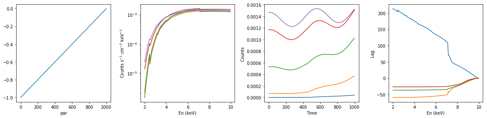

```python
import numpy as np
import matplotlib.pylab as plt
import xspec as xs
import aztools as az
```


```python
def rawlag(x,y,dt=1.0):
    """
    calculate raw (not binned) lag as a function of frequency
    """
    n = len(x);x1 = x-np.mean(x);x2 = y-np.mean(y);
    S=np.fft.rfft(x1)[1:];H=np.fft.rfft(x2)[1:]
    fq = np.arange(1,n/2+1)/(1.0*dt*n)
    lag = np.angle(np.conj(H)*S)/(2*np.pi*fq)
    return (fq,lag)

def simulate_vars(xsmod, xspars, ip, p_lim):
    """Simulate lags from variations in param ip
    when it varies linearly between p_lim[0] and p_lim[1]
    - xsmod: xspec model text. e.g. 'wa*po'
    - xspars: tuple of parameters to initlize xspec model
    - ip: is the parameter number in xspec
    - p_lim: variation limits.
    """
    
    en1, en2, nen, nt  = 2.0, 10.0, 200, 1000
    xtime = np.linspace(0,1000,nt)
    
    # dummy response #
    xs.AllData.dummyrsp(en1 ,en2 ,nen, 'log')
    mod = xs.Model(xsmod)
    mod.setPars(*xspars)
    
    # variations in the parameter of interest #
    p_vals = p_lim[0] + ((p_lim[1]-p_lim[0])/(xtime[-1]-xtime[0])) * xtime
    #p_vals = 0.5*(p_lim[1]+p_lim[0]) + (p_lim[1]-p_lim[0])*np.cos(2*np.pi*xtime/(nt*0.3))
    
    # Get the spectrum at every time bin #
    spec = []
    for it in range(nt):
        mod.setPars({ip: p_vals[it]})
        spec.append(mod.values(0))
    spec = np.array(spec)
    # spec has dims: ntime, nen
    print('spec:', spec.shape)
    
    lc = 1 +0.1*np.cos(2*np.pi*xtime/(nt*0.55))
    spec = spec * lc[:, None]
    
    
    # energy axis 
    enL  =   [np.float(x) for x in mod.energies(0)]
    en   =  [(enL[i]+enL[i+1])/2. for i in range(len(enL)-1)]

    # calculate lags
    lag = np.array([rawlag(spec[:,-1], spec[:,ie])[1] for ie in range(nen)])
    print('lag: ', lag.shape)

    return en, xtime, p_vals, spec, lag

def summary_plot(en, xtime, p_vals, spec, lag):
    """The input is the output of simulate_vars"""
    # plot samples of spec vs en, and spec vs time
    fig, ax = plt.subplots(1,4, figsize=(16,4))
    nplot = 5
    nen, nt = len(en), len(xtime)

    ax[0].plot(xtime, p_vals)
    ax[0].set_xlabel('Time'); ax[0].set_xlabel('par')

    for it in range(0, nt, np.int(nt/nplot)): ax[1].semilogy(en, spec[it])
    #ax[1].set_ylim([5e-4, 0.01])
    ax[1].set_xlabel('En (keV)'); ax[1].set_ylabel(r'Counts s$^{-1}$ cm$^{-2}$ keV$^{-1}$')
    for ie in range(0, nen, np.int(nen/nplot)): ax[2].plot(xtime, spec[:,ie])
    ax[2].set_xlabel('Time'); ax[2].set_ylabel(r'Counts ')
    for ii in range(0, 20, nplot): ax[3].plot(en, lag[:,ii])
    ax[3].set_xlabel('En (keV)'); ax[3].set_ylabel(r'Lag ')
    plt.tight_layout()
```


```python
# neutral absorption: increasing nh #
lags = {}
xsmod, xspars = 'tbabs*po', (5.0, 1.7, 1.0)
en, xtime, p_vals, spec, lag = simulate_vars(xsmod, xspars, ip=1, p_lim=[5.0, 15.0])
summary_plot(en, xtime, p_vals, spec, lag)
lags['neutral_inc_nh'] = [en, xtime, p_vals, spec, lag]
```

    spec: (1000, 200)
    lag:  (200, 500)


```python
# neutral absorption: decreasing nh #
xsmod, xspars = 'tbabs*po', (5.0, 1.7, 1.0)
en, xtime, p_vals, spec, lag = simulate_vars(xsmod, xspars, ip=1, p_lim=[15.0, 5.0])
summary_plot(en, xtime, p_vals, spec, lag)
lags['neutral_dec_nh'] = [en, xtime, p_vals, spec, lag]
```

    spec: (1000, 200)
    lag:  (200, 500)


```python
# neutral absorption: decreasing nh, with constant extra component #
xsmod, xspars = 'tbabs*po+po', (5.0, 1.7, 1.0, 1.7, 10)
en, xtime, p_vals, spec, lag = simulate_vars(xsmod, xspars, ip=1, p_lim=[15.0, 5.0])
summary_plot(en, xtime, p_vals, spec, lag)
lags['neutral_dec_nh_extra_const'] = [en, xtime, p_vals, spec, lag]
```

    spec: (1000, 200)
    lag:  (200, 500)


```python
# partial neutral absorption: increasing cf #
xsmod, xspars = 'tbpcf*po', (5.0, 1, 0, 1.7, 1.0)
en, xtime, p_vals, spec, lag = simulate_vars(xsmod, xspars, ip=2, p_lim=[0.5, 0.6])
summary_plot(en, xtime, p_vals, spec, lag)
lags['partial_dec_cf'] = [en, xtime, p_vals, spec, lag]
```

    spec: (1000, 200)
    lag:  (200, 500)


```python
# ionized absorption: increasing xi #
xsmod, xspars = 'zxipc*po', (10.0, -1, 1, 0, 1.7, 1.0)
en, xtime, p_vals, spec, lag = simulate_vars(xsmod, xspars, ip=2, p_lim=[-1, 0])
summary_plot(en, xtime, p_vals, spec, lag)
lags['ionized_inc_xi'] = [en, xtime, p_vals, spec, lag]
```

    spec: (1000, 200)
    lag:  (200, 500)





```python
# ionized absorption: increasing xi; with constant extra component #
xsmod, xspars = 'zxipc*po+po', (20.0, -1, 1, 0, 1.7, 1.0,0,0.1)
en, xtime, p_vals, spec, lag = simulate_vars(xsmod, xspars, ip=2, p_lim=[-1, 0])
summary_plot(en, xtime, p_vals, spec, lag)
lags['ionized_inc_xi_extra_const'] = [en, xtime, p_vals, spec, lag]
```

    spec: (1000, 200)
    lag:  (200, 500)


```python
# ionized absorption: descreasing xi; with constant extra component #
xsmod, xspars = 'zxipc*po+po', (10.0, -1, 1, 0, 1.7, 1.0,0,0.1)
en, xtime, p_vals, spec, lag = simulate_vars(xsmod, xspars, ip=2, p_lim=[0, -1])
summary_plot(en, xtime, p_vals, spec, lag)
lags['ionized_dec_xi_extra_const'] = [en, xtime, p_vals, spec, lag]
```

    spec: (1000, 200)
    lag:  (200, 500)


```python
# write some data #
import sys,os
base_dir = '/u/home/abzoghbi/data/ngc4151/spec_analysis'
data_dir = 'data/xmm'
timing_dir = 'data/xmm_timing'
os.chdir('%s/%s'%(base_dir, timing_dir))
os.system('mkdir -p lag_models')
os.chdir('lag_models')
np.savez('models.npz', lags=lags)
```


```python
en = lags[list(lags.keys())[0]][0][:-1]
text = '\ndescriptor en\n' + ('\n'.join(['%g'%x for x in en]))
for k in lags.keys():
    lag = lags[k]
    lag = lag[4]
    text += '\n'
    text += '\ndescriptor ' + (' '.join(['lag_%d_%s'%(i+1, k) for i in range(5)])) + '\n'
    text += '\n'.join([' '.join(['%g'%(lag[i,j]/100) for j in range(5)]) for i in range(len(en))])
with open('lag_models.plot', 'w') as fp: fp.write(text)
```


```python

```


```python

```
