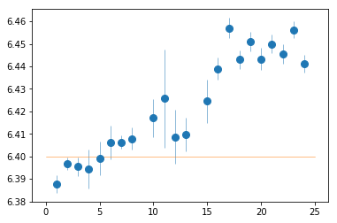
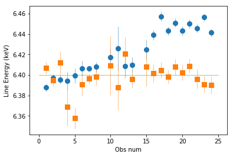
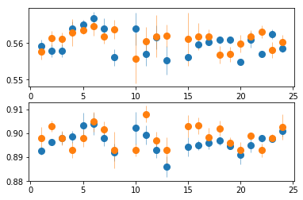
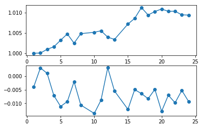

### Description
- Move the spectra from individual observation folder to one folder
- Correct for the gain in the pn data
- Move the spectra from sub-segments and correct their gains. Assuming a single gain correction per observation.
- Move the Suzaku and NuSTAR spectra to `xmm_spec`


```python
import sys,os
base_dir = '/u/home/abzoghbi/data/ngc4151/spec_analysis'
sys.path.append(base_dir)
from spec_helpers import *
%load_ext autoreload
%autoreload 2
```

### Read useful data from data notebook


```python
# define and read some useful descriptive information #
data_dir = 'data/xmm'
spec_dir = 'data/xmm_spec'
os.chdir('%s/%s'%(base_dir, data_dir))
data = np.load('log/data.npz')
spec_obsids = data['spec_obsids']
obsids = data['obsids']
spec_data = data['spec_data']
spec_ids = [i+1 for i,o in enumerate(obsids) if o in spec_obsids]
```

### Move the spectra to one location


```python
os.chdir(base_dir)
if not os.path.exists(spec_dir):
    os.system('mkdir -p %s'%spec_dir)
    os.chdir(spec_dir)
    for o in spec_obsids:
        os.system('cp %s/%s/%s/pn/spec/spec_* .'%(base_dir, data_dir, o))
        os.system('cp %s/%s/%s/mos/spec/spec_* .'%(base_dir, data_dir, o))
        os.system('cp %s/%s/%s/rgs/spec_rgs* .'%(base_dir, data_dir, o))
```

---
<br /><br />

## The energy of the FeK line
### PN spectra
- Fitting is done with `xspec`
- It uses `fit_1` in `fit.tcl`


```python
os.chdir('%s/%s'%(base_dir, spec_dir))
os.system('mkdir -p fits')
fit_1 = fit_xspec_model('fit_1', spec_ids, base_dir, '_pn')
```


```python
plt.errorbar(spec_ids, fit_1[:,2,0], fit_1[:,2,1], fmt='o', ms=8, lw=0.5)
plt.plot([0,25], [6.4]*2, lw=0.5)
```


    [<matplotlib.lines.Line2D at 0x7f84200c3a20>]





### MOS Spectra
do mos-2 only, as mos-1 has some missing spectra, and the gain appear to be wrong too.


```python
os.chdir('%s/%s'%(base_dir, spec_dir))
fit_1_m2 = fit_xspec_model('fit_1', spec_ids, base_dir, '_m2', spec_root='spec_m2_%d.grp')
```


```python
plt.errorbar(spec_ids, fit_1[:,2,0], fit_1[:,2,1], fmt='o', ms=8, lw=0.5)
plt.errorbar(spec_ids, fit_1_m2[:,2,0], fit_1_m2[:,2,1], fmt='s', ms=8, lw=0.5)
plt.plot([0,25], [6.4]*2, lw=0.5)
plt.xlabel('Obs num'); _=plt.ylabel('Line Energy (keV)')
```





```
The mos-2 data is more consistent with 6.4. The PN is affected by gain
```


```python
# save some of these results #
os.system('mkdir -p results/prepare')
text = 'descriptor iobs id en_pn,+- en_m2,+-\n'
text += '\n'.join(['{:5} {:5} {:8.4} {:8.4} {:8.4} {:8.4}'.format(i, spec_ids[i], 
            fit_1[i,2,0], fit_1[i,2,1], fit_1_m2[i,2,0], fit_1_m2[i,2,1]) 
            for i in range(len(fit_1))])
#print(text)
with open('results/prepare/line_en.plot', 'w') as fp: fp.write(text)
```

### Track the soft lines too


```python
os.chdir('%s/%s'%(base_dir, spec_dir))
soft_spec_pn = fit_xspec_model('fit_1a', spec_ids, base_dir, '_pn')
soft_spec_m2 = fit_xspec_model('fit_1a', spec_ids, base_dir, '_m2', spec_root='spec_m2_%d.grp')
```


```python
plt.subplot(211)
plt.errorbar(spec_ids, soft_spec_pn[:,2,0], soft_spec_pn[:,2,1], fmt='o', ms=8, lw=0.5)
plt.errorbar(spec_ids, soft_spec_m2[:,2,0], soft_spec_m2[:,2,1], fmt='o', ms=8, lw=0.5)
plt.subplot(212)
plt.errorbar(spec_ids, soft_spec_pn[:,4,0], soft_spec_pn[:,4,1], fmt='o', ms=8, lw=0.5)
plt.errorbar(spec_ids, soft_spec_m2[:,4,0], soft_spec_m2[:,4,1], fmt='o', ms=8, lw=0.5)
```


    <ErrorbarContainer object of 3 artists>





```python
# save some of these results #
text = '\ndescriptor en_pn_s1,+- en_pn_s2,+- en_m2_s1,+- en_m2_s2,+-\n'
text += '\n'.join(['{:8.4} {:8.4} {:8.4} {:8.4} {:8.4} {:8.4} {:8.4} {:8.4}'.format(
        soft_spec_pn[i,2,0], soft_spec_pn[i,2,1], soft_spec_pn[i,4,0], soft_spec_pn[i,4,1],
        soft_spec_m2[i,2,0], soft_spec_m2[i,2,1], soft_spec_m2[i,4,0], soft_spec_m2[i,4,1]) 
            for i in range(len(soft_spec_pn))])
#print(text)
with open('results/prepare/line_en.plot', 'a') as fp: fp.write(text)
```

```PN and MOS are consistent in the soft band, hence gain correction is needed```

## Finding Gain Correction
We use linear function that corrects the energy of the FeK line and leaves the soft energies (we use 0.9 keV) unchanged.


```python
# soft_en = 0.9
# slopes  = (pn_spec[:,2,0] - soft_en) / (6.4 - soft_en)
# offsets = soft_en - soft_en*slopes
# plt.subplot(211); plt.plot(spec_ids, slopes, 'o-')
# plt.subplot(212); plt.plot(spec_ids, offsets, 'o-')
```

### Regroup RGS spectra


```python
os.chdir('%s/%s'%(base_dir, spec_dir))
for ispec in spec_ids:
    cmd  = 'export HEADASNOQUERY=;export HEADASPROMPT=/dev/null;'
    cmd += ('ftgrouppha spec_rgs_{0}.grp spec_rgs_{0}.g snmin 6').format(ispec)
    p = subp.call(['/bin/bash', '-i', '-c', cmd])
```

### Fit the RGS spectrra: `fit_gain_1`


```python
os.chdir('%s/%s'%(base_dir, spec_dir))
fit_xspec_model('fit_gain_1', spec_ids, base_dir, spec_root='spec_rgs_%d.g', read_fit=False)
```

### Use rgs model in PN to obtain the gain: `fit_gain_2`


```python
# run in serial, because xspec steppar is run in parallel.
os.chdir('%s/%s'%(base_dir, spec_dir))
for ispec in spec_ids:
    if not os.path.exists('fits/fit_gain_2g__%s.xcm'%ispec):
        tcl  = 'source %s/fit.tcl\n'%base_dir
        tcl += 'fit_gain_2 %d\nexit\n'%(ispec) 
        xcm = 'tmp_%d.xcm'%ispec
        with open(xcm, 'w') as fp: fp.write(tcl)
        cmd = 'xspec - %s > tmp_%d.log 2>&1'%(xcm, ispec)
        p = subp.call(['/bin/bash', '-i', '-c', cmd])

```


```python
# read the gains #
gdata = np.array([np.loadtxt('fits/fit_gain_2g__%d.log'%i) for i in spec_ids])
slopes = gdata[:,-2]
offsets = gdata[:,-1]
plt.subplot(211); plt.plot(spec_ids, slopes, 'o-')
plt.subplot(212); plt.plot(spec_ids, offsets, 'o-')
```


    [<matplotlib.lines.Line2D at 0x7f84b3db8cf8>]





### Apply the gain to the response files


```python
os.chdir('%s/%s'%(base_dir, spec_dir))
print('{:5} {:12} {:10} {:10} {:10}'.format('num', 'obsid', 'slope', 'offset', 'apply?'))
for ii,ispec in enumerate(spec_ids):
    #d = np.loadtxt('fits/fit_gain_pn__%dg.log'%ispec)
    slope, offset, apply = slopes[ii], offsets[ii], gdata[ii,-3] < 1
    
    text = '{:5} {:12} {:10.4} {:10.4} {:10}'.format(
        ispec, spec_obsids[ii], slope, offset, apply)
    print(text)
    #continue
    
    # apply gain #
    if not apply: continue
    rmf = 'spec_%d.rmf'%(ispec)
    arf = 'spec_%d.arf'%(ispec)
    
    # rmf #
    with pyfits.open(rmf) as fp:
        if not 'GAINPARS' in fp[1].header.keys(): 
            fp[1].data['energ_lo'] = fp[1].data['energ_lo']/slope - offset
            fp[1].data['energ_hi'] = fp[1].data['energ_hi']/slope - offset
            fp[2].data['e_min'] = fp[2].data['e_min']/slope - offset
            fp[2].data['e_max'] = fp[2].data['e_max']/slope - offset
            fp[1].header['GAINPARS'] = '{}, {}'.format(slope, offset)
            os.system('rm %s.shift >/dev/null 2>&1'%rmf)
            fp.writeto('%s.shift'%rmf)
            os.system('mv %s %s.off'%(rmf, rmf))
            os.system('mv %s.shift %s'%(rmf, rmf))
    # arf #
    with pyfits.open(arf) as fp:
        if not 'GAINPARS' in fp[1].header.keys(): 
            fp[1].data['energ_lo'] = fp[1].data['energ_lo']/slope - offset
            fp[1].data['energ_hi'] = fp[1].data['energ_hi']/slope - offset
            fp[1].header['GAINPARS'] = '{}, {}'.format(slope, offset)
            os.system('rm %s.shift >/dev/null 2>&1'%arf)
            fp.writeto('%s.shift'%arf)
            os.system('mv %s %s.off'%(arf, arf))
            os.system('mv %s.shift %s'%(arf, arf))
```

    num   obsid        slope      offset     apply?    
        1 0112310101          1.0     -0.004          1
        2 0112830201          1.0   0.003093          1
        3 0112830501        1.001   0.001058          1
        4 0143500101        1.002  -0.007168          1
        5 0143500201        1.003    -0.0112          1
        6 0143500301        1.005   -0.00936          1
        7 0402660101        1.002  -0.002021          1
        8 0402660201        1.005   -0.01068          1
       10 0657840301        1.005   -0.01379          1
       11 0657840401        1.006  -0.008874          1
       12 0679780101        1.004    0.00312          1
       13 0679780201        1.003  -0.005462          1
       15 0679780401        1.007   -0.01226          1
       16 0761670101        1.009   -0.00496          1
       17 0761670201        1.011  -0.006429          1
       18 0761670301        1.009  -0.008327          1
       19 0761670401         1.01  -0.004856          1
       20 0761670501        1.011   -0.01301          1
       21 0761670601         1.01   -0.00703          1
       22 0761670701         1.01  -0.009841          1
       23 0761670801        1.009  -0.005254          1
       24 0761670901        1.009  -0.009328          1


```python
# group spectra optimally using ftgrouppha
os.chdir('%s/%s'%(base_dir, spec_dir))
for ispec in spec_ids:
    cmd = 'export HEADASNOQUERY=;export HEADASPROMPT=/dev/null;'
    cmd += 'ftgrouppha spec_{0}.grp tmp_{0}.grp opt respfile=spec_{0}.rmf;'.format(ispec)
    cmd += 'mv tmp_{0}.grp spec_{0}.grp'.format(ispec)
    _ = os.system(cmd)
```

<br /> <br />

---
## SubSpec


```python
### Read useful data from data notebook
data_dir = 'data/xmm'
subspec_dir = 'data/xmm_subspec'
os.chdir('%s/%s'%(base_dir, data_dir))
data = np.load('log/data.npz')
iselect = data['tselect_ispec']
```

### Move the files to one location


```python
### Read useful data from data notebook
os.system('mkdir -p %s/%s'%(base_dir, subspec_dir))
os.chdir('%s/%s'%(base_dir, subspec_dir))
os.system('for i in `find ../xmm|grep subspec$`;do cp $i/spec* .;done')
```


    0


### Apply gain


```python
os.chdir('%s/%s'%(base_dir, subspec_dir))
for ii,idx in enumerate(spec_ids):
    
    slope, offset, apply = slopes[ii], offsets[ii], True
    
    # apply gain #
    for ispec in iselect[ii]:
        
        rmf = 'spec_%d.rmf'%(ispec)
        arf = 'spec_%d.arf'%(ispec)

        # rmf #
        with pyfits.open(rmf) as fp:
            if not 'GAINPARS' in fp[1].header.keys(): 
                fp[1].data['energ_lo'] = fp[1].data['energ_lo']/slope - offset
                fp[1].data['energ_hi'] = fp[1].data['energ_hi']/slope - offset
                fp[2].data['e_min'] = fp[2].data['e_min']/slope - offset
                fp[2].data['e_max'] = fp[2].data['e_max']/slope - offset
                fp[1].header['GAINPARS'] = '{}, {}'.format(slope, offset)
                os.system('rm %s.shift >/dev/null 2>&1'%rmf)
                fp.writeto('%s.shift'%rmf)
                os.system('mv %s %s.off'%(rmf, rmf))
                os.system('mv %s.shift %s'%(rmf, rmf))
        # arf #
        with pyfits.open(arf) as fp:
            if not 'GAINPARS' in fp[1].header.keys(): 
                fp[1].data['energ_lo'] = fp[1].data['energ_lo']/slope - offset
                fp[1].data['energ_hi'] = fp[1].data['energ_hi']/slope - offset
                fp[1].header['GAINPARS'] = '{}, {}'.format(slope, offset)
                os.system('rm %s.shift >/dev/null 2>&1'%arf)
                fp.writeto('%s.shift'%arf)
                os.system('mv %s %s.off'%(arf, arf))
                os.system('mv %s.shift %s'%(arf, arf))
```

<br /> <br />

## Move Suzaku & NuSTAR data to the same location too


```python
suz_dir = 'data/suzaku'
nu_dir = 'data/nustar'
```


```python
os.chdir('%s/%s'%(base_dir, spec_dir))
for o in glob.glob('%s/%s/*_p'%(base_dir, suz_dir)):
    os.system('cp %s/spec/spec*fi* .'%o)
for o in glob.glob('%s/%s/*_p'%(base_dir, nu_dir)):
    os.system('cp %s/spec/spec*.??? .'%o)
```


```python

```
