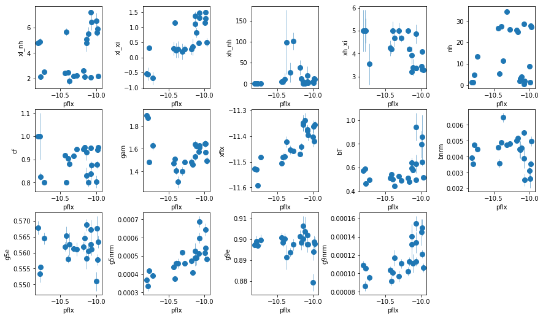

```python
import sys,os
base_dir = '/u/home/abzoghbi/data/ngc4151/spec_analysis'
sys.path.append(base_dir)
from spec_helpers import *
%load_ext autoreload
%autoreload 2
```


```python
### Read useful data from data notebook
data_dir = 'data/xmm'
spec_dir = 'data/xmm_spec'
os.chdir('%s/%s'%(base_dir, data_dir))
data = np.load('log/data.npz')
spec_obsids = data['spec_obsids']
obsids = data['obsids']
spec_data = data['spec_data']
spec_ids = [i+1 for i,o in enumerate(obsids) if o in spec_obsids]
```

### `fit_4`: A starting full model based on what we found `fit_3?`
Using xillver for the reflection instead of a gaussian line


```python
os.chdir('%s/%s'%(base_dir, spec_dir))
fit_4 = fit_xspec_model('fit_4', spec_ids, base_dir)
```


```python
# plot the result #
par_names = ['xl_nh', 'xl_xi', 'xh_nh', 'xh_xi', 'nh', 'cf', 'pflx', 'gam', 'xflx', 
             'bT', 'bnrm', 'g5e', 'g5nrm', 'g9e', 'g9nrm']
fit = fit_4
fig = plt.figure(figsize=(12,7))
idx = [0,1,2,3,4,5,7,8,9,10,11,12,13,14]; iref = 6
for i,ix in enumerate(idx):
    ax = plt.subplot(3,len(idx)//3+1,i+1)
    plt.errorbar(fit[:,iref,0], fit[:,ix,0], fit[:,ix,1], xerr=fit[:,iref,1], 
                 fmt='o', ms=8, lw=0.5)
    ax.set_xlabel(par_names[iref]); ax.set_ylabel(par_names[ix])
plt.tight_layout(pad=0)
```





```python
# write the residuals #
os.system('mkdir -p results/spec')
extra_cmd  ='del 5; del 6; freez [az_free]; thaw 14 22; fit;'
extra_cmd += 'add 3 po &1&1; new 6=15; freez 24; new 13 1 -1; fit; thaw 24; fit'
write_resid(base_dir, spec_ids, '4', extra_cmd, -1, avg_bin=True, outdir='results/spec')
```

> **When scattering is not absorbed by WA: The low xi WA dominates the absorption (hence not modeling the K edge properly), as it tries to model the excess at 2 keV (i.e. allowing some hard flux to leak). The excess is still visible in the high column observations**

### `fit_4a`: Add soft emission lines to fit_4
- Stop when the significance of the added line has `p>0.1`


```python
os.chdir('%s/%s'%(base_dir, spec_dir))
fit_4a = fit_xspec_model('fit_4a', spec_ids, base_dir)
```


```python
# write the residuals #
extra_cmd  ='del 5; del 6; freez [az_free]; thaw 14 22; fit;'
extra_cmd += 'add 3 po &1&1; new 6=15; freez 24; new 13 1 -1; fit; thaw 24; fit'
write_resid(base_dir, spec_ids, '4a', extra_cmd, -1, avg_bin=True, outdir='results/spec')
```

### `fit_4b`: Add absorption lines between 2-5.5 keV to `fit_4a`
- Stop when the significance of the added line has `p>0.1`


```python
os.chdir('%s/%s'%(base_dir, spec_dir))
fit_4b = fit_xspec_model('fit_4b', spec_ids, base_dir)
```


```python
# write the residuals #
extra_cmd  ='del 5; del 6; freez [az_free]; thaw 14 22; fit;'
extra_cmd += 'add 3 po &1&1; new 6=15; freez 24; new 13 1 -1; fit; thaw 24; fit'
write_resid(base_dir, spec_ids, '4b', extra_cmd, -1, avg_bin=True, outdir='results/spec')
```

### `fit_4c`: Add emission at 8.1 and absorption at 8.7 keV


```python
os.chdir('%s/%s'%(base_dir, spec_dir))
fit_4c = fit_xspec_model('fit_4c', spec_ids, base_dir)
```


```python
# write the residuals #
extra_cmd  ='del 5; del 6; freez [az_free]; thaw 14 22; fit;'
extra_cmd += 'add 3 po &1&1; new 6=15; freez 24; new 13 1 -1; fit; thaw 24; fit'
write_resid(base_dir, spec_ids, '4c', extra_cmd, -1, avg_bin=True, outdir='results/spec')
```


```python
## fit_4c1: we force xi of lo-xi wa in 1,2 to be small so we have a trend
## fit them by hand: , fits/fit_4c__1_loxi.xcm, fits/fit_4c__2_loxi.xcm, 
## then copy them to fit_4c1; copy the rest from fit_4c
```

### `fit_4d`: Freeze all emission/absorption lines


```python
os.chdir('%s/%s'%(base_dir, spec_dir))
fit_4d = fit_xspec_model('fit_4d', spec_ids, base_dir)
```


### `fit_4d1`: Replace PC with PL
- For estimating timescale only


```python
os.chdir('%s/%s'%(base_dir, spec_dir))
fit_4d1 = fit_xspec_model('fit_4d1', spec_ids, base_dir)
```

### `fit_4dnu`: Fit the model to nustar data


```python
os.chdir('%s/%s'%(base_dir, spec_dir))
for ispec in [1, 2, 3]:
    tcl  = 'source %s/fit.tcl\n'%base_dir
    tcl += 'fit_4dnu spec_%d_a.grp __%da\nexit\n'%(ispec, ispec) 
    xcm = 'tmp_%d.xcm'%ispec
    with open(xcm, 'w') as fp: fp.write(tcl)
    cmd = 'xspec - %s > tmp_%d.log 2>&1'%(xcm, ispec)
```


```python
# write the residuals #
os.chdir('%s/%s'%(base_dir, spec_dir))
write_resid(base_dir, [1,2,3], '4dnu', '',0, avg_bin=False, 
            outdir='results/spec', ispec_suff='a')
```

<br /> <br />

---
---
### `fit_re_1`: Testing for a broad line similar to Z12
absorbed powerlaw + xillver


```python
os.chdir('%s/%s'%(base_dir, spec_dir))
fit_re_1 = fit_xspec_model('fit_re_1', spec_ids, base_dir)
```


```python
# write the residuals #
os.system('mkdir -p results/broad')
extra_cmd  =''
write_resid(base_dir, spec_ids, 're_1', extra_cmd, -1, avg_bin=True, outdir='results/broad')
```

### `fit_re_1a`: make absorber partial


```python
os.chdir('%s/%s'%(base_dir, spec_dir))
fit_re_1a = fit_xspec_model('fit_re_1a', spec_ids, base_dir)
```


```python
# write the residuals #
extra_cmd  =''
write_resid(base_dir, spec_ids, 're_1a', extra_cmd, -1, avg_bin=True, outdir='results/broad')
```

### `fit_re_1b`: Add low-xi and hi-xi WA if needed


```python
os.chdir('%s/%s'%(base_dir, spec_dir))
fit_re_1b = fit_xspec_model('fit_re_1b', spec_ids, base_dir)
```


```python
# write the residuals #
extra_cmd  =''
write_resid(base_dir, spec_ids, 're_1b', extra_cmd, -1, avg_bin=True, outdir='results/broad')
```

---

### `fit_re_1c`: Use relativistic reflection instead of PC starting from re_1


```python
os.chdir('%s/%s'%(base_dir, spec_dir))
fit_re_1c = fit_xspec_model('fit_re_1c', spec_ids, base_dir)
```


```python
# write the residuals #
extra_cmd  =''
write_resid(base_dir, spec_ids, 're_1c', extra_cmd, -1, avg_bin=True, outdir='results/broad')
```


```python

```
