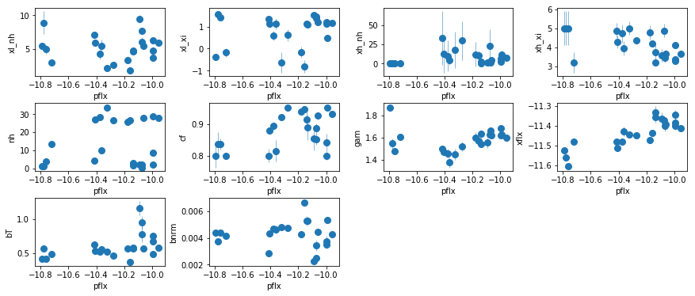
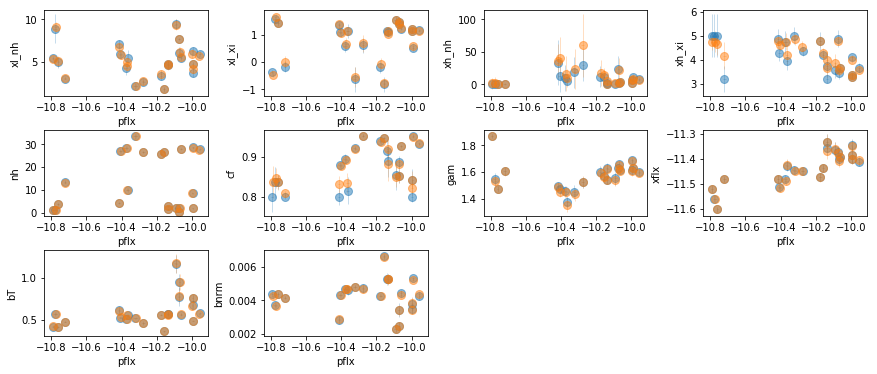
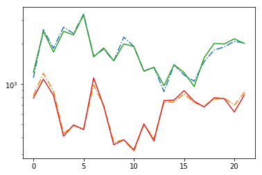
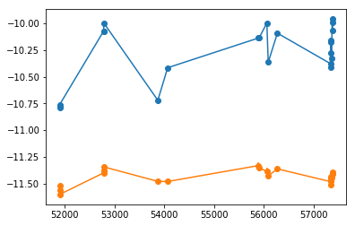
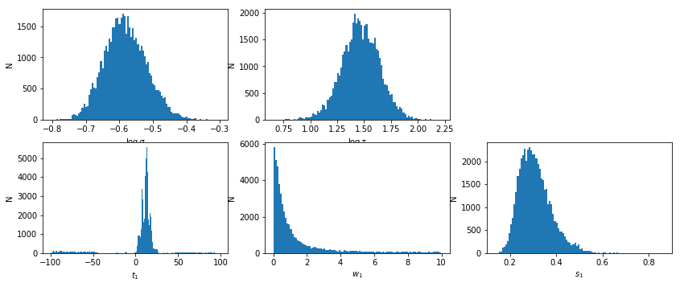
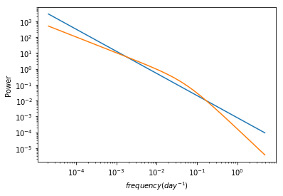
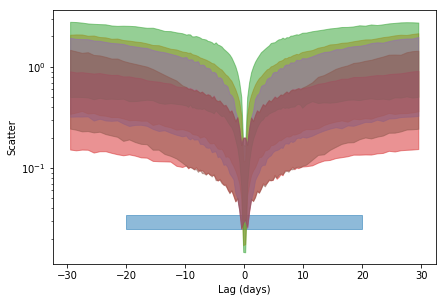
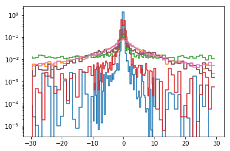

### Content
-


```python
import sys,os
base_dir = '/u/home/abzoghbi/data/ngc4151/spec_analysis'
sys.path.append(base_dir)
from spec_helpers import *
%load_ext autoreload
%autoreload 2
```


```python
### Read useful data from data notebook
data_dir = 'data/xmm'
spec_dir = 'data/xmm_spec'
os.chdir('%s/%s'%(base_dir, data_dir))
data = np.load('log/data.npz')
spec_obsids = data['spec_obsids']
obsids = data['obsids']
spec_data = data['spec_data']
spec_ids = [i+1 for i,o in enumerate(obsids) if o in spec_obsids]
```

---
### Read the continuum and line fluxes from `fit_4d`


```python
os.chdir('%s/%s'%(base_dir, spec_dir))
suff = '4d'
fit = fit_xspec_model('fit_%s'%suff, spec_ids, base_dir)
```


```python
# run mcmc #
fit_xspec_model('fit_%s_mc'%suff, spec_ids, base_dir, read_fit=0, ext_check='fits')
```


```python
# plot the result #
if suff == '4d':
    par_names = ['xl_nh', 'xl_xi', 'xh_nh', 'xh_xi', 'nh', 'cf', 'pflx', 'gam', 'xflx', 
                 'bT', 'bnrm']
else:
    raise NotImplemented
npar = len(par_names)
fit = np.array([f[:npar] for f in fit])
iref = par_names.index('pflx')
idx = list(range(len(par_names)))
idx.pop(iref)
    
fig = plt.figure(figsize=(12,5))
for i,ix in enumerate(idx):
    ax = plt.subplot(3,len(idx)//3+(1 if len(idx)%3 else 0),i+1)
    plt.errorbar(fit[:,iref,0], fit[:,ix,0], fit[:,ix,1], 
                 xerr=fit[:,iref,1], fmt='o', ms=8, lw=0.5)
    ax.set_xlabel(par_names[iref]); ax.set_ylabel(par_names[ix])
plt.tight_layout(pad=0)
```





```python
# shape= (nobs:22, npar, nchain)
fdata = model_correlations('fit_%s'%suff, spec_ids, [len(par_names)], None, None, read_only=True)
fig = plt.figure(figsize=(12,5))
for i,ix in enumerate(idx):
    ax = plt.subplot(3,len(idx)//3+(1 if len(idx)%3 else 0),i+1)
    plt.errorbar(fit[:,iref,0], fit[:,ix,0], fit[:,ix,1], 
                 xerr=fit[:,iref,1], fmt='o', ms=8, lw=0.5, alpha=0.5)
    plt.errorbar(np.median(fdata[:,iref],-1), np.median(fdata[:,ix],-1), np.std(fdata[:,ix],-1), 
                 xerr=np.std(fdata[:,iref],-1), fmt='o', ms=8, lw=0.5, alpha=0.5)
    ax.set_xlabel(par_names[iref]); ax.set_ylabel(par_names[ix])
plt.tight_layout(pad=0)
```





```python
# signal to noise ratios #
icont, iline = par_names.index('pflx'), par_names.index('xflx')
print(np.mean(np.abs(fit[:,icont,0]/fit[:,icont,1])), 
      np.mean(np.abs(fit[:,iline,0]/fit[:,iline,1])))
plt.plot(np.abs(fit[:,icont,0]/fit[:,icont,1]), '-.')
plt.plot(np.abs(fit[:,iline,0]/fit[:,iline,1]), '-.')
plt.plot(np.abs(np.median(fdata[:,icont],-1)/np.std(fdata[:,icont],-1)))
plt.plot(np.abs(np.median(fdata[:,iline],-1)/np.std(fdata[:,iline],-1)))
plt.yscale('log')
```

    1793.5788013392157 674.6008329121943





### Model the Correlations
Use the results of the mcmc fit above


```python
os.chdir('%s/%s'%(base_dir, spec_dir))

if suff == '4d':
    # ['xl_nh', 'xl_xi', 'xh_nh', 'xh_xi', 'nh', 'cf', 'pflx', 'gam', 'xflx', 'bT', 'bnrm']
    ipars = [[6,8], [4,8], [0,8]]; ilog = []
    names = ['pf_gf', 'nh_gf', 'xlnh_gf']
else:
    raise NotImplemented
    


text = model_correlations('fit_%s'%suff, spec_ids, ipars, names, ilog)
```


```python
# write the veusz text for subgroups of the data. 
# the groups are defined in continuum_line_split_text
os.system('mkdir -p results/narrow_line')
with open('results/narrow_line/continuum_line__fit_%s.plot'%suff, 'w') as fp: fp.write(text)
text_sep = continuum_line_split_text(text, 'fit_%s'%suff)
with open('results/narrow_line/continuum_line__fit_%s.plot'%suff, 'a') as fp: fp.write(text_sep)
```

<br /><br />

---
## Measuring The lag using Javelin


```python
os.chdir('%s/%s'%(base_dir, spec_dir))
if suff in ['4d']:
    icont, iline = 6, 8
else:
    raise NotImplemented

xtime, cflux, lflux = spec_data[:,0], fit[:,icont,:2].T, fit[:,iline,:2].T
isort = np.argsort(xtime)
xtime,cflux,lflux = xtime[isort], cflux[:,isort], lflux[:,isort]

plt.errorbar(xtime, cflux[0], cflux[1], fmt='o-')
plt.errorbar(xtime, lflux[0], lflux[1], fmt='o-')
```


    <ErrorbarContainer object of 3 artists>





```python
npz   = 'results/narrow_line/continuum_line_javelin__fit_%s.npz'%(suff)
pfile = 'results/narrow_line/continuum_line_javelin__fit_%s.plot'%(suff)
if os.path.exists(npz):
    d = np.load(npz)
    lmod = d['lmod'][()]
    lmod.show_hist()
    text,_,_,_ = javelin_modeling(xtime, cflux, lflux, suff=suff, mods=[None, lmod])
    with open(pfile, 'w') as fp: fp.write(text)
else:
    text, cmod, lmod, lhist = javelin_modeling(xtime, cflux, lflux, suff='_%s'%(suff), 
                                nburn=1000, nchain=500)
    lmod.show_hist()
    with open(pfile, 'w') as fp: fp.write(text)
    np.savez(npz,xtime=xtime,cflux=cflux,lflux=lflux,cmod=cmod, lmod=lmod)
```





    # percentiles: 68, 90, 99: [6.036, 17.46], [-70.64, 23.25], [-96.54, 87.79]
    # mean lag: 12.43 +5.032 -6.391


<br /><br />

---
## Measuring The lag from scatter
### 1- Estimate the PSD


```python
# fit_indiv_2 #
os.chdir('%s/%s'%(base_dir, spec_dir))
p1,p1e,pm1 = estimate_psd(xtime, cflux[0], cflux[1], 1)
p2,p2e,pm2 = estimate_psd(xtime, lflux[0], lflux[1], 1)

#psdpar = np.array([(p1+p2)/2, (p1e**2+p2e**2)**0.5])
psdpar = np.array([p1, p1e])
print('\n\npsd parameters: {:.4} +/- {:.4} | {:.4} +/- {:.4}'.format(
        psdpar[0,0], psdpar[1,0], psdpar[0,1], psdpar[1,1]))

```

       1 1.074e-01 5.001e+01   inf | -3.836e+01 |    -9    -2
       2 9.361e-02 4.939e+01 1.076e+01 | -2.760e+01 | -9.97 -1.99
       3 7.754e-02 4.799e+01 1.025e+01 | -1.735e+01 | -10.9 -1.98
       4 5.448e-02 4.488e+01 9.093e+00 | -8.256e+00 | -11.7 -1.96
       5 4.254e-02 3.898e+01 6.950e+00 | -1.306e+00 | -12.4 -1.92
       6 6.378e-02 3.106e+01 4.449e+00 | 3.143e+00 | -12.7 -1.84
       7 6.679e-02 2.352e+01 2.830e+00 | 5.973e+00 | -12.5 -1.72
       8 5.575e-02 1.620e+01 1.758e+00 | 7.732e+00 | -12.3 -1.61
       9 3.908e-02 9.317e+00 8.679e-01 | 8.599e+00 | -12.1 -1.52
      10 2.272e-02 4.413e+00 3.107e-01 | 8.910e+00 |   -12 -1.46
      11 1.141e-02 1.852e+00 8.222e-02 | 8.992e+00 | -11.9 -1.43
      12 5.309e-03 7.624e-01 1.809e-02 | 9.010e+00 | -11.8 -1.41
      13 2.397e-03 3.221e-01 3.699e-03 | 9.014e+00 | -11.8  -1.4
      14 1.071e-03 1.393e-01 7.384e-04 | 9.015e+00 | -11.8  -1.4
      15 4.761e-04 6.105e-02 1.461e-04 | 9.015e+00 | -11.8  -1.4
      16 2.114e-04 2.692e-02 2.881e-05 | 9.015e+00 | -11.8  -1.4
    ********************
    -11.7547 -1.39684
    0.505554 0.105365
    -8.60086e-05 0.0269247
    ********************
       1 1.089e-01 5.025e+01   inf | -4.064e+01 |    -9    -2
       2 9.706e-02 5.007e+01 1.096e+01 | -2.968e+01 | -9.98 -1.99
       3 8.562e-02 4.978e+01 1.079e+01 | -1.889e+01 | -10.9 -1.99
       4 7.237e-02 4.921e+01 1.039e+01 | -8.505e+00 | -11.9 -1.98
       5 5.485e-02 4.807e+01 9.564e+00 | 1.060e+00 | -12.7 -1.96
       6 4.214e-02 4.604e+01 8.291e+00 | 9.351e+00 | -13.4 -1.91
       7 6.445e-02 4.311e+01 6.959e+00 | 1.631e+01 | -13.9 -1.83
       8 8.293e-02 3.935e+01 5.945e+00 | 2.225e+01 | -14.1 -1.71
       9 9.206e-02 3.397e+01 5.070e+00 | 2.732e+01 |   -14 -1.57
      10 8.749e-02 2.556e+01 3.875e+00 | 3.120e+01 | -13.9 -1.43
      11 6.355e-02 1.418e+01 2.191e+00 | 3.339e+01 | -13.8  -1.3
      12 2.683e-02 4.318e+00 6.545e-01 | 3.405e+01 | -13.7 -1.22
      13 4.975e-03 4.990e-01 6.167e-02 | 3.411e+01 | -13.7 -1.19
      14 4.893e-04 3.987e-02 1.217e-03 | 3.411e+01 | -13.6 -1.18
      15 4.275e-05 3.812e-03 1.067e-05 | 3.411e+01 | -13.6 -1.18
    ********************
    -13.6331 -1.17905
    0.629763 0.131635
    -0.000231532 0.00381167
    ********************
    
    
    psd parameters: -11.75 +/- 0.5056 | -1.397 +/- 0.1054


```python
os.chdir('%s/%s'%(base_dir, spec_dir))
p1,p1e,pm1_b = estimate_psd(xtime, cflux[0], cflux[1], 2)

psdpar_b = np.array([p1, p1e])
print('\n\npsd parameters: {:.4} +/- {:.4} | {:.4} +/- {:.4} | {:.4} +/- {:.4}'.format(
    psdpar_b[0,0], psdpar_b[1,0], psdpar_b[0,1], psdpar_b[1,1], psdpar_b[0,2], psdpar_b[1,2]))
```

       1 3.059e-01 3.719e+00   inf | 1.017e+01 |  -9.4    -2  -3.6
       2 1.330e-01 1.965e+00 3.078e-01 | 1.048e+01 | -9.24 -2.47  -2.5
       3 3.183e-02 2.887e-01 3.512e-01 | 1.083e+01 | -9.25 -2.45 -2.83
       4 7.612e-03 1.248e-02 8.083e-03 | 1.084e+01 | -9.24 -2.42 -2.92
       5 1.560e-03 5.244e-03 1.778e-04 | 1.084e+01 | -9.23 -2.41 -2.94
       6 3.138e-04 4.160e-04 7.747e-06 | 1.084e+01 | -9.23  -2.4 -2.95
    ********************
    -9.2303 -2.40492 -2.94797
    0.572415 0.900494 1.35848
    -0.000116705 0.000213887 -0.000415955
    ********************
    
    
    psd parameters: -9.23 +/- 0.5724 | -2.405 +/- 0.9005 | -2.948 +/- 1.358


```python
# plot the best fit psd models for comparison #
f1, m1 = pm1.mods[0].calculate_model(psdpar[0])
f2, m2 = pm1_b.mods[0].calculate_model(psdpar_b[0])
plt.loglog(f1,m1)
plt.loglog(f2,m2)
plt.xlabel('$frequency (day^{-1})$')
plt.ylabel('Power')
```


    Text(0, 0.5, 'Power')





### 2- Calculate the scatter in the data


```python
data_scat = calc_scatter(cflux[0], cflux[1], lflux[0], lflux[1], nsim=100)
print('scatter data: {:.4} +- {:.4}'.format(*data_scat))
```

    scatter data: 0.02938 +- 0.004591


### 3- Simulate the scatter for different lags
- PSD parameters are randomized using the measured uncertainties in `psd_par`
- The light curve is randomized following the standard light curve simlations procedure.

#### Simple powerlaw psd and delta-function lag


```python
dt = 0.25
args = [xtime, cflux, lflux, psdpar, dt, 'const', 5000]
npz = 'results/narrow_line/continuum_line_lag__fit_%s.npz'%suff
fit_sim_scat = run_parallel_simulate_scatter(npz, args)
```

#### Bending powerlaw psd and delta-function lag


```python
args = [xtime, cflux, lflux, psdpar_b, dt, 'const', 5000]
npz = 'results/narrow_line/continuum_line_lag_b__fit_%s.npz'%suff
fit_sim_scat_b = run_parallel_simulate_scatter(npz, args)
```

#### Powerlaw psd and a broad tranfer function lag


```python
args = [xtime, cflux, lflux, psdpar, dt, 'none', 5000]
npz = 'results/narrow_line/continuum_line_lag_t__fit_%s.npz'%suff
fit_sim_scat_t = run_parallel_simulate_scatter(npz, args)
```

#### Powerlaw psd and with w=1 tranfer function


```python
args = [xtime, cflux, lflux, psdpar, dt, 'none', 5000, -1.0]
npz = 'results/narrow_line/continuum_line_lag_w1__fit_%s.npz'%suff
fit_sim_scat_w1 = run_parallel_simulate_scatter(npz, args)
```

#### Powerlaw psd and with w=10 tranfer function


```python
args = [xtime, cflux, lflux, psdpar, dt, 'none', 5000, -10.0]
npz = 'results/narrow_line/continuum_line_lag_w10__fit_%s.npz'%suff
fit_sim_scat_w10 = run_parallel_simulate_scatter(npz, args)
```

#### Powerlaw psd and with random w, so we marginalize over it


```python
args = [xtime, cflux, lflux, psdpar, dt, 'none', 5000, 0]
npz = 'results/narrow_line/continuum_line_lag_w__fit_%s.npz'%suff
fit_sim_scat_w = run_parallel_simulate_scatter(npz, args)
```

#### bending powerlaw psd and with random w, so we marginalize over it


```python
args = [xtime, cflux, lflux, psdpar_b, dt, 'none', 5000, 0]
npz = 'results/narrow_line/continuum_line_lag_wb__fit_%s.npz'%suff
fit_sim_scat_wb = run_parallel_simulate_scatter(npz, args)
```

### 4- Compare the scatter in the data with simulations


```python

plt.fill_between([-20., 20], data_scat[0]-data_scat[1], data_scat[0]+data_scat[1], 
                 alpha=0.5, color='C0')
for i,s in enumerate([fit_sim_scat, fit_sim_scat_b, fit_sim_scat_t,
                     fit_sim_scat_w1, fit_sim_scat_w10,#fit_sim_scat_w,
                     #fit_sim_scat_wb
                     ]):
    sim_scat, lag = s[:2]        
    sim_scat_m = np.percentile(sim_scat, 50, 1)
    sim_scat_sn = np.percentile(sim_scat, 16, 1)
    sim_scat_sp = np.percentile(sim_scat, 68+16, 1)

    plt.fill_between(lag, sim_scat_m-sim_scat_sn, sim_scat_m+sim_scat_sp, 
                 alpha=0.5, color='C%d'%(i+1))
    
#if i==1: ax.set_xscale('log')
plt.yscale('log')
#plt.xscale('log')
#plt.xlim([-5,5])
plt.xlabel('Lag (days)'); _ = plt.ylabel('Scatter')
plt.tight_layout(pad=0)
```





### 5- Limits on the lag


```python
bins = np.logspace(-2, np.log10(0.5), 80)
dat_hist = np.histogram(np.random.randn(1000)*data_scat[1] + data_scat[0], bins, density=1)[0]
stats = []
for i,s in enumerate([fit_sim_scat, fit_sim_scat_b, fit_sim_scat_t,
                     fit_sim_scat_w1, fit_sim_scat_w10, fit_sim_scat_w10,
                     fit_sim_scat_wb]):
    sim_scat, lag, dlag = s[:3]
    sim_hist = np.array([np.histogram(sc, bins, density=1)[0] for sc in sim_scat])  
    prob = (dat_hist[None,:] * sim_hist).sum(1)
    prior = np.zeros_like(prob); prior[np.logical_and(lag>-30, lag<30)] = 1
    prob = prob*prior / (prob*prior*dlag).sum()
    pvalue = np.cumsum((prob*dlag))
    stat = [lag[np.argmin(np.abs(pvalue-x))] for x in [0.68, 0.95, 0.99]]
    stats.append([prob, pvalue, stat])
    plt.step(lag, prob)
plt.yscale('log')
```





```python
# write the results to an ascii file #
t_suff = [x+'__%s'%suff for x in ['', '_b', '_t', '_w1', '_w10', '_w', '_wb']]
text = ''
for i,s in enumerate([fit_sim_scat, fit_sim_scat_b, fit_sim_scat_t,
                      fit_sim_scat_w1, fit_sim_scat_w10, fit_sim_scat_w,
                     fit_sim_scat_wb]):
    sim_scat, lag, dlag = s[:3]
    sm = np.percentile(sim_scat, 50, 1)
    s1 = [np.percentile(sim_scat, 68+16, 1)-sm, np.percentile(sim_scat, 16, 1)-sm]
    s2 = [np.percentile(sim_scat, 95+2.5, 1)-sm, np.percentile(sim_scat, 2.5, 1)-sm]
    s3 = [np.percentile(sim_scat, 99+0.5, 1)-sm, np.percentile(sim_scat, 0.5, 1)-sm]
    
    text += ('\ndescriptor lag{0} sim_scat{0}_1s,+,- sim_scat{0}_2s,+,- '
             'sim_scat{0}_3s,+,-\n').format(t_suff[i])
    text += '\n'.join(['{0:.4} {1:.4} {2:.4} {3:.4} {1:.4} {4:.4} {5:.4} {1:.4} {6:.4} {7:.4}'.format(
                *x) for x in zip(lag, sm, s1[0], s1[1], s2[0], s2[1], s3[0], s3[1])])
    text += '\n# histogram stats: 68, 95, 99: {:.4} {:.4} {:.4}'.format(*stats[i][2])
    text += '\ndescriptor lag_hx{0} prob_hy{0}\n'.format(t_suff[i])
    text += '\n'.join(['{:.4} {:.4}'.format(*x) for x in zip(lag, stats[i][0])])

text += '\ndescriptor lag_data_{0} scat_data_{0},+-\n'.format(suff)
text += '-100 {0} {1}\n100 {0} {1}\n'.format(*data_scat)
with open('results/narrow_line/continuum_line_lag__%s.plot'%suff, 'w') as fp: fp.write(text)
```

## Black Hole Mass Estimate
$M_{BH} = \frac{fc\tau v^{2}}{G}$


```python
c, G, Msun = 3e8, 6.67408e-11, 2e30
f = 1 # +- 1.05 from Grier+13
tau = 2.8 # upper limit from javelin modeling in subspec notebook
tau = [3.3, 0.7, 1.8] # value, -err, +err
#sigma = [0.023, 0.002, 0.002] # sigma from the total spectrum
sigma = [0.055, 0.022, 0.042] # sigma from the variable spectrum (Miller+); lower, upper
```


```python
M = f * c * (tau[0]*24*3600) * (c * sigma[0]/6.4)**2 / (G*Msun)
ml = M * ((tau[1]/tau[0])**2 + 2*(sigma[1]/sigma[0])**2)**0.5
mu = M * ((tau[2]/tau[0])**2 + 2*(sigma[2]/sigma[0])**2)**0.5
print('naive mass estimate: {:.4} +{:.4} -{:.4}'.format(M/1e6, mu/1e6, ml/1e6))
```

    naive mass estimate: 4.259 +5.153 -2.573


```python

```
