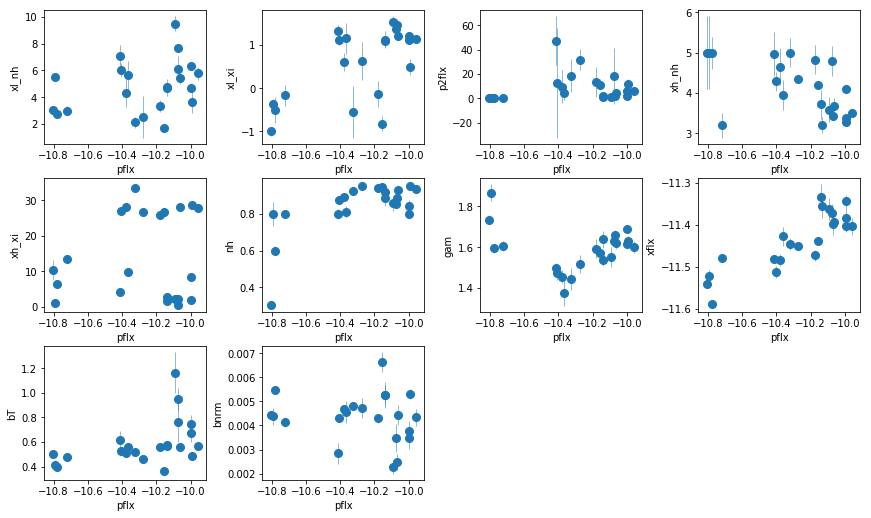

### Content
-


```python
import sys,os
base_dir = '/u/home/abzoghbi/data/ngc4151/spec_analysis'
sys.path.append(base_dir)
from spec_helpers import *
%load_ext autoreload
%autoreload 2
```


```python
### Read useful data from data notebook
data_dir = 'data/xmm'
spec_dir = 'data/xmm_spec'
os.chdir('%s/%s'%(base_dir, data_dir))
data = np.load('log/data.npz')
spec_obsids = data['spec_obsids']
obsids = data['obsids']
spec_data = data['spec_data']
spec_ids = [i+1 for i,o in enumerate(obsids) if o in spec_obsids]
```

---
### Redo the main fit (fit_4c) and include errors of the two strongest lines: fit_4e


```python
os.chdir('%s/%s'%(base_dir, spec_dir))
suff = '4e'
fit_4e = fit_xspec_model('fit_%s'%suff, spec_ids, base_dir)
```


```python
# plot the result #
par_names = ['xl_nh', 'xl_xi', 'xh_nh', 'xh_xi', 'nh', 'cf', 'pflx', 'gam', 'xflx', 
             'bT', 'bnrm', 'g5e', 'g5nrm', 'g9e', 'g9nrm']
fit = fit_4e
fig = plt.figure(figsize=(12,7))
idx = [0,1,2,3,4,5,7,8,9,10,11,12,13,14]; iref = 6
for i,ix in enumerate(idx):
    ax = plt.subplot(3,len(idx)//3+1,i+1)
    plt.errorbar(fit[:,iref,0], fit[:,ix,0], fit[:,ix,1], xerr=fit[:,iref,1], 
                 fmt='o', ms=8, lw=0.5)
    ax.set_xlabel(par_names[iref]); ax.set_ylabel(par_names[ix])
plt.tight_layout(pad=0)
```


```python
x,xe = fit[:,iref,0], fit[:,iref,1]
y,ye = fit[:,1,0], fit[:,1,1]
plt.errorbar(x,y,yerr=ye, fmt='o', ms=8, lw=0.5)
```


    <ErrorbarContainer object of 3 artists>


<br /><br />

---
##  Estimate the PSDs
Do it for the powerlaw flux. Compare bending powerlaw to 0-centered lorentzian. The latter can be used to fit the other parameters, for which the former cannot be constrained.
The bend frequency and lorentzian width are different, so we obtain some calibration factor so for other lorentzian fit, we use it to scale to the commonly used break frequency


```python

fit = fit_4e
ipar = 6
xtime = spec_data[:,0]
param = fit[:,ipar,:2]
isort = np.argsort(xtime)
xtime, param = xtime[isort], param[isort,:].T


fqL = [0.1/(xtime[-1]-xtime[0]), 2./np.diff(xtime).min()]
# bending powerlaw
pm_bpl = plag.PLag('psdf', [xtime], [param[0]], [param[1]], 0.1, fqL, 'rms', 0, 2)
p0 = [-9.4,-2, -3.6]
par_bpl = plag.optimize(pm_bpl, p0)[0]

# 0-centered lorentzian
pm_l0 = plag.PLag('psdf', [xtime], [param[0]], [param[1]], 0.1, fqL, 'rms', 0, 4)
p0 = [-5,-4.]
par_l0 = plag.optimize(pm_l0, p0)[0]

scale_shift = par_bpl[2] - par_l0[1]
print('scale shift: %g'%scale_shift)
# so we have: break = lore_width + scale_shift
```

       1 3.026e-01 3.703e+00   inf | 1.020e+01 |  -9.4    -2  -3.6
       2 1.305e-01 1.951e+00 3.116e-01 | 1.051e+01 | -9.24 -2.46 -2.51
       3 3.142e-02 2.861e-01 3.427e-01 | 1.085e+01 | -9.25 -2.44 -2.84
       4 7.469e-03 1.274e-02 7.924e-03 | 1.086e+01 | -9.24 -2.42 -2.93
       5 1.545e-03 4.994e-03 1.716e-04 | 1.086e+01 | -9.23  -2.4 -2.95
       6 3.114e-04 4.340e-04 7.495e-06 | 1.086e+01 | -9.23  -2.4 -2.95
    ********************
    -9.22946 -2.40171 -2.9538
    0.572789 0.893383 1.35897
    -0.000117633 0.000179097 -0.000433978
    ********************
       1 1.637e-01 9.314e+00   inf | -7.170e-01 |    -5    -4
       2 1.007e-01 7.093e+00 7.107e+00 | 6.390e+00 | -5.82 -4.06
       3 4.256e-02 3.628e+00 3.651e+00 | 1.004e+01 |  -6.4 -4.19
       4 2.749e-02 8.256e-01 8.487e-01 | 1.089e+01 | -6.65 -4.37
       5 8.265e-03 1.323e-01 6.134e-02 | 1.095e+01 | -6.66 -4.49
       6 1.919e-03 2.545e-02 2.535e-03 | 1.095e+01 | -6.65 -4.53
       7 4.407e-04 5.682e-03 1.308e-04 | 1.095e+01 | -6.65 -4.54
       8 1.014e-04 1.299e-03 6.910e-06 | 1.095e+01 | -6.65 -4.54
    ********************
    -6.64514 -4.53801
    0.434769 0.596516
    -1.14667e-05 -0.00129888
    ********************
    scale shift: 1.5842


```python
import emcee
def lnprob(x, mod):
    if x[0] < -11 or x[1]<-11: return -np.inf
    if x[0] >1.7 or x[1]>1.7: return -np.inf
    return mod.logLikelihood(x)

def get_time_scale(ipar, use_opt=True):
    # ipar is the index in fit array
    xtime = spec_data[:,0]
    if isinstance(ipar, list):
        param = fit[:,ipar[0],:2]
        for i in ipar[1:]:
            param[:,0] += fit[:,ipar[i],0]
            param[:,1] = (param[:,1]**2 + fit[:,ipar[i],1]**2)**0.5
    else:
        param = fit[:,ipar,:2]
    isort = np.argsort(xtime)
    xtime, param = xtime[isort], param[isort,:].T
        
    pm_l0 = plag.PLag('psdf', [xtime], [param[0]], [param[1]], 0.1, fqL, 'rms', 0, 4)
    p0 = [-5,-4.]
    p,pe = plag.optimize(pm_l0, p0)[:2]

    # mcmc #
    ndim, nwalkers = 2, 100
    if not use_opt:
        p = np.array([-2., -4])
        pe = np.array([0.1, 0.1])
    p0 = [np.random.rand(ndim)*pe+p for i in range(nwalkers)]

    sampler = emcee.EnsembleSampler(nwalkers, ndim, lnprob, args=[pm_l0])
    _ = sampler.run_mcmc(p0, 1000)
    chains = sampler.flatchain[len(sampler.flatchain)//2:]
    return chains
```


```python
# powerlaw flux #
hist = {}
ipar = 6
chains = get_time_scale(ipar)
ts = np.log10(1./(np.exp(chains[:,1] + scale_shift) ) )
h1 = np.histogram(chains[:,0], 60)
plt.subplot(121)
h2 = plt.hist(chains[:,1], 60)
plt.subplot(122)
hs = plt.hist(ts, 60)
hist[par_names[ipar]] = [h1[:2], h2[:2], hs[:2], chains]
```

       1 1.637e-01 9.314e+00   inf | -7.170e-01 |    -5    -4
       2 1.007e-01 7.093e+00 7.107e+00 | 6.390e+00 | -5.82 -4.06
       3 4.256e-02 3.628e+00 3.651e+00 | 1.004e+01 |  -6.4 -4.19
       4 2.749e-02 8.256e-01 8.487e-01 | 1.089e+01 | -6.65 -4.37
       5 8.265e-03 1.323e-01 6.134e-02 | 1.095e+01 | -6.66 -4.49
       6 1.919e-03 2.545e-02 2.535e-03 | 1.095e+01 | -6.65 -4.53
       7 4.407e-04 5.682e-03 1.308e-04 | 1.095e+01 | -6.65 -4.54
       8 1.014e-04 1.299e-03 6.910e-06 | 1.095e+01 | -6.65 -4.54
    ********************
    -6.64514 -4.53801
    0.434769 0.596516
    -1.14667e-05 -0.00129888
    ********************


```python
# xillver flux #
ipar = 8
chains = get_time_scale(ipar)
ts = np.log10(1./(np.exp(chains[:,1] + scale_shift) ) )
h1 = np.histogram(chains[:,0], 60)
plt.subplot(121)
h2 = plt.hist(chains[:,1], 60)
plt.subplot(122)
hs = plt.hist(ts, 60)
hist[par_names[ipar]] = [h1[:2], h2[:2], hs[:2], chains]
```

       1 1.977e-01 1.068e+01   inf | -1.712e+00 |    -5    -4
       2 1.619e-01 1.018e+01 1.025e+01 | 8.537e+00 | -5.99 -3.98
       3 1.324e-01 9.077e+00 9.185e+00 | 1.772e+01 | -6.96 -3.93
       4 1.022e-01 7.087e+00 7.165e+00 | 2.489e+01 | -7.88  -3.8
       5 8.115e-02 4.352e+00 4.332e+00 | 2.922e+01 | -8.68 -3.58
       6 7.104e-02 1.665e+00 1.649e+00 | 3.087e+01 | -9.26 -3.29
       7 4.090e-02 2.357e-01 2.791e-01 | 3.115e+01 | -9.52 -3.05
       8 2.141e-02 1.319e-01 2.707e-02 | 3.117e+01 | -9.59 -2.93
       9 1.167e-02 7.228e-02 6.106e-03 | 3.118e+01 |  -9.6 -2.87
      10 6.431e-03 3.931e-02 1.764e-03 | 3.118e+01 | -9.61 -2.83
      11 3.549e-03 2.152e-02 5.238e-04 | 3.118e+01 | -9.61 -2.82
      12 1.960e-03 1.183e-02 1.575e-04 | 3.118e+01 | -9.61 -2.81
      13 1.082e-03 6.517e-03 4.770e-05 | 3.118e+01 | -9.61  -2.8
    ********************
    -9.61488 -2.79961
    0.387752 0.708842
    0.00187241 0.00651705
    ********************


```python
# neutral nh #
ipar = 4
chains = get_time_scale(ipar)
ts = np.log10(1./(np.exp(chains[:,1] + scale_shift) ) )
h1 = np.histogram(chains[:,0], 60)
plt.subplot(121)
h2 = plt.hist(chains[:,1], 60)
plt.subplot(122)
hs = plt.hist(ts, 60)
hist[par_names[ipar]] = [h1[:2], h2[:2], hs[:2], chains]
```

       1 7.280e+01 7.717e+02   inf | -8.979e+02 |    -5    -4
       2 7.995e+00 1.061e+02 7.280e+02 | -1.698e+02 |    -3    -6
       3 2.974e+00 2.950e+01 7.013e+01 | -9.971e+01 |    -1    -8
       4 5.483e-01 5.918e+00 3.517e+01 | -6.455e+01 |     1    -6
       5 4.811e-01 2.500e+00 2.460e+00 | -6.209e+01 | 0.452 -6.03
       6 1.074e-01 4.645e-01 3.799e-01 | -6.171e+01 | 0.234 -6.08
       7 6.397e-03 4.865e-02 1.405e-02 | -6.169e+01 | 0.209 -6.12
       8 2.084e-03 6.166e-03 2.254e-04 | -6.169e+01 | 0.211 -6.12
       9 3.243e-04 8.187e-04 4.012e-06 | -6.169e+01 | 0.211 -6.13
    ********************
    0.211003 -6.1263
    0.498517 0.635167
    -0.000526084 -0.000818706
    ********************


```python
# xi_l nh #
ipar = 0
chains = get_time_scale(ipar)
ts = np.log10(1./(np.exp(chains[:,1] + scale_shift) ) )
h1 = np.histogram(chains[:,0], 60)
plt.subplot(121)
h2 = plt.hist(chains[:,1], 60)
plt.subplot(122)
hs = plt.hist(ts, 60)
hist[par_names[ipar]] = [h1[:2], h2[:2], hs[:2], chains]
```

       1 6.918e+00 6.577e+01   inf | -1.981e+02 |    -5    -4
       2 2.060e+00 3.353e+01 1.274e+02 | -7.072e+01 |    -3    -2
       3   inf 2.297e+00 2.478e+01 | -4.594e+01 |    -1     0
       4 1.429e+00 3.119e-01 3.158e-01 | -4.562e+01 | -1.24 -0.0543
       5 5.603e-01 1.961e-02 6.727e-03 | -4.562e+01 | -1.28 -0.132
       6 3.602e-01 2.202e-02 1.535e-03 | -4.561e+01 | -1.29 -0.206
       7 2.876e-01 2.623e-02 1.775e-03 | -4.561e+01 | -1.29 -0.28
       8 2.550e-01 3.301e-02 2.372e-03 | -4.561e+01 |  -1.3 -0.36
       9 2.359e-01 4.276e-02 3.474e-03 | -4.561e+01 |  -1.3 -0.452
      10 2.153e-01 5.476e-02 5.217e-03 | -4.560e+01 | -1.31 -0.559
      11 1.817e-01 6.490e-02 7.273e-03 | -4.559e+01 | -1.31 -0.679
      12 1.334e-01 6.538e-02 8.187e-03 | -4.559e+01 | -1.31 -0.802
      13 8.311e-02 5.246e-02 6.444e-03 | -4.558e+01 | -1.31 -0.909
      14 4.512e-02 3.368e-02 3.310e-03 | -4.558e+01 | -1.31 -0.985
      15 2.249e-02 1.845e-02 1.170e-03 | -4.557e+01 | -1.31 -1.03
      16 1.072e-02 9.231e-03 3.218e-04 | -4.557e+01 | -1.31 -1.05
      17 5.005e-03 4.411e-03 7.707e-05 | -4.557e+01 | -1.31 -1.06
    ********************
    -1.31356 -1.0638
    0.326303 1.10023
    -0.000528733 -0.00441064
    ********************


    /u/home/abzoghbi/soft/etc/python/plag/plag.py:545: RuntimeWarning: divide by zero encountered in true_divide
      absmax = np.max(np.abs(dpar/tmpp))


```python
# xi_l xi #
ipar = 1
chains = get_time_scale(ipar, use_opt=False)
ts = np.log10(1./(np.exp(chains[:,1] + scale_shift) ) )
h1 = np.histogram(chains[:,0], 60)
plt.subplot(121)
h2 = plt.hist(chains[:,1], 60)
plt.subplot(122)
hs = plt.hist(ts, 60)
hist[par_names[ipar]] = [h1[:2], h2[:2], hs[:2], chains]
```

       1 4.930e+01 4.911e+01   inf | -2.813e+02 |    -5    -4
       2 8.638e+00 5.497e+01 1.103e+02 | -1.711e+02 |    -3    -2
       3   inf 2.616e+01 1.285e+02 | -4.257e+01 |    -1     0
       4 3.413e+01 4.926e-01 1.895e+01 | -2.362e+01 |     1     2
       5 5.654e+02 2.192e+00 -2.692e-01 | -2.389e+01 |     3     4
       6 1.773e+04 2.265e+00 -2.046e-02 | -2.391e+01 |     5     6
       7 6.796e+05 2.267e+00 -3.868e-04 | -2.391e+01 |     7     8
       8 7.067e+05 2.267e+00 -7.088e-06 | -2.391e+01 |     9    10
    ********************
       9   10
    2.37266e+07 2.37266e+07
    -2.26664 2.26664
    ********************


```python
# xi_h nh #
ipar = 2
chains = get_time_scale(ipar, use_opt=True)
ts = np.log10(1./(np.exp(chains[:,1] + scale_shift) ) )
h1 = np.histogram(chains[:,0], 60)
plt.subplot(121)
h2 = plt.hist(chains[:,1], 60)
plt.subplot(122)
hs = plt.hist(ts, 60)
hist[par_names[ipar]] = [h1[:2], h2[:2], hs[:2], chains]
```

       1 4.956e+01 2.095e+02   inf | -3.836e+02 |    -5    -4
       2 1.858e+01 6.386e+01 2.455e+02 | -1.381e+02 |    -3    -2
       3 2.219e+00 7.147e+00 6.263e+01 | -7.548e+01 |    -1    -4
       4 5.446e-01 2.801e+00 3.156e+00 | -7.233e+01 |     1    -6
       5 4.852e-01 9.756e-01 1.123e+00 | -7.121e+01 | 0.455 -6.12
       6 1.003e-01 9.859e-02 1.264e-01 | -7.108e+01 | 0.234 -6.17
       7 2.271e-03 1.308e-03 1.205e-03 | -7.108e+01 | 0.211 -6.17
       8 1.881e-04 1.777e-04 5.056e-07 | -7.108e+01 | 0.211 -6.17
    ********************
    0.21141 -6.17164
    0.548277 1.12758
    -1.7852e-05 -0.000177658
    ********************


```python
# xi_h xi #
ipar = 3
chains = get_time_scale(ipar, use_opt=False)
ts = np.log10(1./(np.exp(chains[:,1] + scale_shift) ) )
h1 = np.histogram(chains[:,0], 60)
plt.subplot(121)
h2 = plt.hist(chains[:,1], 60)
plt.subplot(122)
hs = plt.hist(ts, 60)
hist[par_names[ipar]] = [h1[:2], h2[:2], hs[:2], chains]
```

       1 1.031e+00 1.233e+01   inf | -3.671e+01 |    -5    -4
       2 1.662e-01 9.818e-01 1.067e+01 | -2.604e+01 |    -3 -4.34
       3 1.669e-01 8.963e-01 6.164e-01 | -2.543e+01 | -3.13 -3.62
       4 2.358e-01 9.924e-01 5.412e-01 | -2.489e+01 | -3.16 -3.02
       5 4.553e-01 1.224e+00 7.806e-01 | -2.411e+01 | -3.18 -2.31
       6 1.660e+00 1.123e+00 1.283e+00 | -2.282e+01 |  -3.2 -1.26
       7 2.060e+00 4.153e-01 9.244e-01 | -2.190e+01 | -3.17 0.744
       8 5.270e+00 1.583e+00 -6.401e-01 | -2.254e+01 | -3.43 -0.788
       9 1.840e+01 1.474e-01 6.401e-01 | -2.190e+01 | -3.02  1.21
      10 2.241e+01 1.516e+01 -1.343e+01 | -3.533e+01 | -5.02 -0.788
      11 1.840e+01 1.474e-01 1.343e+01 | -2.190e+01 | -3.02  1.21
      12 2.241e+01 1.516e+01 -1.343e+01 | -3.533e+01 | -5.02 -0.788
      13 1.840e+01 1.474e-01 1.343e+01 | -2.190e+01 | -3.02  1.21
      14 2.241e+01 1.516e+01 -1.343e+01 | -3.533e+01 | -5.02 -0.788
      15 1.840e+01 1.474e-01 1.343e+01 | -2.190e+01 | -3.02  1.21
      16 2.241e+01 1.516e+01 -1.343e+01 | -3.533e+01 | -5.02 -0.788
      17 1.840e+01 1.474e-01 1.343e+01 | -2.190e+01 | -3.02  1.21
      18 2.241e+01 1.516e+01 -1.343e+01 | -3.533e+01 | -5.02 -0.788
      19 1.840e+01 1.474e-01 1.343e+01 | -2.190e+01 | -3.02  1.21
      20 2.241e+01 1.516e+01 -1.343e+01 | -3.533e+01 | -5.02 -0.788
      21 1.840e+01 1.474e-01 1.343e+01 | -2.190e+01 | -3.02  1.21
      22 2.241e+01 1.516e+01 -1.343e+01 | -3.533e+01 | -5.02 -0.788
      23 1.840e+01 1.474e-01 1.343e+01 | -2.190e+01 | -3.02  1.21
      24 2.241e+01 1.516e+01 -1.343e+01 | -3.533e+01 | -5.02 -0.788
      25 1.840e+01 1.474e-01 1.343e+01 | -2.190e+01 | -3.02  1.21
      26 2.241e+01 1.516e+01 -1.343e+01 | -3.533e+01 | -5.02 -0.788
      27 1.840e+01 1.474e-01 1.343e+01 | -2.190e+01 | -3.02  1.21
      28 2.241e+01 1.516e+01 -1.343e+01 | -3.533e+01 | -5.02 -0.788
      29 1.840e+01 1.474e-01 1.343e+01 | -2.190e+01 | -3.02  1.21
      30 2.241e+01 1.516e+01 -1.343e+01 | -3.533e+01 | -5.02 -0.788
      31 1.840e+01 1.474e-01 1.343e+01 | -2.190e+01 | -3.02  1.21
      32 2.241e+01 1.516e+01 -1.343e+01 | -3.533e+01 | -5.02 -0.788
      33 1.840e+01 1.474e-01 1.343e+01 | -2.190e+01 | -3.02  1.21
      34 2.241e+01 1.516e+01 -1.343e+01 | -3.533e+01 | -5.02 -0.788
      35 1.840e+01 1.474e-01 1.343e+01 | -2.190e+01 | -3.02  1.21
      36 2.241e+01 1.516e+01 -1.343e+01 | -3.533e+01 | -5.02 -0.788
      37 1.840e+01 1.474e-01 1.343e+01 | -2.190e+01 | -3.02  1.21
      38 2.241e+01 1.516e+01 -1.343e+01 | -3.533e+01 | -5.02 -0.788
      39 1.840e+01 1.474e-01 1.343e+01 | -2.190e+01 | -3.02  1.21
      40 2.241e+01 1.516e+01 -1.343e+01 | -3.533e+01 | -5.02 -0.788
      41 1.840e+01 1.474e-01 1.343e+01 | -2.190e+01 | -3.02  1.21
      42 2.241e+01 1.516e+01 -1.343e+01 | -3.533e+01 | -5.02 -0.788
      43 1.840e+01 1.474e-01 1.343e+01 | -2.190e+01 | -3.02  1.21
      44 2.241e+01 1.516e+01 -1.343e+01 | -3.533e+01 | -5.02 -0.788
      45 1.840e+01 1.474e-01 1.343e+01 | -2.190e+01 | -3.02  1.21
      46 2.241e+01 1.516e+01 -1.343e+01 | -3.533e+01 | -5.02 -0.788
      47 1.840e+01 1.474e-01 1.343e+01 | -2.190e+01 | -3.02  1.21
      48 2.241e+01 1.516e+01 -1.343e+01 | -3.533e+01 | -5.02 -0.788
      49 1.840e+01 1.474e-01 1.343e+01 | -2.190e+01 | -3.02  1.21
      50 2.241e+01 1.516e+01 -1.343e+01 | -3.533e+01 | -5.02 -0.788
      51 1.840e+01 1.474e-01 1.343e+01 | -2.190e+01 | -3.02  1.21
      52 2.241e+01 1.516e+01 -1.343e+01 | -3.533e+01 | -5.02 -0.788
      53 1.840e+01 1.474e-01 1.343e+01 | -2.190e+01 | -3.02  1.21
      54 2.241e+01 1.516e+01 -1.343e+01 | -3.533e+01 | -5.02 -0.788
      55 1.840e+01 1.474e-01 1.343e+01 | -2.190e+01 | -3.02  1.21
      56 2.241e+01 1.516e+01 -1.343e+01 | -3.533e+01 | -5.02 -0.788
      57 1.840e+01 1.474e-01 1.343e+01 | -2.190e+01 | -3.02  1.21
      58 2.241e+01 1.516e+01 -1.343e+01 | -3.533e+01 | -5.02 -0.788
      59 1.840e+01 1.474e-01 1.343e+01 | -2.190e+01 | -3.02  1.21
      60 2.241e+01 1.516e+01 -1.343e+01 | -3.533e+01 | -5.02 -0.788
      61 1.840e+01 1.474e-01 1.343e+01 | -2.190e+01 | -3.02  1.21
      62 2.241e+01 1.516e+01 -1.343e+01 | -3.533e+01 | -5.02 -0.788
      63 1.840e+01 1.474e-01 1.343e+01 | -2.190e+01 | -3.02  1.21
      64 2.241e+01 1.516e+01 -1.343e+01 | -3.533e+01 | -5.02 -0.788
      65 1.840e+01 1.474e-01 1.343e+01 | -2.190e+01 | -3.02  1.21
      66 2.241e+01 1.516e+01 -1.343e+01 | -3.533e+01 | -5.02 -0.788
      67 1.840e+01 1.474e-01 1.343e+01 | -2.190e+01 | -3.02  1.21
      68 2.241e+01 1.516e+01 -1.343e+01 | -3.533e+01 | -5.02 -0.788
      69 1.840e+01 1.474e-01 1.343e+01 | -2.190e+01 | -3.02  1.21
      70 2.241e+01 1.516e+01 -1.343e+01 | -3.533e+01 | -5.02 -0.788
      71 1.840e+01 1.474e-01 1.343e+01 | -2.190e+01 | -3.02  1.21
      72 2.241e+01 1.516e+01 -1.343e+01 | -3.533e+01 | -5.02 -0.788
      73 1.840e+01 1.474e-01 1.343e+01 | -2.190e+01 | -3.02  1.21
      74 2.241e+01 1.516e+01 -1.343e+01 | -3.533e+01 | -5.02 -0.788
      75 1.840e+01 1.474e-01 1.343e+01 | -2.190e+01 | -3.02  1.21
      76 2.241e+01 1.516e+01 -1.343e+01 | -3.533e+01 | -5.02 -0.788
      77 1.840e+01 1.474e-01 1.343e+01 | -2.190e+01 | -3.02  1.21
      78 2.241e+01 1.516e+01 -1.343e+01 | -3.533e+01 | -5.02 -0.788
      79 1.840e+01 1.474e-01 1.343e+01 | -2.190e+01 | -3.02  1.21
      80 2.241e+01 1.516e+01 -1.343e+01 | -3.533e+01 | -5.02 -0.788
      81 1.840e+01 1.474e-01 1.343e+01 | -2.190e+01 | -3.02  1.21
      82 2.241e+01 1.516e+01 -1.343e+01 | -3.533e+01 | -5.02 -0.788
      83 1.840e+01 1.474e-01 1.343e+01 | -2.190e+01 | -3.02  1.21
      84 2.241e+01 1.516e+01 -1.343e+01 | -3.533e+01 | -5.02 -0.788
      85 1.840e+01 1.474e-01 1.343e+01 | -2.190e+01 | -3.02  1.21
      86 2.241e+01 1.516e+01 -1.343e+01 | -3.533e+01 | -5.02 -0.788
      87 1.840e+01 1.474e-01 1.343e+01 | -2.190e+01 | -3.02  1.21
      88 2.241e+01 1.516e+01 -1.343e+01 | -3.533e+01 | -5.02 -0.788
      89 1.840e+01 1.474e-01 1.343e+01 | -2.190e+01 | -3.02  1.21
      90 2.241e+01 1.516e+01 -1.343e+01 | -3.533e+01 | -5.02 -0.788
      91 1.840e+01 1.474e-01 1.343e+01 | -2.190e+01 | -3.02  1.21
      92 2.241e+01 1.516e+01 -1.343e+01 | -3.533e+01 | -5.02 -0.788
      93 1.840e+01 1.474e-01 1.343e+01 | -2.190e+01 | -3.02  1.21
      94 2.241e+01 1.516e+01 -1.343e+01 | -3.533e+01 | -5.02 -0.788
      95 1.840e+01 1.474e-01 1.343e+01 | -2.190e+01 | -3.02  1.21
      96 2.241e+01 1.516e+01 -1.343e+01 | -3.533e+01 | -5.02 -0.788
      97 1.840e+01 1.474e-01 1.343e+01 | -2.190e+01 | -3.02  1.21
      98 2.241e+01 1.516e+01 -1.343e+01 | -3.533e+01 | -5.02 -0.788
      99 1.840e+01 1.474e-01 1.343e+01 | -2.190e+01 | -3.02  1.21
     100 2.241e+01 1.516e+01 -1.343e+01 | -3.533e+01 | -5.02 -0.788
     101 1.840e+01 1.474e-01 1.343e+01 | -2.190e+01 | -3.02  1.21
     102 2.241e+01 1.516e+01 -1.343e+01 | -3.533e+01 | -5.02 -0.788
     103 1.840e+01 1.474e-01 1.343e+01 | -2.190e+01 | -3.02  1.21
     104 2.241e+01 1.516e+01 -1.343e+01 | -3.533e+01 | -5.02 -0.788
     105 1.840e+01 1.474e-01 1.343e+01 | -2.190e+01 | -3.02  1.21
     106 2.241e+01 1.516e+01 -1.343e+01 | -3.533e+01 | -5.02 -0.788
     107 1.840e+01 1.474e-01 1.343e+01 | -2.190e+01 | -3.02  1.21
     108 2.241e+01 1.516e+01 -1.343e+01 | -3.533e+01 | -5.02 -0.788
     109 1.840e+01 1.474e-01 1.343e+01 | -2.190e+01 | -3.02  1.21
     110 2.241e+01 1.516e+01 -1.343e+01 | -3.533e+01 | -5.02 -0.788
     111 1.840e+01 1.474e-01 1.343e+01 | -2.190e+01 | -3.02  1.21
     112 2.241e+01 1.516e+01 -1.343e+01 | -3.533e+01 | -5.02 -0.788
     113 1.840e+01 1.474e-01 1.343e+01 | -2.190e+01 | -3.02  1.21
     114 2.241e+01 1.516e+01 -1.343e+01 | -3.533e+01 | -5.02 -0.788
     115 1.840e+01 1.474e-01 1.343e+01 | -2.190e+01 | -3.02  1.21
     116 2.241e+01 1.516e+01 -1.343e+01 | -3.533e+01 | -5.02 -0.788
     117 1.840e+01 1.474e-01 1.343e+01 | -2.190e+01 | -3.02  1.21
     118 2.241e+01 1.516e+01 -1.343e+01 | -3.533e+01 | -5.02 -0.788
     119 1.840e+01 1.474e-01 1.343e+01 | -2.190e+01 | -3.02  1.21
     120 2.241e+01 1.516e+01 -1.343e+01 | -3.533e+01 | -5.02 -0.788
     121 1.840e+01 1.474e-01 1.343e+01 | -2.190e+01 | -3.02  1.21
     122 2.241e+01 1.516e+01 -1.343e+01 | -3.533e+01 | -5.02 -0.788
     123 1.840e+01 1.474e-01 1.343e+01 | -2.190e+01 | -3.02  1.21
     124 2.241e+01 1.516e+01 -1.343e+01 | -3.533e+01 | -5.02 -0.788
     125 1.840e+01 1.474e-01 1.343e+01 | -2.190e+01 | -3.02  1.21
     126 2.241e+01 1.516e+01 -1.343e+01 | -3.533e+01 | -5.02 -0.788
     127 1.840e+01 1.474e-01 1.343e+01 | -2.190e+01 | -3.02  1.21
     128 2.241e+01 1.516e+01 -1.343e+01 | -3.533e+01 | -5.02 -0.788
     129 1.840e+01 1.474e-01 1.343e+01 | -2.190e+01 | -3.02  1.21
     130 2.241e+01 1.516e+01 -1.343e+01 | -3.533e+01 | -5.02 -0.788
     131 1.840e+01 1.474e-01 1.343e+01 | -2.190e+01 | -3.02  1.21
     132 2.241e+01 1.516e+01 -1.343e+01 | -3.533e+01 | -5.02 -0.788
     133 1.840e+01 1.474e-01 1.343e+01 | -2.190e+01 | -3.02  1.21
     134 2.241e+01 1.516e+01 -1.343e+01 | -3.533e+01 | -5.02 -0.788
     135 1.840e+01 1.474e-01 1.343e+01 | -2.190e+01 | -3.02  1.21
     136 2.241e+01 1.516e+01 -1.343e+01 | -3.533e+01 | -5.02 -0.788
     137 1.840e+01 1.474e-01 1.343e+01 | -2.190e+01 | -3.02  1.21
     138 2.241e+01 1.516e+01 -1.343e+01 | -3.533e+01 | -5.02 -0.788
     139 1.840e+01 1.474e-01 1.343e+01 | -2.190e+01 | -3.02  1.21
     140 2.241e+01 1.516e+01 -1.343e+01 | -3.533e+01 | -5.02 -0.788
     141 1.840e+01 1.474e-01 1.343e+01 | -2.190e+01 | -3.02  1.21
     142 2.241e+01 1.516e+01 -1.343e+01 | -3.533e+01 | -5.02 -0.788
     143 1.840e+01 1.474e-01 1.343e+01 | -2.190e+01 | -3.02  1.21
     144 2.241e+01 1.516e+01 -1.343e+01 | -3.533e+01 | -5.02 -0.788
     145 1.840e+01 1.474e-01 1.343e+01 | -2.190e+01 | -3.02  1.21
     146 2.241e+01 1.516e+01 -1.343e+01 | -3.533e+01 | -5.02 -0.788
     147 1.840e+01 1.474e-01 1.343e+01 | -2.190e+01 | -3.02  1.21
     148 2.241e+01 1.516e+01 -1.343e+01 | -3.533e+01 | -5.02 -0.788
     149 1.840e+01 1.474e-01 1.343e+01 | -2.190e+01 | -3.02  1.21
     150 2.241e+01 1.516e+01 -1.343e+01 | -3.533e+01 | -5.02 -0.788
     151 1.840e+01 1.474e-01 1.343e+01 | -2.190e+01 | -3.02  1.21
     152 2.241e+01 1.516e+01 -1.343e+01 | -3.533e+01 | -5.02 -0.788
     153 1.840e+01 1.474e-01 1.343e+01 | -2.190e+01 | -3.02  1.21
     154 2.241e+01 1.516e+01 -1.343e+01 | -3.533e+01 | -5.02 -0.788
     155 1.840e+01 1.474e-01 1.343e+01 | -2.190e+01 | -3.02  1.21
     156 2.241e+01 1.516e+01 -1.343e+01 | -3.533e+01 | -5.02 -0.788
     157 1.840e+01 1.474e-01 1.343e+01 | -2.190e+01 | -3.02  1.21
     158 2.241e+01 1.516e+01 -1.343e+01 | -3.533e+01 | -5.02 -0.788
     159 1.840e+01 1.474e-01 1.343e+01 | -2.190e+01 | -3.02  1.21
     160 2.241e+01 1.516e+01 -1.343e+01 | -3.533e+01 | -5.02 -0.788
     161 1.840e+01 1.474e-01 1.343e+01 | -2.190e+01 | -3.02  1.21
     162 2.241e+01 1.516e+01 -1.343e+01 | -3.533e+01 | -5.02 -0.788
     163 1.840e+01 1.474e-01 1.343e+01 | -2.190e+01 | -3.02  1.21
     164 2.241e+01 1.516e+01 -1.343e+01 | -3.533e+01 | -5.02 -0.788
     165 1.840e+01 1.474e-01 1.343e+01 | -2.190e+01 | -3.02  1.21
     166 2.241e+01 1.516e+01 -1.343e+01 | -3.533e+01 | -5.02 -0.788
     167 1.840e+01 1.474e-01 1.343e+01 | -2.190e+01 | -3.02  1.21
     168 2.241e+01 1.516e+01 -1.343e+01 | -3.533e+01 | -5.02 -0.788
     169 1.840e+01 1.474e-01 1.343e+01 | -2.190e+01 | -3.02  1.21
     170 2.241e+01 1.516e+01 -1.343e+01 | -3.533e+01 | -5.02 -0.788
     171 1.840e+01 1.474e-01 1.343e+01 | -2.190e+01 | -3.02  1.21
     172 2.241e+01 1.516e+01 -1.343e+01 | -3.533e+01 | -5.02 -0.788
     173 1.840e+01 1.474e-01 1.343e+01 | -2.190e+01 | -3.02  1.21
     174 2.241e+01 1.516e+01 -1.343e+01 | -3.533e+01 | -5.02 -0.788
     175 1.840e+01 1.474e-01 1.343e+01 | -2.190e+01 | -3.02  1.21
     176 2.241e+01 1.516e+01 -1.343e+01 | -3.533e+01 | -5.02 -0.788
     177 1.840e+01 1.474e-01 1.343e+01 | -2.190e+01 | -3.02  1.21
     178 2.241e+01 1.516e+01 -1.343e+01 | -3.533e+01 | -5.02 -0.788
     179 1.840e+01 1.474e-01 1.343e+01 | -2.190e+01 | -3.02  1.21
     180 2.241e+01 1.516e+01 -1.343e+01 | -3.533e+01 | -5.02 -0.788
     181 1.840e+01 1.474e-01 1.343e+01 | -2.190e+01 | -3.02  1.21
     182 2.241e+01 1.516e+01 -1.343e+01 | -3.533e+01 | -5.02 -0.788
     183 1.840e+01 1.474e-01 1.343e+01 | -2.190e+01 | -3.02  1.21
     184 2.241e+01 1.516e+01 -1.343e+01 | -3.533e+01 | -5.02 -0.788
     185 1.840e+01 1.474e-01 1.343e+01 | -2.190e+01 | -3.02  1.21
     186 2.241e+01 1.516e+01 -1.343e+01 | -3.533e+01 | -5.02 -0.788
     187 1.840e+01 1.474e-01 1.343e+01 | -2.190e+01 | -3.02  1.21
     188 2.241e+01 1.516e+01 -1.343e+01 | -3.533e+01 | -5.02 -0.788
     189 1.840e+01 1.474e-01 1.343e+01 | -2.190e+01 | -3.02  1.21
     190 2.241e+01 1.516e+01 -1.343e+01 | -3.533e+01 | -5.02 -0.788
     191 1.840e+01 1.474e-01 1.343e+01 | -2.190e+01 | -3.02  1.21
     192 2.241e+01 1.516e+01 -1.343e+01 | -3.533e+01 | -5.02 -0.788
     193 1.840e+01 1.474e-01 1.343e+01 | -2.190e+01 | -3.02  1.21
     194 2.241e+01 1.516e+01 -1.343e+01 | -3.533e+01 | -5.02 -0.788
     195 1.840e+01 1.474e-01 1.343e+01 | -2.190e+01 | -3.02  1.21
     196 2.241e+01 1.516e+01 -1.343e+01 | -3.533e+01 | -5.02 -0.788
     197 1.840e+01 1.474e-01 1.343e+01 | -2.190e+01 | -3.02  1.21
     198 2.241e+01 1.516e+01 -1.343e+01 | -3.533e+01 | -5.02 -0.788
     199 1.840e+01 1.474e-01 1.343e+01 | -2.190e+01 | -3.02  1.21
     200 2.241e+01 1.516e+01 -1.343e+01 | -3.533e+01 | -5.02 -0.788
     201 1.840e+01 1.474e-01 1.343e+01 | -2.190e+01 | -3.02  1.21
     202 2.241e+01 1.516e+01 -1.343e+01 | -3.533e+01 | -5.02 -0.788
     203 1.840e+01 1.474e-01 1.343e+01 | -2.190e+01 | -3.02  1.21
     204 2.241e+01 1.516e+01 -1.343e+01 | -3.533e+01 | -5.02 -0.788
     205 1.840e+01 1.474e-01 1.343e+01 | -2.190e+01 | -3.02  1.21
     206 2.241e+01 1.516e+01 -1.343e+01 | -3.533e+01 | -5.02 -0.788
     207 1.840e+01 1.474e-01 1.343e+01 | -2.190e+01 | -3.02  1.21
     208 2.241e+01 1.516e+01 -1.343e+01 | -3.533e+01 | -5.02 -0.788
     209 1.840e+01 1.474e-01 1.343e+01 | -2.190e+01 | -3.02  1.21
     210 2.241e+01 1.516e+01 -1.343e+01 | -3.533e+01 | -5.02 -0.788
     211 1.840e+01 1.474e-01 1.343e+01 | -2.190e+01 | -3.02  1.21
     212 2.241e+01 1.516e+01 -1.343e+01 | -3.533e+01 | -5.02 -0.788
     213 1.840e+01 1.474e-01 1.343e+01 | -2.190e+01 | -3.02  1.21
     214 2.241e+01 1.516e+01 -1.343e+01 | -3.533e+01 | -5.02 -0.788
     215 1.840e+01 1.474e-01 1.343e+01 | -2.190e+01 | -3.02  1.21
     216 2.241e+01 1.516e+01 -1.343e+01 | -3.533e+01 | -5.02 -0.788
     217 1.840e+01 1.474e-01 1.343e+01 | -2.190e+01 | -3.02  1.21
     218 2.241e+01 1.516e+01 -1.343e+01 | -3.533e+01 | -5.02 -0.788
     219 1.840e+01 1.474e-01 1.343e+01 | -2.190e+01 | -3.02  1.21
     220 2.241e+01 1.516e+01 -1.343e+01 | -3.533e+01 | -5.02 -0.788
     221 1.840e+01 1.474e-01 1.343e+01 | -2.190e+01 | -3.02  1.21
     222 2.241e+01 1.516e+01 -1.343e+01 | -3.533e+01 | -5.02 -0.788
     223 1.840e+01 1.474e-01 1.343e+01 | -2.190e+01 | -3.02  1.21
     224 2.241e+01 1.516e+01 -1.343e+01 | -3.533e+01 | -5.02 -0.788
     225 1.840e+01 1.474e-01 1.343e+01 | -2.190e+01 | -3.02  1.21
     226 2.241e+01 1.516e+01 -1.343e+01 | -3.533e+01 | -5.02 -0.788
     227 1.840e+01 1.474e-01 1.343e+01 | -2.190e+01 | -3.02  1.21
     228 2.241e+01 1.516e+01 -1.343e+01 | -3.533e+01 | -5.02 -0.788
     229 1.840e+01 1.474e-01 1.343e+01 | -2.190e+01 | -3.02  1.21
     230 2.241e+01 1.516e+01 -1.343e+01 | -3.533e+01 | -5.02 -0.788
     231 1.840e+01 1.474e-01 1.343e+01 | -2.190e+01 | -3.02  1.21
     232 2.241e+01 1.516e+01 -1.343e+01 | -3.533e+01 | -5.02 -0.788
     233 1.840e+01 1.474e-01 1.343e+01 | -2.190e+01 | -3.02  1.21
     234 2.241e+01 1.516e+01 -1.343e+01 | -3.533e+01 | -5.02 -0.788
     235 1.840e+01 1.474e-01 1.343e+01 | -2.190e+01 | -3.02  1.21
     236 2.241e+01 1.516e+01 -1.343e+01 | -3.533e+01 | -5.02 -0.788
     237 1.840e+01 1.474e-01 1.343e+01 | -2.190e+01 | -3.02  1.21
     238 2.241e+01 1.516e+01 -1.343e+01 | -3.533e+01 | -5.02 -0.788
     239 1.840e+01 1.474e-01 1.343e+01 | -2.190e+01 | -3.02  1.21
     240 2.241e+01 1.516e+01 -1.343e+01 | -3.533e+01 | -5.02 -0.788
     241 1.840e+01 1.474e-01 1.343e+01 | -2.190e+01 | -3.02  1.21
     242 2.241e+01 1.516e+01 -1.343e+01 | -3.533e+01 | -5.02 -0.788
     243 1.840e+01 1.474e-01 1.343e+01 | -2.190e+01 | -3.02  1.21
     244 2.241e+01 1.516e+01 -1.343e+01 | -3.533e+01 | -5.02 -0.788
     245 1.840e+01 1.474e-01 1.343e+01 | -2.190e+01 | -3.02  1.21
     246 2.241e+01 1.516e+01 -1.343e+01 | -3.533e+01 | -5.02 -0.788
     247 1.840e+01 1.474e-01 1.343e+01 | -2.190e+01 | -3.02  1.21
     248 2.241e+01 1.516e+01 -1.343e+01 | -3.533e+01 | -5.02 -0.788
     249 1.840e+01 1.474e-01 1.343e+01 | -2.190e+01 | -3.02  1.21
     250 2.241e+01 1.516e+01 -1.343e+01 | -3.533e+01 | -5.02 -0.788
     251 1.840e+01 1.474e-01 1.343e+01 | -2.190e+01 | -3.02  1.21
     252 2.241e+01 1.516e+01 -1.343e+01 | -3.533e+01 | -5.02 -0.788
     253 1.840e+01 1.474e-01 1.343e+01 | -2.190e+01 | -3.02  1.21
     254 2.241e+01 1.516e+01 -1.343e+01 | -3.533e+01 | -5.02 -0.788
     255 1.840e+01 1.474e-01 1.343e+01 | -2.190e+01 | -3.02  1.21
     256 2.241e+01 1.516e+01 -1.343e+01 | -3.533e+01 | -5.02 -0.788
     257 1.840e+01 1.474e-01 1.343e+01 | -2.190e+01 | -3.02  1.21
     258 2.241e+01 1.516e+01 -1.343e+01 | -3.533e+01 | -5.02 -0.788
     259 1.840e+01 1.474e-01 1.343e+01 | -2.190e+01 | -3.02  1.21
     260 2.241e+01 1.516e+01 -1.343e+01 | -3.533e+01 | -5.02 -0.788
     261 1.840e+01 1.474e-01 1.343e+01 | -2.190e+01 | -3.02  1.21
     262 2.241e+01 1.516e+01 -1.343e+01 | -3.533e+01 | -5.02 -0.788
     263 1.840e+01 1.474e-01 1.343e+01 | -2.190e+01 | -3.02  1.21
     264 2.241e+01 1.516e+01 -1.343e+01 | -3.533e+01 | -5.02 -0.788
     265 1.840e+01 1.474e-01 1.343e+01 | -2.190e+01 | -3.02  1.21
     266 2.241e+01 1.516e+01 -1.343e+01 | -3.533e+01 | -5.02 -0.788
     267 1.840e+01 1.474e-01 1.343e+01 | -2.190e+01 | -3.02  1.21
     268 2.241e+01 1.516e+01 -1.343e+01 | -3.533e+01 | -5.02 -0.788
     269 1.840e+01 1.474e-01 1.343e+01 | -2.190e+01 | -3.02  1.21
     270 2.241e+01 1.516e+01 -1.343e+01 | -3.533e+01 | -5.02 -0.788
     271 1.840e+01 1.474e-01 1.343e+01 | -2.190e+01 | -3.02  1.21
     272 2.241e+01 1.516e+01 -1.343e+01 | -3.533e+01 | -5.02 -0.788
     273 1.840e+01 1.474e-01 1.343e+01 | -2.190e+01 | -3.02  1.21
     274 2.241e+01 1.516e+01 -1.343e+01 | -3.533e+01 | -5.02 -0.788
     275 1.840e+01 1.474e-01 1.343e+01 | -2.190e+01 | -3.02  1.21
     276 2.241e+01 1.516e+01 -1.343e+01 | -3.533e+01 | -5.02 -0.788
     277 1.840e+01 1.474e-01 1.343e+01 | -2.190e+01 | -3.02  1.21
     278 2.241e+01 1.516e+01 -1.343e+01 | -3.533e+01 | -5.02 -0.788
     279 1.840e+01 1.474e-01 1.343e+01 | -2.190e+01 | -3.02  1.21
     280 2.241e+01 1.516e+01 -1.343e+01 | -3.533e+01 | -5.02 -0.788
     281 1.840e+01 1.474e-01 1.343e+01 | -2.190e+01 | -3.02  1.21
     282 2.241e+01 1.516e+01 -1.343e+01 | -3.533e+01 | -5.02 -0.788
     283 1.840e+01 1.474e-01 1.343e+01 | -2.190e+01 | -3.02  1.21
     284 2.241e+01 1.516e+01 -1.343e+01 | -3.533e+01 | -5.02 -0.788
     285 1.840e+01 1.474e-01 1.343e+01 | -2.190e+01 | -3.02  1.21
     286 2.241e+01 1.516e+01 -1.343e+01 | -3.533e+01 | -5.02 -0.788
     287 1.840e+01 1.474e-01 1.343e+01 | -2.190e+01 | -3.02  1.21
     288 2.241e+01 1.516e+01 -1.343e+01 | -3.533e+01 | -5.02 -0.788
     289 1.840e+01 1.474e-01 1.343e+01 | -2.190e+01 | -3.02  1.21
     290 2.241e+01 1.516e+01 -1.343e+01 | -3.533e+01 | -5.02 -0.788
     291 1.840e+01 1.474e-01 1.343e+01 | -2.190e+01 | -3.02  1.21
     292 2.241e+01 1.516e+01 -1.343e+01 | -3.533e+01 | -5.02 -0.788
     293 1.840e+01 1.474e-01 1.343e+01 | -2.190e+01 | -3.02  1.21
     294 2.241e+01 1.516e+01 -1.343e+01 | -3.533e+01 | -5.02 -0.788
     295 1.840e+01 1.474e-01 1.343e+01 | -2.190e+01 | -3.02  1.21
     296 2.241e+01 1.516e+01 -1.343e+01 | -3.533e+01 | -5.02 -0.788
     297 1.840e+01 1.474e-01 1.343e+01 | -2.190e+01 | -3.02  1.21
     298 2.241e+01 1.516e+01 -1.343e+01 | -3.533e+01 | -5.02 -0.788
     299 1.840e+01 1.474e-01 1.343e+01 | -2.190e+01 | -3.02  1.21
     300 2.241e+01 1.516e+01 -1.343e+01 | -3.533e+01 | -5.02 -0.788
     301 1.840e+01 1.474e-01 1.343e+01 | -2.190e+01 | -3.02  1.21
     302 2.241e+01 1.516e+01 -1.343e+01 | -3.533e+01 | -5.02 -0.788
     303 1.840e+01 1.474e-01 1.343e+01 | -2.190e+01 | -3.02  1.21
     304 2.241e+01 1.516e+01 -1.343e+01 | -3.533e+01 | -5.02 -0.788
     305 1.840e+01 1.474e-01 1.343e+01 | -2.190e+01 | -3.02  1.21
     306 2.241e+01 1.516e+01 -1.343e+01 | -3.533e+01 | -5.02 -0.788
     307 1.840e+01 1.474e-01 1.343e+01 | -2.190e+01 | -3.02  1.21
     308 2.241e+01 1.516e+01 -1.343e+01 | -3.533e+01 | -5.02 -0.788
     309 1.840e+01 1.474e-01 1.343e+01 | -2.190e+01 | -3.02  1.21
     310 2.241e+01 1.516e+01 -1.343e+01 | -3.533e+01 | -5.02 -0.788
     311 1.840e+01 1.474e-01 1.343e+01 | -2.190e+01 | -3.02  1.21
     312 2.241e+01 1.516e+01 -1.343e+01 | -3.533e+01 | -5.02 -0.788
     313 1.840e+01 1.474e-01 1.343e+01 | -2.190e+01 | -3.02  1.21
     314 2.241e+01 1.516e+01 -1.343e+01 | -3.533e+01 | -5.02 -0.788
     315 1.840e+01 1.474e-01 1.343e+01 | -2.190e+01 | -3.02  1.21
     316 2.241e+01 1.516e+01 -1.343e+01 | -3.533e+01 | -5.02 -0.788
     317 1.840e+01 1.474e-01 1.343e+01 | -2.190e+01 | -3.02  1.21
     318 2.241e+01 1.516e+01 -1.343e+01 | -3.533e+01 | -5.02 -0.788
     319 1.840e+01 1.474e-01 1.343e+01 | -2.190e+01 | -3.02  1.21
     320 2.241e+01 1.516e+01 -1.343e+01 | -3.533e+01 | -5.02 -0.788
     321 1.840e+01 1.474e-01 1.343e+01 | -2.190e+01 | -3.02  1.21
     322 2.241e+01 1.516e+01 -1.343e+01 | -3.533e+01 | -5.02 -0.788
     323 1.840e+01 1.474e-01 1.343e+01 | -2.190e+01 | -3.02  1.21
     324 2.241e+01 1.516e+01 -1.343e+01 | -3.533e+01 | -5.02 -0.788
     325 1.840e+01 1.474e-01 1.343e+01 | -2.190e+01 | -3.02  1.21
     326 2.241e+01 1.516e+01 -1.343e+01 | -3.533e+01 | -5.02 -0.788
     327 1.840e+01 1.474e-01 1.343e+01 | -2.190e+01 | -3.02  1.21
     328 2.241e+01 1.516e+01 -1.343e+01 | -3.533e+01 | -5.02 -0.788
     329 1.840e+01 1.474e-01 1.343e+01 | -2.190e+01 | -3.02  1.21
     330 2.241e+01 1.516e+01 -1.343e+01 | -3.533e+01 | -5.02 -0.788
     331 1.840e+01 1.474e-01 1.343e+01 | -2.190e+01 | -3.02  1.21
     332 2.241e+01 1.516e+01 -1.343e+01 | -3.533e+01 | -5.02 -0.788
     333 1.840e+01 1.474e-01 1.343e+01 | -2.190e+01 | -3.02  1.21
     334 2.241e+01 1.516e+01 -1.343e+01 | -3.533e+01 | -5.02 -0.788
     335 1.840e+01 1.474e-01 1.343e+01 | -2.190e+01 | -3.02  1.21
     336 2.241e+01 1.516e+01 -1.343e+01 | -3.533e+01 | -5.02 -0.788
     337 1.840e+01 1.474e-01 1.343e+01 | -2.190e+01 | -3.02  1.21
     338 2.241e+01 1.516e+01 -1.343e+01 | -3.533e+01 | -5.02 -0.788
     339 1.840e+01 1.474e-01 1.343e+01 | -2.190e+01 | -3.02  1.21
     340 2.241e+01 1.516e+01 -1.343e+01 | -3.533e+01 | -5.02 -0.788
     341 1.840e+01 1.474e-01 1.343e+01 | -2.190e+01 | -3.02  1.21
     342 2.241e+01 1.516e+01 -1.343e+01 | -3.533e+01 | -5.02 -0.788
     343 1.840e+01 1.474e-01 1.343e+01 | -2.190e+01 | -3.02  1.21
     344 2.241e+01 1.516e+01 -1.343e+01 | -3.533e+01 | -5.02 -0.788
     345 1.840e+01 1.474e-01 1.343e+01 | -2.190e+01 | -3.02  1.21
     346 2.241e+01 1.516e+01 -1.343e+01 | -3.533e+01 | -5.02 -0.788
     347 1.840e+01 1.474e-01 1.343e+01 | -2.190e+01 | -3.02  1.21
     348 2.241e+01 1.516e+01 -1.343e+01 | -3.533e+01 | -5.02 -0.788
     349 1.840e+01 1.474e-01 1.343e+01 | -2.190e+01 | -3.02  1.21
     350 2.241e+01 1.516e+01 -1.343e+01 | -3.533e+01 | -5.02 -0.788
     351 1.840e+01 1.474e-01 1.343e+01 | -2.190e+01 | -3.02  1.21
     352 2.241e+01 1.516e+01 -1.343e+01 | -3.533e+01 | -5.02 -0.788
     353 1.840e+01 1.474e-01 1.343e+01 | -2.190e+01 | -3.02  1.21
     354 2.241e+01 1.516e+01 -1.343e+01 | -3.533e+01 | -5.02 -0.788
     355 1.840e+01 1.474e-01 1.343e+01 | -2.190e+01 | -3.02  1.21
     356 2.241e+01 1.516e+01 -1.343e+01 | -3.533e+01 | -5.02 -0.788
     357 1.840e+01 1.474e-01 1.343e+01 | -2.190e+01 | -3.02  1.21
     358 2.241e+01 1.516e+01 -1.343e+01 | -3.533e+01 | -5.02 -0.788
     359 1.840e+01 1.474e-01 1.343e+01 | -2.190e+01 | -3.02  1.21
     360 2.241e+01 1.516e+01 -1.343e+01 | -3.533e+01 | -5.02 -0.788
     361 1.840e+01 1.474e-01 1.343e+01 | -2.190e+01 | -3.02  1.21
     362 2.241e+01 1.516e+01 -1.343e+01 | -3.533e+01 | -5.02 -0.788
     363 1.840e+01 1.474e-01 1.343e+01 | -2.190e+01 | -3.02  1.21
     364 2.241e+01 1.516e+01 -1.343e+01 | -3.533e+01 | -5.02 -0.788
     365 1.840e+01 1.474e-01 1.343e+01 | -2.190e+01 | -3.02  1.21
     366 2.241e+01 1.516e+01 -1.343e+01 | -3.533e+01 | -5.02 -0.788
     367 1.840e+01 1.474e-01 1.343e+01 | -2.190e+01 | -3.02  1.21
     368 2.241e+01 1.516e+01 -1.343e+01 | -3.533e+01 | -5.02 -0.788
     369 1.840e+01 1.474e-01 1.343e+01 | -2.190e+01 | -3.02  1.21
     370 2.241e+01 1.516e+01 -1.343e+01 | -3.533e+01 | -5.02 -0.788
     371 1.840e+01 1.474e-01 1.343e+01 | -2.190e+01 | -3.02  1.21
     372 2.241e+01 1.516e+01 -1.343e+01 | -3.533e+01 | -5.02 -0.788
     373 1.840e+01 1.474e-01 1.343e+01 | -2.190e+01 | -3.02  1.21
     374 2.241e+01 1.516e+01 -1.343e+01 | -3.533e+01 | -5.02 -0.788
     375 1.840e+01 1.474e-01 1.343e+01 | -2.190e+01 | -3.02  1.21
     376 2.241e+01 1.516e+01 -1.343e+01 | -3.533e+01 | -5.02 -0.788
     377 1.840e+01 1.474e-01 1.343e+01 | -2.190e+01 | -3.02  1.21
     378 2.241e+01 1.516e+01 -1.343e+01 | -3.533e+01 | -5.02 -0.788
     379 1.840e+01 1.474e-01 1.343e+01 | -2.190e+01 | -3.02  1.21
     380 2.241e+01 1.516e+01 -1.343e+01 | -3.533e+01 | -5.02 -0.788
     381 1.840e+01 1.474e-01 1.343e+01 | -2.190e+01 | -3.02  1.21
     382 2.241e+01 1.516e+01 -1.343e+01 | -3.533e+01 | -5.02 -0.788
     383 1.840e+01 1.474e-01 1.343e+01 | -2.190e+01 | -3.02  1.21
     384 2.241e+01 1.516e+01 -1.343e+01 | -3.533e+01 | -5.02 -0.788
     385 1.840e+01 1.474e-01 1.343e+01 | -2.190e+01 | -3.02  1.21
     386 2.241e+01 1.516e+01 -1.343e+01 | -3.533e+01 | -5.02 -0.788
     387 1.840e+01 1.474e-01 1.343e+01 | -2.190e+01 | -3.02  1.21
     388 2.241e+01 1.516e+01 -1.343e+01 | -3.533e+01 | -5.02 -0.788
     389 1.840e+01 1.474e-01 1.343e+01 | -2.190e+01 | -3.02  1.21
     390 2.241e+01 1.516e+01 -1.343e+01 | -3.533e+01 | -5.02 -0.788
     391 1.840e+01 1.474e-01 1.343e+01 | -2.190e+01 | -3.02  1.21
     392 2.241e+01 1.516e+01 -1.343e+01 | -3.533e+01 | -5.02 -0.788
     393 1.840e+01 1.474e-01 1.343e+01 | -2.190e+01 | -3.02  1.21
     394 2.241e+01 1.516e+01 -1.343e+01 | -3.533e+01 | -5.02 -0.788
     395 1.840e+01 1.474e-01 1.343e+01 | -2.190e+01 | -3.02  1.21
     396 2.241e+01 1.516e+01 -1.343e+01 | -3.533e+01 | -5.02 -0.788
     397 1.840e+01 1.474e-01 1.343e+01 | -2.190e+01 | -3.02  1.21
     398 2.241e+01 1.516e+01 -1.343e+01 | -3.533e+01 | -5.02 -0.788
     399 1.840e+01 1.474e-01 1.343e+01 | -2.190e+01 | -3.02  1.21
     400 2.241e+01 1.516e+01 -1.343e+01 | -3.533e+01 | -5.02 -0.788
     401 1.840e+01 1.474e-01 1.343e+01 | -2.190e+01 | -3.02  1.21
     402 2.241e+01 1.516e+01 -1.343e+01 | -3.533e+01 | -5.02 -0.788
     403 1.840e+01 1.474e-01 1.343e+01 | -2.190e+01 | -3.02  1.21
     404 2.241e+01 1.516e+01 -1.343e+01 | -3.533e+01 | -5.02 -0.788
     405 1.840e+01 1.474e-01 1.343e+01 | -2.190e+01 | -3.02  1.21
     406 2.241e+01 1.516e+01 -1.343e+01 | -3.533e+01 | -5.02 -0.788
     407 1.840e+01 1.474e-01 1.343e+01 | -2.190e+01 | -3.02  1.21
     408 2.241e+01 1.516e+01 -1.343e+01 | -3.533e+01 | -5.02 -0.788
     409 1.840e+01 1.474e-01 1.343e+01 | -2.190e+01 | -3.02  1.21
     410 2.241e+01 1.516e+01 -1.343e+01 | -3.533e+01 | -5.02 -0.788
     411 1.840e+01 1.474e-01 1.343e+01 | -2.190e+01 | -3.02  1.21
     412 2.241e+01 1.516e+01 -1.343e+01 | -3.533e+01 | -5.02 -0.788
     413 1.840e+01 1.474e-01 1.343e+01 | -2.190e+01 | -3.02  1.21
     414 2.241e+01 1.516e+01 -1.343e+01 | -3.533e+01 | -5.02 -0.788
     415 1.840e+01 1.474e-01 1.343e+01 | -2.190e+01 | -3.02  1.21
     416 2.241e+01 1.516e+01 -1.343e+01 | -3.533e+01 | -5.02 -0.788
     417 1.840e+01 1.474e-01 1.343e+01 | -2.190e+01 | -3.02  1.21
     418 2.241e+01 1.516e+01 -1.343e+01 | -3.533e+01 | -5.02 -0.788
     419 1.840e+01 1.474e-01 1.343e+01 | -2.190e+01 | -3.02  1.21
     420 2.241e+01 1.516e+01 -1.343e+01 | -3.533e+01 | -5.02 -0.788
     421 1.840e+01 1.474e-01 1.343e+01 | -2.190e+01 | -3.02  1.21
     422 2.241e+01 1.516e+01 -1.343e+01 | -3.533e+01 | -5.02 -0.788
     423 1.840e+01 1.474e-01 1.343e+01 | -2.190e+01 | -3.02  1.21
     424 2.241e+01 1.516e+01 -1.343e+01 | -3.533e+01 | -5.02 -0.788
     425 1.840e+01 1.474e-01 1.343e+01 | -2.190e+01 | -3.02  1.21
     426 2.241e+01 1.516e+01 -1.343e+01 | -3.533e+01 | -5.02 -0.788
     427 1.840e+01 1.474e-01 1.343e+01 | -2.190e+01 | -3.02  1.21
     428 2.241e+01 1.516e+01 -1.343e+01 | -3.533e+01 | -5.02 -0.788
     429 1.840e+01 1.474e-01 1.343e+01 | -2.190e+01 | -3.02  1.21
     430 2.241e+01 1.516e+01 -1.343e+01 | -3.533e+01 | -5.02 -0.788
     431 1.840e+01 1.474e-01 1.343e+01 | -2.190e+01 | -3.02  1.21
     432 2.241e+01 1.516e+01 -1.343e+01 | -3.533e+01 | -5.02 -0.788
     433 1.840e+01 1.474e-01 1.343e+01 | -2.190e+01 | -3.02  1.21
     434 2.241e+01 1.516e+01 -1.343e+01 | -3.533e+01 | -5.02 -0.788
     435 1.840e+01 1.474e-01 1.343e+01 | -2.190e+01 | -3.02  1.21
     436 2.241e+01 1.516e+01 -1.343e+01 | -3.533e+01 | -5.02 -0.788
     437 1.840e+01 1.474e-01 1.343e+01 | -2.190e+01 | -3.02  1.21
     438 2.241e+01 1.516e+01 -1.343e+01 | -3.533e+01 | -5.02 -0.788
     439 1.840e+01 1.474e-01 1.343e+01 | -2.190e+01 | -3.02  1.21
     440 2.241e+01 1.516e+01 -1.343e+01 | -3.533e+01 | -5.02 -0.788
     441 1.840e+01 1.474e-01 1.343e+01 | -2.190e+01 | -3.02  1.21
     442 2.241e+01 1.516e+01 -1.343e+01 | -3.533e+01 | -5.02 -0.788
     443 1.840e+01 1.474e-01 1.343e+01 | -2.190e+01 | -3.02  1.21
     444 2.241e+01 1.516e+01 -1.343e+01 | -3.533e+01 | -5.02 -0.788
     445 1.840e+01 1.474e-01 1.343e+01 | -2.190e+01 | -3.02  1.21
     446 2.241e+01 1.516e+01 -1.343e+01 | -3.533e+01 | -5.02 -0.788
     447 1.840e+01 1.474e-01 1.343e+01 | -2.190e+01 | -3.02  1.21
     448 2.241e+01 1.516e+01 -1.343e+01 | -3.533e+01 | -5.02 -0.788
     449 1.840e+01 1.474e-01 1.343e+01 | -2.190e+01 | -3.02  1.21
     450 2.241e+01 1.516e+01 -1.343e+01 | -3.533e+01 | -5.02 -0.788
     451 1.840e+01 1.474e-01 1.343e+01 | -2.190e+01 | -3.02  1.21
     452 2.241e+01 1.516e+01 -1.343e+01 | -3.533e+01 | -5.02 -0.788
     453 1.840e+01 1.474e-01 1.343e+01 | -2.190e+01 | -3.02  1.21
     454 2.241e+01 1.516e+01 -1.343e+01 | -3.533e+01 | -5.02 -0.788
     455 1.840e+01 1.474e-01 1.343e+01 | -2.190e+01 | -3.02  1.21
     456 2.241e+01 1.516e+01 -1.343e+01 | -3.533e+01 | -5.02 -0.788
     457 1.840e+01 1.474e-01 1.343e+01 | -2.190e+01 | -3.02  1.21
     458 2.241e+01 1.516e+01 -1.343e+01 | -3.533e+01 | -5.02 -0.788
     459 1.840e+01 1.474e-01 1.343e+01 | -2.190e+01 | -3.02  1.21
     460 2.241e+01 1.516e+01 -1.343e+01 | -3.533e+01 | -5.02 -0.788
     461 1.840e+01 1.474e-01 1.343e+01 | -2.190e+01 | -3.02  1.21
     462 2.241e+01 1.516e+01 -1.343e+01 | -3.533e+01 | -5.02 -0.788
     463 1.840e+01 1.474e-01 1.343e+01 | -2.190e+01 | -3.02  1.21
     464 2.241e+01 1.516e+01 -1.343e+01 | -3.533e+01 | -5.02 -0.788
     465 1.840e+01 1.474e-01 1.343e+01 | -2.190e+01 | -3.02  1.21
     466 2.241e+01 1.516e+01 -1.343e+01 | -3.533e+01 | -5.02 -0.788
     467 1.840e+01 1.474e-01 1.343e+01 | -2.190e+01 | -3.02  1.21
     468 2.241e+01 1.516e+01 -1.343e+01 | -3.533e+01 | -5.02 -0.788
     469 1.840e+01 1.474e-01 1.343e+01 | -2.190e+01 | -3.02  1.21
     470 2.241e+01 1.516e+01 -1.343e+01 | -3.533e+01 | -5.02 -0.788
     471 1.840e+01 1.474e-01 1.343e+01 | -2.190e+01 | -3.02  1.21
     472 2.241e+01 1.516e+01 -1.343e+01 | -3.533e+01 | -5.02 -0.788
     473 1.840e+01 1.474e-01 1.343e+01 | -2.190e+01 | -3.02  1.21
     474 2.241e+01 1.516e+01 -1.343e+01 | -3.533e+01 | -5.02 -0.788
     475 1.840e+01 1.474e-01 1.343e+01 | -2.190e+01 | -3.02  1.21
     476 2.241e+01 1.516e+01 -1.343e+01 | -3.533e+01 | -5.02 -0.788
     477 1.840e+01 1.474e-01 1.343e+01 | -2.190e+01 | -3.02  1.21
     478 2.241e+01 1.516e+01 -1.343e+01 | -3.533e+01 | -5.02 -0.788
     479 1.840e+01 1.474e-01 1.343e+01 | -2.190e+01 | -3.02  1.21
     480 2.241e+01 1.516e+01 -1.343e+01 | -3.533e+01 | -5.02 -0.788
     481 1.840e+01 1.474e-01 1.343e+01 | -2.190e+01 | -3.02  1.21
     482 2.241e+01 1.516e+01 -1.343e+01 | -3.533e+01 | -5.02 -0.788
     483 1.840e+01 1.474e-01 1.343e+01 | -2.190e+01 | -3.02  1.21
     484 2.241e+01 1.516e+01 -1.343e+01 | -3.533e+01 | -5.02 -0.788
     485 1.840e+01 1.474e-01 1.343e+01 | -2.190e+01 | -3.02  1.21
     486 2.241e+01 1.516e+01 -1.343e+01 | -3.533e+01 | -5.02 -0.788
     487 1.840e+01 1.474e-01 1.343e+01 | -2.190e+01 | -3.02  1.21
     488 2.241e+01 1.516e+01 -1.343e+01 | -3.533e+01 | -5.02 -0.788
     489 1.840e+01 1.474e-01 1.343e+01 | -2.190e+01 | -3.02  1.21
     490 2.241e+01 1.516e+01 -1.343e+01 | -3.533e+01 | -5.02 -0.788
     491 1.840e+01 1.474e-01 1.343e+01 | -2.190e+01 | -3.02  1.21
     492 2.241e+01 1.516e+01 -1.343e+01 | -3.533e+01 | -5.02 -0.788
     493 1.840e+01 1.474e-01 1.343e+01 | -2.190e+01 | -3.02  1.21
     494 2.241e+01 1.516e+01 -1.343e+01 | -3.533e+01 | -5.02 -0.788
     495 1.840e+01 1.474e-01 1.343e+01 | -2.190e+01 | -3.02  1.21
     496 2.241e+01 1.516e+01 -1.343e+01 | -3.533e+01 | -5.02 -0.788
     497 1.840e+01 1.474e-01 1.343e+01 | -2.190e+01 | -3.02  1.21
     498 2.241e+01 1.516e+01 -1.343e+01 | -3.533e+01 | -5.02 -0.788
     499 1.840e+01 1.474e-01 1.343e+01 | -2.190e+01 | -3.02  1.21
     500 2.241e+01 1.516e+01 -1.343e+01 | -3.533e+01 | -5.02 -0.788
    ********************
    -3.01611 1.21166
    0.603644 3.39494
    15.1631 0.840234
    ********************


```python
# cf #
ipar = 5
chains = get_time_scale(ipar, use_opt=True)
ts = np.log10(1./(np.exp(chains[:,1] + scale_shift) ) )
h1 = np.histogram(chains[:,0], 60)
plt.subplot(121)
h2 = plt.hist(chains[:,1], 60)
plt.subplot(122)
hs = plt.hist(ts, 60)
hist[par_names[ipar]] = [h1[:2], h2[:2], hs[:2], chains]
```

       1 2.352e-01 4.195e+00   inf | 3.482e+01 |    -5    -4
       2 5.082e-02 9.882e-01 1.330e+00 | 3.615e+01 | -4.78 -3.06
       3 1.082e-02 6.212e-02 9.096e-02 | 3.624e+01 | -4.86 -3.21
       4 1.203e-03 8.126e-03 1.314e-03 | 3.624e+01 | -4.85 -3.25
       5 1.371e-04 8.231e-04 1.670e-05 | 3.624e+01 | -4.85 -3.25
    ********************
    -4.8498 -3.25349
    0.419524 0.718029
    0.000138241 -0.000823084
    ********************


```python
# gamma #
ipar = 7
chains = get_time_scale(ipar, use_opt=False)
ts = np.log10(1./(np.exp(chains[:,1] + scale_shift) ) )
h1 = np.histogram(chains[:,0], 60)
plt.subplot(121)
h2 = plt.hist(chains[:,1], 60)
plt.subplot(122)
hs = plt.hist(ts, 60)
hist[par_names[ipar]] = [h1[:2], h2[:2], hs[:2], chains]
```

       1 2.370e+00 1.784e+01   inf | -3.348e+01 |    -5    -4
       2 3.777e+00 1.307e+01 3.630e+01 | 2.813e+00 | -4.85    -2
       3   inf 2.523e+00 1.521e+01 | 1.802e+01 | -4.73     0
       4 2.448e+01 2.526e+00 9.248e-01 | 1.895e+01 | -3.92     2
       5 4.488e+02 4.570e+00 -1.118e+00 | 1.783e+01 | -1.92     4
       6 5.527e+05 4.625e+00 -4.357e-02 | 1.778e+01 | 0.0817     6
       7 1.171e+06 4.626e+00 -8.152e-04 | 1.778e+01 |  2.08     8
       8 9.438e+04 4.626e+00 -1.494e-05 | 1.778e+01 |  4.08    10
    ********************
    4.08171   10
     nan  nan
    -4.62579 4.62579
    ********************


    /u/home/abzoghbi/soft/etc/python/plag/plag.py:562: RuntimeWarning: invalid value encountered in sqrt
      p, pe = tmpp, np.sqrt(np.diagonal(hinv))


```python
# bnorm #
ipar = 10
chains = get_time_scale(ipar, use_opt=True)
ts = np.log10(1./(np.exp(chains[:,1] + scale_shift) ) )
h1 = np.histogram(chains[:,0], 60)
plt.subplot(121)
h2 = plt.hist(chains[:,1], 60)
plt.subplot(122)
hs = plt.hist(ts, 60)
hist[par_names[ipar]] = [h1[:2], h2[:2], hs[:2], chains]
```

       1 2.846e+00 4.707e+01   inf | 3.113e+01 |    -5    -4
       2 4.288e-01 1.016e+01 8.766e+01 | 1.188e+02 |    -3    -2
       3 2.268e-01 3.905e+00 2.619e+00 | 1.214e+02 | -1.71 -2.07
       4 3.930e-02 8.188e-01 9.900e-01 | 1.224e+02 |  -2.1 -2.14
       5 2.801e-03 9.682e-03 3.759e-02 | 1.224e+02 | -2.18 -2.18
       6 1.006e-03 3.765e-03 4.736e-05 | 1.224e+02 | -2.18 -2.18
    ********************
    -2.18314 -2.18309
    0.356621 0.750248
    0.000768923 -0.00376461
    ********************


```python
# g@0.5 #
ipar = 12
chains = get_time_scale(ipar, use_opt=True)
ts = np.log10(1./(np.exp(chains[:,1] + scale_shift) ) )
h1 = np.histogram(chains[:,0], 60)
plt.subplot(121)
h2 = plt.hist(chains[:,1], 60)
plt.subplot(122)
hs = plt.hist(ts, 60)
hist[par_names[ipar]] = [h1[:2], h2[:2], hs[:2], chains]
```

       1 1.130e+00 1.393e+01   inf | 1.544e+02 |    -5    -4
       2 5.587e-01 2.028e+00 2.342e+01 | 1.778e+02 |    -3    -2
       3 3.114e-02 9.982e-02 1.324e+00 | 1.792e+02 | -3.39 -0.883
       4 2.002e-02 1.355e-02 7.561e-04 | 1.792e+02 | -3.38 -0.855
       5 1.648e-02 8.965e-03 2.169e-05 | 1.792e+02 | -3.38 -0.872
    ********************
    -3.37709 -0.872319
    0.343078 1.2661
    -0.00343262 0.00896493
    ********************


```python
# g@0.9 #
ipar = 14
chains = get_time_scale(ipar, use_opt=True)
ts = np.log10(1./(np.exp(chains[:,1] + scale_shift) ) )
h1 = np.histogram(chains[:,0], 60)
plt.subplot(121)
h2 = plt.hist(chains[:,1], 60)
plt.subplot(122)
hs = plt.hist(ts, 60)
hist[par_names[ipar]] = [h1[:2], h2[:2], hs[:2], chains]
```

       1 9.403e-01 1.030e+01   inf | 1.997e+02 |    -5    -4
       2 1.324e-01 3.257e+00 1.191e+01 | 2.117e+02 |    -3    -2
       3 4.187e-02 5.177e-01 7.965e-01 | 2.124e+02 |  -3.4 -2.07
       4 2.210e-02 6.397e-02 2.648e-02 | 2.125e+02 | -3.46 -2.16
       5 8.062e-03 2.655e-02 2.197e-03 | 2.125e+02 | -3.45  -2.2
       6 2.971e-03 9.712e-03 3.140e-04 | 2.125e+02 | -3.45 -2.22
       7 1.068e-03 3.532e-03 4.256e-05 | 2.125e+02 | -3.44 -2.23
    ********************
    -3.44475 -2.22792
    0.403349 0.839083
    -0.000921179 -0.00353154
    ********************


```python
os.system('mkdir -p results/other_pars')
np.savez('results/other_pars/lor_hist.npz', hist=hist, fit=fit, par_names=par_names)
```


```python
plt.plot(hist['nh'][2][1][1:], hist['nh'][2][0])
```


    [<matplotlib.lines.Line2D at 0x7fd1a4f2a208>]


```python
d = np.load('results/other_pars/lor_hist.npz')
hist = d['hist'][()]
fit = d['fit']
par_names = d['par_names']
scale_shift = d['scale_shift'][()]
```


    (50000, 2)


```python
q = np.quantile(1./np.exp(hist['pflx'][3][:,1] + scale_shift), [0.5, 0.16, 0.84])
print(q[0], q[1]-q[0], q[2]-q[0])
```

    19.540324055756834 -9.475743146306439 20.324145457800014


# q = np.quantile(1./np.exp(hist['nh'][3][:,1] + scale_shift), [0.5, 0.16, 0.84])
print(q[0], q[1]-q[0], q[2]-q[0])


```python
q = np.quantile(1./np.exp(hist['cf'][3][:,1] + scale_shift), [0.5, 0.16, 0.84])
print(q[0], q[1]-q[0], q[2]-q[0])
```

    4.831323970781556 -2.9364150632206916 6.039728554021691


<br /> <br />

## fit_4d1: replace PC with PL


```python
os.chdir('%s/%s'%(base_dir, spec_dir))
suff = '4d1'
fit_4d1 = fit_xspec_model('fit_%s'%suff, spec_ids, base_dir)
```


```python
# plot the result #
par_names = ['xl_nh', 'xl_xi', 'p2flx', 'xh_nh', 'xh_xi', 'nh', 'pflx', 'gam', 'xflx', 
             'bT', 'bnrm']
fit = fit_4d1
fig = plt.figure(figsize=(12,7))
idx = [0,1,2,3,4,5,7,8,9,10]; iref = 6
for i,ix in enumerate(idx):
    ax = plt.subplot(3,len(idx)//3+1,i+1)
    plt.errorbar(fit[:,iref,0], fit[:,ix,0], fit[:,ix,1], xerr=fit[:,iref,1], 
                 fmt='o', ms=8, lw=0.5)
    ax.set_xlabel(par_names[iref]); ax.set_ylabel(par_names[ix])
plt.tight_layout(pad=0)
```


```python
# 2nd powerlaw #
ipar = 2
chains = get_time_scale(ipar)
ts = np.log10(1./(np.exp(chains[:,1] + scale_shift) ) )
h1 = np.histogram(chains[:,0], 60)
plt.subplot(121)
h2 = plt.hist(chains[:,1], 60)
plt.subplot(122)
hs = plt.hist(ts, 60)
hist[par_names[ipar]] = [h1[:2], h2[:2], hs[:2], chains]
```

       1 1.721e-01 8.202e+00   inf | -4.139e+00 |    -5    -4
       2 1.136e-01 5.478e+00 5.872e+00 | 1.733e+00 | -5.86 -3.95
       3 5.293e-02 2.231e+00 2.483e+00 | 4.216e+00 | -6.53 -3.81
       4 3.209e-02 3.429e-01 4.279e-01 | 4.644e+00 | -6.87 -3.62
       5 1.015e-02 6.647e-02 2.590e-02 | 4.670e+00 | -6.96  -3.5
       6 2.714e-03 1.782e-02 1.611e-03 | 4.672e+00 | -6.97 -3.47
       7 7.214e-04 4.752e-03 1.122e-04 | 4.672e+00 | -6.97 -3.46
       8 1.915e-04 1.262e-03 7.870e-06 | 4.672e+00 | -6.97 -3.46
    ********************
    -6.97462 -3.45557
    0.429131 0.708857
    -0.00016565 0.00126185
    ********************


```python
q = np.quantile(1./np.exp(chains[:,1] + scale_shift), [0.5, 0.16, 0.84])
print(q[0], q[1]-q[0], q[2]-q[0])
```

    6.633923154126462 -3.8989064638560604 8.319376812510656


---
### fit_4c1: force low xi for 1,2 and explore xi variations


```python
os.chdir('%s/%s'%(base_dir, spec_dir))
suff = '4c1'
fit_4c1 = fit_xspec_model('fit_%s'%suff, spec_ids, base_dir)
```


```python
# plot the result #
par_names = ['xl_nh', 'xl_xi', 'p2flx', 'xh_nh', 'xh_xi', 'nh', 'pflx', 'gam', 'xflx', 
             'bT', 'bnrm']
fit = fit_4c1
fig = plt.figure(figsize=(12,7))
idx = [0,1,2,3,4,5,7,8,9,10]; iref = 6
for i,ix in enumerate(idx):
    ax = plt.subplot(3,len(idx)//3+1,i+1)
    plt.errorbar(fit[:,iref,0], fit[:,ix,0], fit[:,ix,1], xerr=fit[:,iref,1], 
                 fmt='o', ms=8, lw=0.5)
    ax.set_xlabel(par_names[iref]); ax.set_ylabel(par_names[ix])
plt.tight_layout(pad=0)
```





```python
# pflx
xarr, xerr = fit[:,6,0], fit[:,6,1]
# xi
yarr, yerr = fit[:,1,0], fit[:,1,1]
plt.errorbar(xarr, yarr, yerr, xerr=xerr, fmt='o')
```


    <ErrorbarContainer object of 3 artists>


```python
X = np.random.randn(200, len(xarr)) * xerr + xarr
Y = np.random.randn(200, len(xarr)) * yerr + yarr
xdat, ydat, xmod, ymod, text = fit_linear_model(X, Y, 'pf_xi', spec_ids)
```

    
    # pf_xi: spearman r,pvalue:    0.511  0.00754
    


```python
print(text)
```

    
    # pf_xi: spearman r,pvalue:    0.511  0.00754
    # fit pars:    1.893 +-   0.1365,    20.07 +-    1.388
    
    descriptor pf_xi_x pf_xi_y,+-
    -10.8061 -0.404963 0.0997348
    -10.7843 -0.363537 0.0971211
    -10.7625 -0.322297 0.0945289
    -10.7407 -0.281056 0.0919601
    -10.7189 -0.239941 0.0894165
    -10.6971 -0.19905 0.0869006
    -10.6753 -0.157518 0.0844146
    -10.6535 -0.117419 0.0819614
    -10.6317 -0.0765933 0.0795439
    -10.6099 -0.0349582 0.0771657
    -10.5881 0.00621111 0.0748303
    -10.5663 0.0484322 0.0725419
    -10.5445 0.0887713 0.0703051
    -10.5227 0.130923 0.068125
    -10.5009  0.17165 0.0660072
    -10.4791   0.2113 0.0639579
    -10.4573 0.252881 0.061984
    -10.4355 0.294765 0.0600927
    -10.4137 0.336772 0.0582922
    -10.3919 0.378032 0.0565912
      -10.37 0.418102 0.0549988
    -10.3482 0.459333 0.0535247
    -10.3264 0.500512 0.0521791
    -10.3046 0.540325 0.050972
    -10.2828 0.580577 0.0499135
     -10.261 0.620525 0.0490133
    -10.2392 0.662218 0.0482801
    -10.2174 0.705674 0.0477218
    -10.1956 0.745523 0.0473444
    -10.1738 0.786374 0.0471524
     -10.152  0.82581 0.0471479
    -10.1302 0.867496 0.0473312
    -10.1084 0.910311 0.0476998
    -10.0866 0.951733 0.0482498
    -10.0648 0.992384 0.0489748
     -10.043  1.03392 0.0498673
    -10.0212  1.07529 0.0509185
    -9.99939  1.11537 0.0521188
    -9.97758  1.15681 0.0534582
    -9.95578  1.19784 0.0549264
    descriptor id pf_xi_xd,+- pf_xi_yd,+-
       1 -10.8061 0.00565998 -0.993889 0.100214
       2  -10.778 0.00335872 -0.481052 0.310682
       3 -10.7922 0.00696853 -0.375095  0.11419
       4 -10.0709 0.00346941  1.47806 0.150863
       5 -10.0728 0.00438831  1.37328 0.0677261
       6  -9.9961 0.0021622  1.21713 0.102057
       7 -10.7202 0.00660506 -0.179783 0.231239
       8 -10.4155 0.00661477  1.31811 0.148171
      10 -10.1376 0.00947865  1.09424 0.185907
      11  -10.136 0.00519688  1.08682 0.136444
      12 -9.99641 0.0054289   1.1121 0.0496004
      13 -10.3636 0.0086133  1.13198 0.358864
      15 -10.0906 0.00790318  1.52834  0.14184
      16 -10.3755 0.00606473 0.614552 0.201328
      17 -10.2757 0.00767961 0.600153  0.46684
      18 -10.4052 0.00531393  1.12288 0.128568
      19  -10.324 0.00990581 -0.582264 0.573452
      20 -10.1783 0.00536644 -0.159649  0.28637
      21  -10.156 0.00345762 -0.837471 0.183429
      22 -9.99302 0.00625617 0.494651 0.187846
      23 -9.95578 0.00465043  1.14026 0.0915122
      24 -10.0624 0.00567419  1.22119 0.0834203


```python

```
