### Content
- Similar to `spec_narrow_line`, but applied to the 5ks spectra


```python
import sys,os
base_dir = '/u/home/abzoghbi/data/ngc4151/spec_analysis'
sys.path.append(base_dir)
from spec_helpers import *
%load_ext autoreload
%autoreload 2
```


```python
### Read useful data from data notebook
data_dir = 'data/xmm'
spec_dir = 'data/xmm_subspec'
os.chdir('%s/%s'%(base_dir, data_dir))
data = np.load('log/data.npz')
spec_obsids = data['spec_obsids']
obsids = data['obsids']
spec_data = data['spec_data']
tselect = data['tselect']
iselect = data['tselect_ispec']
spec_ids = np.concatenate(iselect)
```

---
### Calculate fluxes of the continuum and the narrrow Fe K$\alpha$
may need to run this several times to ensure all spectra are modeled


```python
iselect
```


    array([list([1, 2, 3, 4]), list([5, 6, 7, 8, 9, 10, 11, 12, 13, 14]),
           list([15, 16, 17]), list([18, 19]), list([20, 21]), list([22, 23]),
           list([24, 25, 26, 27, 28]), list([29, 30, 31, 32]), list([33]),
           list([34]), list([35]), list([36]), list([37]),
           list([38, 39, 40, 41]), list([42, 43, 44, 45]),
           list([46, 47, 48, 49, 50, 51]), list([52, 53, 54, 55]),
           list([56, 57, 58, 59, 60]), list([61, 62, 63, 64, 65]),
           list([66, 67, 68, 69, 70]), list([71, 72, 73, 74, 75]),
           list([76, 77, 78, 79, 80, 81])], dtype=object)


```python
os.chdir('%s/%s'%(base_dir, spec_dir))
os.system('mkdir -p fits')

suff = '4a'
_ = os.system('cp ../xmm_spec/fits/fit_4a__*.xcm fits')
fit_4a = fit_xspec_model('fit_sub_%s'%suff, spec_ids, base_dir)
```


```python
# plot the result #
if suff == '4a':
    par_names = ['xl_nh', 'xl_xi', 'nh', 'cf', 'pflx', 'gam', 'xflx', 'bT', 'bnrm']
    fit = fit_4a
else:
    raise NotImplemented

iref = par_names.index('pflx')
idx = list(range(len(par_names)))
idx.pop(iref)
    
fig = plt.figure(figsize=(6,5))
for i,ix in enumerate(idx):
    ax = plt.subplot(3,len(idx)//3+(1 if len(idx)%3 else 0),i+1)
    plt.errorbar(fit[:,iref,0], fit[:,ix,0], fit[:,ix,1], 
                 xerr=fit[:,iref,1], fmt='o', ms=8, lw=0.5)
    ax.set_xlabel(par_names[iref]); ax.set_ylabel(par_names[ix])
plt.tight_layout(pad=0)
```


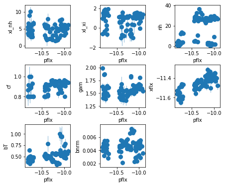


```python
fit_4a[iselect[1], 1, :2]
```


    array([[ 1.787,  0.317],
           [ 1.353,  0.287],
           [ 0.954,  0.306],
           [ 1.533,  0.337],
           [ 1.313,  0.229],
           [ 1.09 ,  0.265],
           [ 1.803,  0.325],
           [ 0.719,  0.189],
           [ 1.921,  0.135],
           [-0.612,  0.098]])


```python
# signal to noise ratios #
icont, iline = par_names.index('pflx'), par_names.index('xflx')
print(np.mean(np.abs(fit[:,icont,0]/fit[:,icont,1])), 
      np.mean(np.abs(fit[:,iline,0]/fit[:,iline,1])))
plt.plot(np.abs(fit[:,icont,0]/fit[:,icont,1]), '-.')
plt.plot(np.abs(fit[:,iline,0]/fit[:,iline,1]), '-.')
plt.yscale('log')
```

    1055.0671244019773 383.24922364655185


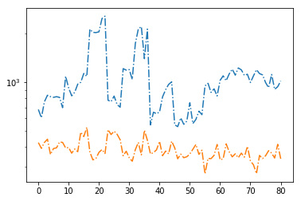


```python
plt.errorbar(fit[:,icont,0], fit[:,iline,0], fit[:,iline,1], 
                xerr=fit[:,icont,1], fmt='o', ms=8, lw=0.5, alpha=0.5)
os.system('mkdir -p results/narrow_line')
text = 'descriptor cont_sub_%s,+,- line_sub_%s,+,-\n'%(suff, suff)
text += '\n'.join(['{} {} {} {} {} {}'.format(*z) 
        for z in np.hstack((fit[:,icont,[0,2,3]], fit[:,iline,[0,2,3]]))])
with open('results/narrow_line/continuum_line_sub.plot', 'w') as fp: fp.write(text)
```


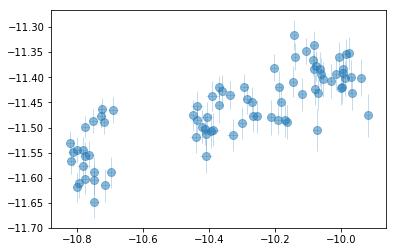


<br /><br />

---
## Measuring The lag using Javelin


```python
## fit_indiv ##
os.chdir('%s/%s'%(base_dir, spec_dir))
if suff in ['4a']:
    icont, iline = 4, 6
else:
    raise NotImplemented

xtime = np.concatenate(tselect).mean(1) / (3600*24)
cflux, lflux = fit[:,icont,:2].T, fit[:,iline,:2].T
isort = np.argsort(xtime)
xtime,cflux,lflux = xtime[isort], cflux[:,isort], lflux[:,isort]

plt.errorbar(xtime, cflux[0], cflux[1], fmt='o-')
plt.errorbar(xtime, lflux[0], lflux[1], fmt='o-')


npz   = 'results/narrow_line/continuum_line_javelin__fit_sub_%s.npz'%(suff)
pfile = 'results/narrow_line/continuum_line_javelin__fit_sub_%s.plot'%(suff)
if os.path.exists(npz):
    d = np.load(npz)
    lmod = d['lmod'][()]
    lmod.show_hist()
    text,_,_,lag = javelin_modeling(xtime, cflux, lflux, suff='_%s'%(suff), mods=[None, lmod])
    text = text.replace(suff, 'sub_%s'%suff)
    with open(pfile, 'w') as fp: fp.write(text)
else:
    text, cmod, lmod, lag = javelin_modeling(xtime, cflux, lflux, suff='_%s'%(suff), 
                                        nburn=2000, nchain=500)
    lmod.show_hist()
    with open(pfile, 'w') as fp: fp.write(text)
    np.savez(npz,xtime=xtime,cflux=cflux,lflux=lflux,cmod=cmod, lmod=lmod, lag=lag)
```


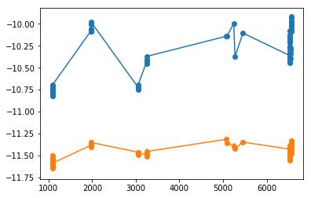


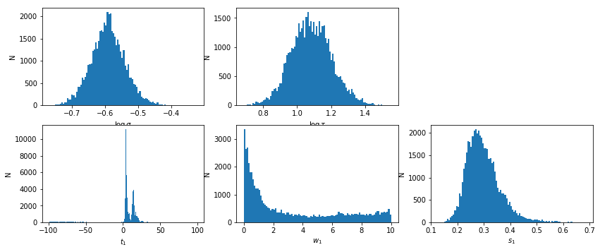


    # percentiles: 68, 90, 99: [3.125, 15.17], [-63.65, 20.86], [-97.6, 84.75]
    # mean lag: 5.237 +9.932 -2.113


```python
# prepare array for using xmm and suzaku #
xtime_xmm, cflux_xmm, lflux_xmm = np.array(xtime)+50814, np.array(cflux), np.array(lflux)
lag_xmm = np.array(lag)
```

## XMM: FLux dependency
Test if the two peaks are somehow depend on the flux


```python
## fit_indiv ##
os.chdir('%s/%s'%(base_dir, spec_dir))
if suff in ['4a']:
    icont, iline = 4, 6
else:
    raise NotImplemented

xtime = np.concatenate(tselect).mean(1) / (3600*24)
cflux, lflux = fit[:,icont,:2].T, fit[:,iline,:2].T
isort = np.argsort(xtime)
xtime,cflux,lflux = xtime[isort], cflux[:,isort], lflux[:,isort]
plt.hist(xtime, 10)
```


    (array([17.,  6.,  0.,  9.,  0.,  0.,  0.,  5.,  0., 44.]),
     array([1085.758, 1633.67 , 2181.583, 2729.496, 3277.409, 3825.322,
            4373.234, 4921.147, 5469.06 , 6016.973, 6564.886]),
     <a list of 10 Patch objects>)


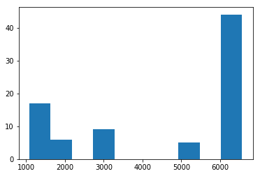


```python
## new observations #
idx = xtime > 4000
suff2 = 'new'
xtime2,cflux2,lflux2 = xtime[idx], cflux[:,idx], lflux[:,idx]

npz   = 'results/narrow_line/continuum_line_javelin__fit_sub_%s__%s.npz'%(suff, suff2)
pfile = 'results/narrow_line/continuum_line_javelin__fit_sub_%s__%s.plot'%(suff, suff2)
if os.path.exists(npz):
    d = np.load(npz)
    lmod = d['lmod'][()]
    lmod.show_hist()
    text,_,_,lag = javelin_modeling(xtime2, cflux2, lflux2, suff='_%s'%(suff), mods=[None, lmod])
    text = text.replace(suff, 'sub_%s__%s'%(suff, suff2))
    with open(pfile, 'w') as fp: fp.write(text)
else:
    text, cmod, lmod, lag = javelin_modeling(xtime2, cflux2, lflux2, suff='_%s'%(suff), 
                                        nburn=2000, nchain=500)
    lmod.show_hist()
    text = text.replace(suff, 'sub_%s__%s'%(suff, suff2))
    with open(pfile, 'w') as fp: fp.write(text)
    np.savez(npz,xtime=xtime2,cflux=cflux2,lflux=lflux2,cmod=cmod, lmod=lmod, lag=lag)
```

    Optimization terminated successfully.
             Current function value: -239.083324
             Iterations: 425
             Function evaluations: 691
    # percentiles: 68, 90, 99: [-70.32, 72.97], [-90.37, 91.73], [-98.9, 99.26]
    # mean lag: 13.08 +59.89 -83.4


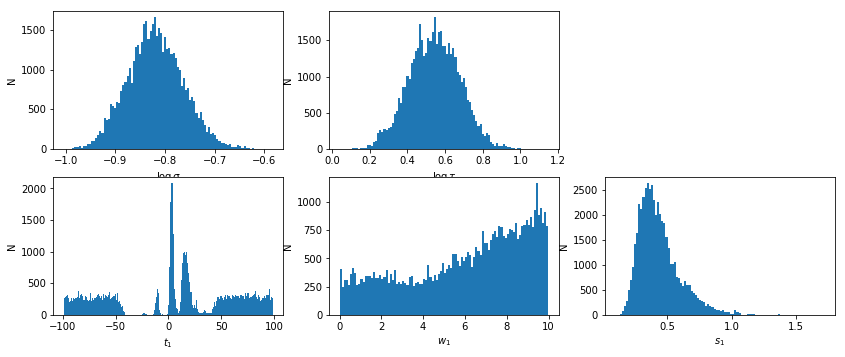


```python
## old observations #
idx = xtime < 4000
suff2 = 'old'
xtime2,cflux2,lflux2 = xtime[idx], cflux[:,idx], lflux[:,idx]

npz   = 'results/narrow_line/continuum_line_javelin__fit_sub_%s__%s.npz'%(suff, suff2)
pfile = 'results/narrow_line/continuum_line_javelin__fit_sub_%s__%s.plot'%(suff, suff2)
if os.path.exists(npz):
    d = np.load(npz)
    lmod = d['lmod'][()]
    lmod.show_hist()
    text,_,_,lag = javelin_modeling(xtime2, cflux2, lflux2, suff='_%s'%(suff), mods=[None, lmod])
    text = text.replace(suff, 'sub_%s__%s'%(suff, suff2))
    with open(pfile, 'w') as fp: fp.write(text)
else:
    text, cmod, lmod, lag = javelin_modeling(xtime2, cflux2, lflux2, suff='_%s'%(suff), 
                                        nburn=2000, nchain=500)
    lmod.show_hist()
    text = text.replace(suff, 'sub_%s__%s'%(suff, suff2))
    with open(pfile, 'w') as fp: fp.write(text)
    np.savez(npz,xtime=xtime2,cflux=cflux2,lflux=lflux2,cmod=cmod, lmod=lmod, lag=lag)
```

    Optimization terminated successfully.
             Current function value: -171.324089
             Iterations: 389
             Function evaluations: 618
    # percentiles: 68, 90, 99: [-58.86, 58.08], [-87.6, 87.2], [-99.01, 98.79]
    # mean lag: 7.201 +50.88 -66.06


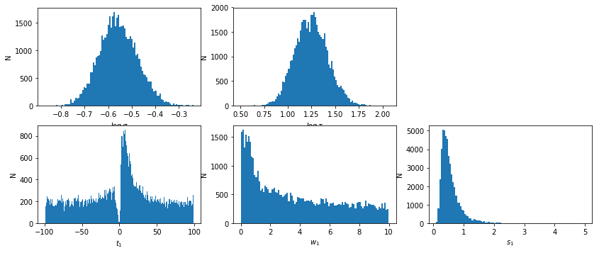


```python
# high flux
#plt.hist(cflux[0], 50)
#plt.plot(cflux[0], 'o'); plt.plot([0,80], [-10.24]*2)

idx = cflux[0] > -10.24
suff2 = 'hi'
xtime2,cflux2,lflux2 = xtime[idx], cflux[:,idx], lflux[:,idx]

npz   = 'results/narrow_line/continuum_line_javelin__fit_sub_%s__%s.npz'%(suff, suff2)
pfile = 'results/narrow_line/continuum_line_javelin__fit_sub_%s__%s.plot'%(suff, suff2)
if os.path.exists(npz):
    d = np.load(npz)
    lmod = d['lmod'][()]
    lmod.show_hist()
    text,_,_,lag = javelin_modeling(xtime2, cflux2, lflux2, suff='_%s'%(suff), mods=[None, lmod])
    text = text.replace(suff, 'sub_%s__%s'%(suff, suff2))
    with open(pfile, 'w') as fp: fp.write(text)
else:
    text, cmod, lmod, lag = javelin_modeling(xtime2, cflux2, lflux2, suff='_%s'%(suff), 
                                        nburn=2000, nchain=500)
    lmod.show_hist()
    text = text.replace(suff, 'sub_%s__%s'%(suff, suff2))
    with open(pfile, 'w') as fp: fp.write(text)
    np.savez(npz,xtime=xtime2,cflux=cflux2,lflux=lflux2,cmod=cmod, lmod=lmod, lag=lag)
```

    Warning: Maximum number of function evaluations has been exceeded.
    # percentiles: 68, 90, 99: [-69.86, 72.72], [-89.96, 92.03], [-99.0, 99.27]
    # mean lag: 11.85 +60.87 -81.71


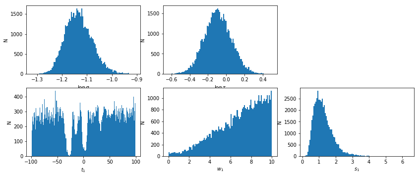


```python
# high flux
#plt.hist(cflux[0], 50)
#plt.plot(cflux[0], 'o'); plt.plot([0,80], [-10.24]*2)

idx = cflux[0] < -10.24
suff2 = 'low'
xtime2,cflux2,lflux2 = xtime[idx], cflux[:,idx], lflux[:,idx]

npz   = 'results/narrow_line/continuum_line_javelin__fit_sub_%s__%s.npz'%(suff, suff2)
pfile = 'results/narrow_line/continuum_line_javelin__fit_sub_%s__%s.plot'%(suff, suff2)
if os.path.exists(npz):
    d = np.load(npz)
    lmod = d['lmod'][()]
    lmod.show_hist()
    text,_,_,lag = javelin_modeling(xtime2, cflux2, lflux2, suff='_%s'%(suff), mods=[None, lmod])
    text = text.replace(suff, 'sub_%s__%s'%(suff, suff2))
    with open(pfile, 'w') as fp: fp.write(text)
else:
    text, cmod, lmod, lag = javelin_modeling(xtime2, cflux2, lflux2, suff='_%s'%(suff), 
                                        nburn=2000, nchain=500)
    lmod.show_hist()
    text = text.replace(suff, 'sub_%s__%s'%(suff, suff2))
    with open(pfile, 'w') as fp: fp.write(text)
    np.savez(npz,xtime=xtime2,cflux=cflux2,lflux=lflux2,cmod=cmod, lmod=lmod, lag=lag)
```

    Optimization terminated successfully.
             Current function value: -235.379411
             Iterations: 338
             Function evaluations: 556
    # percentiles: 68, 90, 99: [-63.07, 61.96], [-87.13, 87.51], [-98.38, 98.9]
    # mean lag: 6.194 +55.77 -69.26


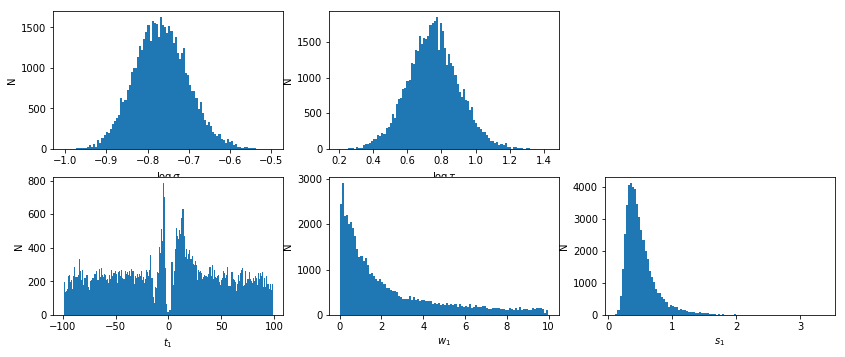


```python

```

<br /> <br />

---
## Suzaku Data


```python
### Read useful data from data notebook
data_dir = 'data/suzaku'
spec_dir = 'data/suzaku_subspec'
os.chdir('%s/%s'%(base_dir, data_dir))
data = np.load('log/data.npz')
obsids = data['obsids']
spec_data = data['spec_data']
tselect = data['tselect']
iselect = data['tselect_ispec']
spec_ids = np.concatenate(iselect)

# remove one odd observation #
iselect[0] = np.delete(iselect[0], 17)
tselect[0].pop(17)
spec_ids = np.concatenate(iselect)
```

### copy data 


```python
# os.system('mkdir -p %s/%s'%(base_dir, spec_dir))
# os.chdir('%s/%s'%(base_dir, spec_dir))
# for o in obsids:
#     os.system('cp %s/%s/%s_p/subspec/spec_fi* .'%(base_dir, data_dir, o))
```

### Fit the data


```python
os.chdir('%s/%s'%(base_dir, spec_dir))
os.system('mkdir -p fits')

suff = '4a'
os.system(('tail -n +8 ../xmm_subspec/fits/fit_sub_%s__1.xcm > '
           'fits/fit_%s_base.xcm')%(suff,suff))
fit_4a = fit_xspec_model('fit_sub_suz_%s'%suff, spec_ids, base_dir, spec_root='spec_fi_%d.grp')
```


```python
# plot the result #
if suff == '4a':
    par_names = ['xl_nh', 'xl_xi', 'nh', 'cf', 'pflx', 'gam', 'xflx', 'bT', 'bnrm']
    fit = fit_4a
else:
    raise NotImplemented

iref = par_names.index('pflx')
idx = list(range(len(par_names)))
idx.pop(iref)
    
fig = plt.figure(figsize=(6,5))
for i,ix in enumerate(idx):
    ax = plt.subplot(3,len(idx)//3+(1 if len(idx)%3 else 0),i+1)
    plt.errorbar(fit[:,iref,0], fit[:,ix,0], fit[:,ix,1], 
                 xerr=fit[:,iref,1], fmt='o', ms=8, lw=0.5)
    ax.set_xlabel(par_names[iref]); ax.set_ylabel(par_names[ix])
plt.tight_layout(pad=0)
```


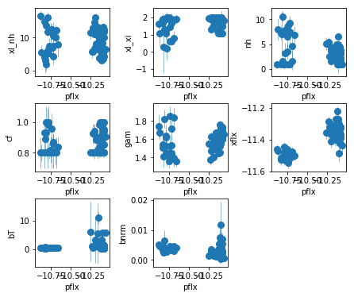


```python
# signal to noise ratios #
icont, iline = par_names.index('pflx'), par_names.index('xflx')
print(np.mean(np.abs(fit[:,icont,0]/fit[:,icont,1])), 
      np.mean(np.abs(fit[:,iline,0]/fit[:,iline,1])))
plt.plot(np.abs(fit[:,icont,0]/fit[:,icont,1]), '-.')
plt.plot(np.abs(fit[:,iline,0]/fit[:,iline,1]), '-.')
plt.yscale('log')
```

    996.0345313368119 317.60313030806935


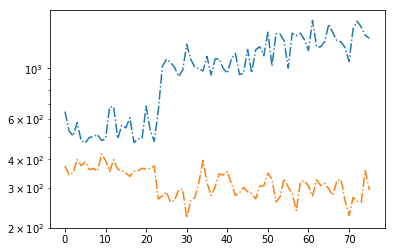


```python
plt.errorbar(fit[:,icont,0], fit[:,iline,0], fit[:,iline,1], 
                xerr=fit[:,icont,1], fmt='o', ms=8, lw=0.5, alpha=0.5)
os.system('mkdir -p results/narrow_line')
text = 'descriptor cont_sub_suz_%s,+,- line_sub_suz_%s,+,-\n'%(suff, suff)
text += '\n'.join(['{} {} {} {} {} {}'.format(*z) 
        for z in np.hstack((fit[:,icont,[0,2,3]], fit[:,iline,[0,2,3]]))])
with open('results/narrow_line/continuum_line_sub_suz.plot', 'w') as fp: fp.write(text)
```


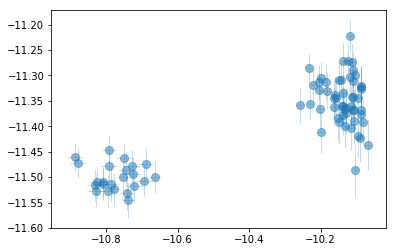


---

## Javelin


```python
## fit_indiv ##
os.chdir('%s/%s'%(base_dir, spec_dir))
if suff in ['4a']:
    icont, iline = 4, 6
else:
    raise NotImplemented

xtime = np.concatenate(tselect).mean(1)
cflux, lflux = fit[:,icont,:2].T, fit[:,iline,:2].T
isort = np.argsort(xtime)
xtime,cflux,lflux = xtime[isort], cflux[:,isort], lflux[:,isort]

plt.errorbar(xtime, cflux[0], cflux[1], fmt='o-')
plt.errorbar(xtime, lflux[0], lflux[1], fmt='o-')


npz   = 'results/narrow_line/continuum_line_javelin__fit_sub_suz_%s.npz'%(suff)
pfile = 'results/narrow_line/continuum_line_javelin__fit_sub_suz_%s.plot'%(suff)
if os.path.exists(npz):
    d = np.load(npz)
    lmod = d['lmod'][()]
    lmod.show_hist()
    text,_,_,lag = javelin_modeling(xtime, cflux, lflux, suff='_%s'%(suff), mods=[None, lmod])
    text = text.replace(suff, 'sub_suz_%s'%suff)
    with open(pfile, 'w') as fp: fp.write(text)
else:
    text, cmod, lmod, lag = javelin_modeling(xtime, cflux, lflux, suff='_%s'%(suff), 
                                        nburn=2000, nchain=500)
    lmod.show_hist()
    with open(pfile, 'w') as fp: fp.write(text)
    np.savez(npz,xtime=xtime,cflux=cflux,lflux=lflux,cmod=cmod, lmod=lmod, lag=lag)
```


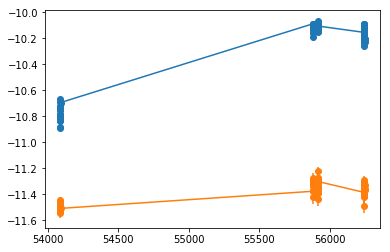


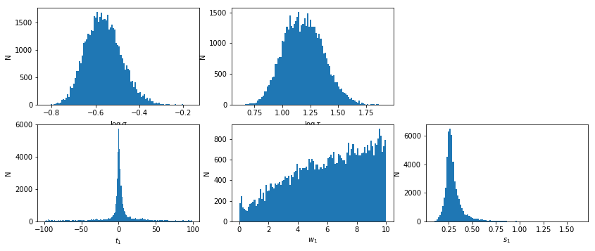


    # percentiles: 68, 90, 99: [-9.13, 14.71], [-61.55, 56.54], [-95.6, 95.76]
    # mean lag: 0.9095 +13.8 -10.04


```python
# prepare array for using xmm and suzaku #
xtime_suz, cflux_suz, lflux_suz = np.array(xtime), np.array(cflux), np.array(lflux)
lag_suz = np.array(lag)
```

### Joint XMM-Suzaku constraint


```python
lag_joint = lag_xmm[0]*lag_suz[0]
lag_joint /= lag_joint.sum()

bins_cent = (lag_xmm[1][1:] + lag_xmm[1][:-1])/2
bins_err  = (lag_xmm[1][1:] - lag_xmm[1][:-1])/2

# statistics from the distribution #
csum = np.cumsum(lag_joint)
from scipy.interpolate import UnivariateSpline as US
spl = US(bins_cent, csum)
spl.set_smoothing_factor(0.001)
xlag = np.linspace(-20, 20,1000000)
ycdf = spl(xlag)


def percentile(p):
    # p: e.g 0.68, 0.99 etc
    vl = xlag[np.argmin(np.abs(ycdf - (1-p)/2))]
    vu = xlag[np.argmin(np.abs(ycdf - (1+p)/2))]
    return [vl, vu]

text = '# percentiles: 50, 68, 90, 99: {}, {}, {}, {}'.format(*[
    '[{:.4}, {:.4}]'.format(*percentile(x)) for x in [0., .68, .90, .99]])
print(text)
text += ('\ndescriptor lag_javelin_{0},+- lag_javelin_prob_{0}_sub_suz '
         'lag_javelin_prob_{0}_sub_joint\n').format(suff)
text += '\n'.join(['{:.4} {:.4} {:.4} {:.4}'.format(*x) 
                   for x in zip(bins_cent, bins_err, lag_suz[0], lag_joint)])
with open('results/narrow_line/continuum_line_javelin__sub_suz_%s.plot'%suff, 'w') as fp: fp.write(text)
```

    # percentiles: 50, 68, 90, 99: [3.294, 3.294], [2.574, 5.127], [1.846, 13.72], [-6.164, 20.0]


```python

```
