```python
import sys,os
base_dir = '/home/abzoghbi/data/ngc4151/spec_analysis'
data_dir = 'data/xmm'
timing_dir = 'data/xmm_timing'

sys.path.append(base_dir)
from timing_helpers import *
from spec_helpers import *
%load_ext autoreload
%autoreload 2
```

### Read useful data from narrow line directory
For timing analysis, we use only light curves with length > 10 ks


```python
data_info = np.load('%s/%s/log/data.npz'%(base_dir, data_dir))
spec_obsids = data_info['spec_obsids']
obsids = data_info['obsids']
spec_data = data_info['spec_data']
lc_obsids = [spec_obsids[i] for i in range(len(spec_obsids)) if spec_data[i,2]>=10]
lc_ids = [i+1 for i,o in enumerate(obsids) if o in lc_obsids]
spec_ids = [i+1 for i,o in enumerate(obsids) if o in spec_obsids]
print(lc_ids)
```

    [1, 2, 3, 4, 5, 6, 7, 8, 16, 17, 18, 19, 20, 21, 22, 23, 24]


```python
os.chdir(base_dir)
_ = os.system('mkdir -p %s'%timing_dir)
```

---

## Plot Light curves


```python
# read light curves #
os.chdir('%s/%s'%(base_dir, timing_dir))
lcdir, ebins, dt = '1b', '2 10', 128
Lc, en, ene = read_pn_lc(lc_obsids, dt, ebins, lcdir, '%s/%s'%(base_dir, data_dir), 
                         min_exp=0.0, interp=False)
nen, nobs = len(Lc), len(Lc[0])
Lc = [Lc[0][i].rebin(2, 'norm', 0.6).make_even() for i in range(nobs)]

# plot #
fig = plt.figure(figsize=(12,8))
nsub = np.int(nobs**0.5)
for i in range(nobs):
    ax = plt.subplot(nsub, nsub+1, i+1)
    ltime = (Lc[i].time - Lc[i].time[0])/1e3
    ax.errorbar(ltime, Lc[i].rate, Lc[i].rerr, fmt='o', ms=3, alpha=0.5)
    ax.set_xlim([0,50])
plt.tight_layout()

# write ascii file #
text = ''
for i in range(nobs):
    text += '\ndescriptor time_{0} rate_{0},+-\n'.format(i+1)
    ltime = (Lc[i].time - Lc[i].time[0])/1e3
    text += '\n'.join(['{} {} {}'.format(*z) for z in zip(ltime, Lc[i].rate, Lc[i].rerr)])
with open('lc.plot', 'w') as fp: fp.write(text)
```


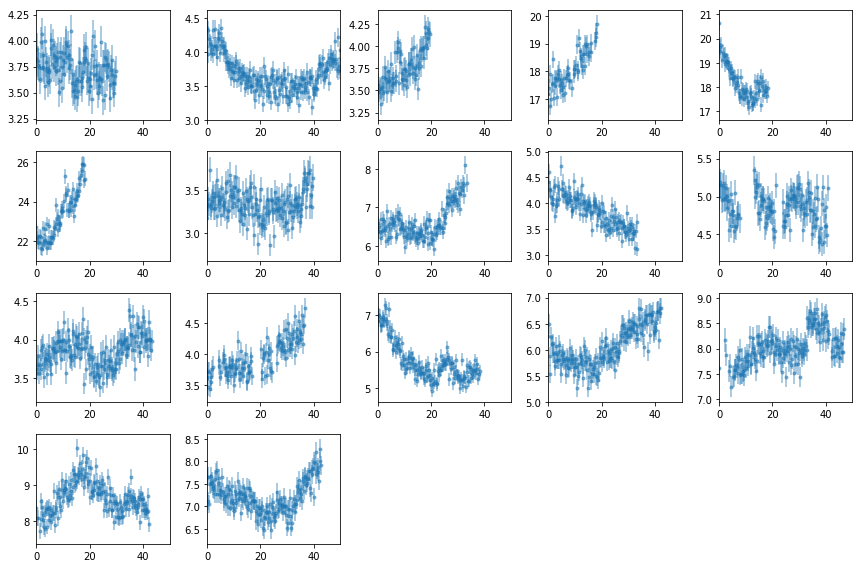


---

## Power Spectra

### The total 2-10 keV PSD
- Light curves have `dt=32`
- The frequency binning uses `fqbin  = {'bins': 8e-6*1.12**np.arange(100), 'min_per_bin':2}`. That is frequencies between `f` and `1.12f` are accumulated in to one bin.


```python
# read light curves #
os.chdir('%s/%s'%(base_dir, timing_dir))
os.system('mkdir -p psd'); os.chdir('psd')
lcdir, ebins, dt = '1b', '2 10', 128

Lc, en, ene = read_pn_lc(lc_obsids, dt, ebins, lcdir, '%s/%s'%(base_dir, data_dir), 
                         min_exp=0.1, interp=False)
```

#### Split the light curves into segments
Here, we are using the full light curves without splitting. So `lc_to_segments` only converst from az.LCurve to a list of arrays.
Pick the segments of the largest length to avoid gaps


```python
min_length = np.int(5e3/dt)
rate_all, rerr_all, time_all, seg_idx = lc_to_segments(Lc, min_seg_length=min_length)
rate = rate_all[0]
rerr = rerr_all[0]
tarr = time_all[0]
print([len(r) for r in rate])
```

    [235, 446, 154, 65, 51, 145, 145, 313, 262, 263, 63, 75, 136, 342, 90, 93, 300, 334, 288, 42, 336, 341]


```python
# plot to check #
fig = plt.figure(figsize=(12,4))
nsub = np.int(nobs**0.5)
for i in range(nobs):
    ax = plt.subplot(nsub, nsub+1, i+1)
    ax.plot((Lc[0][i].time - Lc[0][i].time[0])/1e3, Lc[0][i].rate, lw=0.2)
    for j in np.arange(len(tarr))[seg_idx==i]:
        ax.plot((tarr[j] - Lc[0][i].time[0])/1e3, rate[j], lw=0.2)
    ax.set_xlim([0,50])
plt.tight_layout()
```


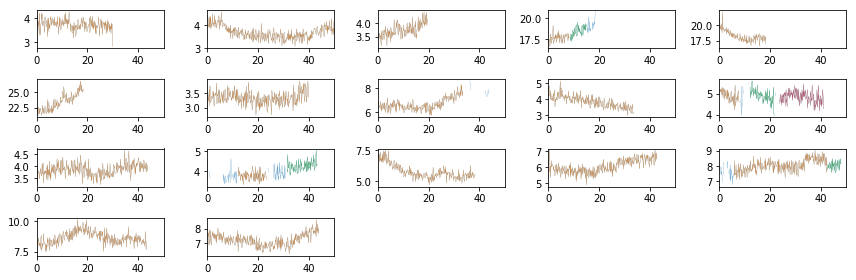


#### Calculate the total & individual PSDs
- We use Hanning tapering before calculating the psd to control against rednoise leak. see p388 Bendat & Piersol
- PSD is in rms units.
- The averaging is done in log space (Papadakis+93)
- We calculate the total and the individual psd's


```python
# total psd #
fqbin  = {'bins': 8e-6*1.12**np.arange(200), 'min_per_bin':2}
psd  = az.LCurve.calculate_psd(rate, dt, 'rms', rerr=rerr, taper=True)
psdb = az.LCurve.bin_psd(psd[0], psd[1], fqbin, noise=psd[2], logavg=True)

# individual psd's #
ipsd, ipsdb = [], []
for io in range(nobs):
    ir = np.argwhere(seg_idx==io)[:,0]
    r  = [rate[i] for i in ir]
    re = [rerr[i] for i in ir]
    p  = az.LCurve.calculate_psd(r, dt, 'rms', rerr=re, taper=True)
    pb = az.LCurve.bin_psd(p[0], p[1], fqbin, noise=p[2], logavg=True)
    ipsd.append(p)
    ipsdb.append(pb)
```

#### plot psd


```python
# plot the total psd, and from individual observations #
nseg  = len(ipsd)
ns1 = np.int(nseg**0.5)
ns2 = nseg//ns1 + (1 if nseg%ns1 else 0)
fig = plt.figure(figsize=(3*ns1, 2*ns2))

for i in range(nseg):
    ax = plt.subplot(ns1, ns2, i+1)
    ax.set_xscale('log'); ax.set_yscale('log')
    # raw psd's #
    ax.plot(psd[0], psd[1], lw=0.3, alpha=0.3)
    ax.plot(ipsd[i][0], ipsd[i][1], lw=0.6, alpha=0.6)
    # binned #
    ax.errorbar(psdb[0], psdb[1], psdb[2], fmt='-', alpha=.8)
    ax.errorbar(ipsdb[i][0], ipsdb[i][1], ipsdb[i][2], fmt='-', alpha=.8)
plt.tight_layout(pad=0)
```


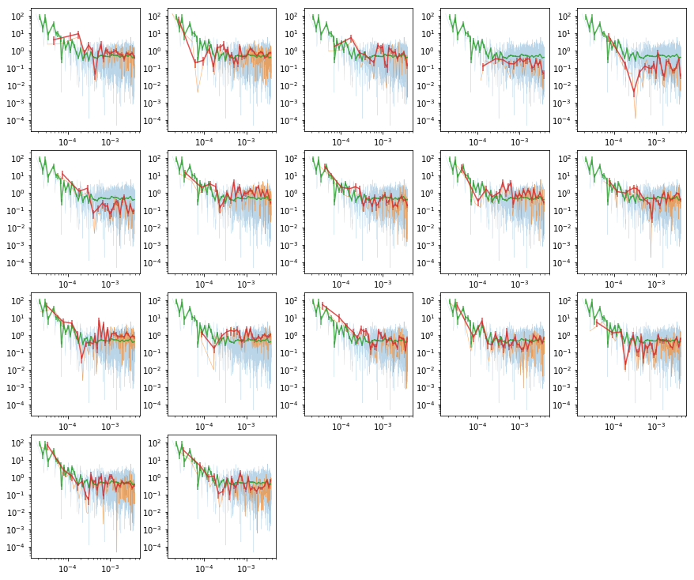


```python
# write psd to pha file and fit in xspec
fqL = np.array(psdb[-1]['fqL'])
az.misc.write_pha_spec(fqL[:-1], fqL[1:], psdb[1], psdb[2], 'psd_tot')
```

    psd_tot.pha was created successfully


```python
# fit the psd with xspec #
tcl = [
    'da psd_tot.pha; statis whittle2',
    'mo po+po & 0 -1& 0.5& 2 .1 1.5 1.5 3 3& 1e-10; fit 1000',
    'source ~/codes/xspec/az.tcl', 'az_calc_errors [az_free_params] fit_psd_tot 1.0',
    'add 1 po & 0.02 .1 0 0 & 0 -1', 'add 3 cpflux & 3e-5 & 5e-4 & =p1^2.0',
    'new 9 1 -1; fit;',
    'source ~/codes/xspec/az.tcl', 'az_calc_errors [az_free_params] fit_psd_tot__flx 1.0;exit'
]
tcl = '\n'.join(tcl)
with open('tmp.xcm', 'w') as fp: fp.write(tcl)
cmd = 'xspec - tmp.xcm > tmp.log 2>&1'
p = subp.call(['/bin/bash', '-i', '-c', cmd])
!cat fit_psd_tot__flx.log
```

    
    # -681.891 41 -16.6315 -1
    2.9468e-02 2.9731e-03 3.1964e-03 -2.7499e-03 "PhoIndex "
    4.5245e-01 6.9766e-02 7.5771e-02 -6.3761e-02 "norm "
    2.5483e+00 3.1696e-01 3.3452e-01 -2.9941e-01 "PhoIndex "
    


Note that the index and norm/rms are highly correlated.

<br />

### PSD as a function of energy
- Light curves have `dt=128`
- Use 8 bins in log-space (`8l` in the data notebook)
- Similar frequency binning as the total psd


```python
# read light curves #
os.chdir('%s/%s/psd'%(base_dir, timing_dir))
lcdir, ebins, dt = '8l', '2 2.4 3 3.7 4.5 5.5 6.7 8.2 10', 128
os.system('mkdir -p %s'%lcdir); os.chdir(lcdir)
Lc, en, ene = read_pn_lc(lc_obsids, dt, ebins, lcdir, '%s/%s'%(base_dir, data_dir), 
                         min_exp=0.1, interp=True)

min_length = np.int(5e3/dt)
rate_all, rerr_all, time_all, seg_idx = lc_to_segments(Lc, min_seg_length=min_length)
```


```python
# psd @ individual energies #
ie_psd, ie_psdb = [], []
for ie in range(len(en)):
    
    r  = rate_all[ie]
    re = rerr_all[ie]
    
    p  = az.LCurve.calculate_psd(r, dt, 'rms', rerr=re, taper=True)
    pb = az.LCurve.bin_psd(p[0], p[1], fqbin, noise=p[2], logavg=True)
    ie_psd.append(p)
    ie_psdb.append(pb)
```

#### Plot the psd at different energies along with total


```python
# plot the total psd, and from individual energies #
nplt = len(en)
ns1 = np.int(nplt**0.5)
ns2 = nplt//ns1 + (1 if nplt%ns1 else 0)
fig = plt.figure(figsize=(9, 5))

for i in range(nplt):
    ax = plt.subplot(ns1, ns2, i+1)
    ax.set_xscale('log'); ax.set_yscale('log')
    ax.errorbar(psdb[0], psdb[1], psdb[2])
    ax.errorbar(ie_psdb[i][0], ie_psdb[i][1], ie_psdb[i][2])
plt.tight_layout(pad=0)
```


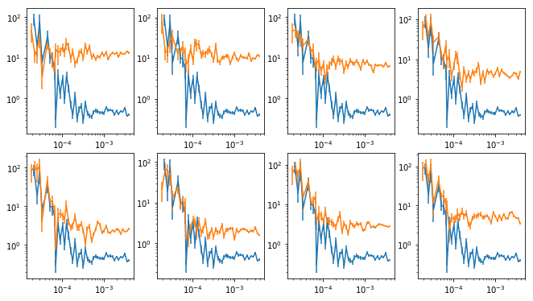


#### Write this to pha files and fit with xspec


```python
# write files and fit with xspec #
for ip,pb in enumerate(ie_psdb):
    fqL = np.array(pb[-1]['fqL'])
    az.misc.write_pha_spec(fqL[:-1], fqL[1:], pb[1], pb[2], 'psd_%s_%d'%(lcdir, ip+1))
```

    psd_8l_1.pha was created successfully
    psd_8l_2.pha was created successfully
    psd_8l_3.pha was created successfully
    psd_8l_4.pha was created successfully
    psd_8l_5.pha was created successfully
    psd_8l_6.pha was created successfully
    psd_8l_7.pha was created successfully
    psd_8l_8.pha was created successfully


#### Fit with a powerlaw, allowing both norm and index to vary


```python
# fit the psd's with xspec #
psd_fit = []
for ip in range(len(ie_psdb)):
    tcl = [
    'da psd_%s_%d.pha; statis whittle2',
    'mo po+po & 0 -1& 0.5& 2 .1 1. 1. 3 3& 1e-10 -.1; fit 1000; thaw 4; fit',
    'source ~/codes/xspec/az.tcl', 'az_calc_errors [az_free_params] fit_psd_%s_%d 1.0',
    'add 1 po & 0.03 .1 0 0 & 0 -1', 'add 3 cpflux & 3e-5 & 5e-4 & =p1^2.0',
    'new 9 1 -1; fit;',
    'source ~/codes/xspec/az.tcl', 'az_calc_errors [az_free_params] fit_psd_%s_%d__flx 1.0;exit'
    ]
    tcl = '\n'.join(tcl)%(lcdir, ip+1, lcdir,ip+1, lcdir, ip+1)
    with open('tmp.xcm', 'w') as fp: fp.write(tcl)
    cmd = 'xspec - tmp.xcm > tmp.log 2>&1'
    p = subp.call(['/bin/bash', '-i', '-c', cmd])
    psd_fit.append(np.loadtxt('fit_psd_%s_%d__flx.log'%(lcdir, ip+1), usecols=[0,1,2,3]))
psd_fit = np.array(psd_fit)
```


```python
# plot #
fit_tot = np.loadtxt('../fit_psd_tot__flx.log', usecols=[0,1,2,3])
ax = plt.subplot(121)
plt.errorbar(en, psd_fit[:,0,0], np.abs([-psd_fit[:,0,3],psd_fit[:,0,2]]), fmt='o', ms=10)
plt.fill_between([2,10], [fit_tot[0,0]+fit_tot[0,2]]*2, [fit_tot[0,0]+fit_tot[0,3]]*2, alpha=0.5)
ax = plt.subplot(122)
plt.errorbar(en, psd_fit[:,2,0], np.abs([-psd_fit[:,2,3],psd_fit[:,2,2]]), fmt='o', ms=10)
plt.fill_between([2,10], [fit_tot[2,0]+fit_tot[2,2]]*2, [fit_tot[2,0]+fit_tot[2,3]]*2, alpha=0.5)
plt.tight_layout()
```


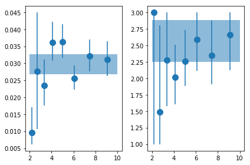


#### Fit with a powerlaw, fix gamma


```python
# fit the psd's with xspec #
psd_fit_g = []
for ip in range(len(ie_psdb)):
    tcl = [
        '@fit_psd_%s_%d__flx', 'statis whittle2', 'new 8 %g -1', 'fit 1000',
        'source ~/codes/xspec/az.tcl', 'az_calc_errors [az_free_params] fit_psd_%s_%dg__flx 1.0'
    ]
    tcl = '\n'.join(tcl)%(lcdir, ip+1, fit_tot[2,0], lcdir, ip+1)
    with open('tmp.xcm', 'w') as fp: fp.write(tcl)
    cmd = 'xspec - tmp.xcm > tmp.log 2>&1'
    p = subp.call(['/bin/bash', '-i', '-c', cmd])
    psd_fit_g.append(np.loadtxt('fit_psd_%s_%dg__flx.log'%(lcdir, ip+1), usecols=[0,1,2,3]))
psd_fit_g = np.array(psd_fit_g)
```


```python
# plot #
plt.errorbar(en, psd_fit_g[:,0,0], np.abs([-psd_fit_g[:,0,3],psd_fit_g[:,0,2]]), fmt='o', ms=10)
plt.fill_between([2,10], [fit_tot[0,0]+fit_tot[0,2]]*2, [fit_tot[0,0]+fit_tot[0,3]]*2, alpha=0.5)

```


    <matplotlib.collections.PolyCollection at 0x7faf13ea76d8>


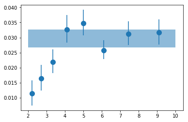


```python
# write results #
txt = ('\ndescriptor en_{0},+- rms_tot,+,- gam_tot,+,- rms_{0},+,- gam_{0},+,- '
       'rms_g_{0},+,-\n').format(lcdir)
txt += '\n'.join(['{} {} {} {} {} {} {} {} {} {} {} {} {} {} {} {} {}'.format(*z) 
                  for z in zip(en, ene, 
            [fit_tot[0,0]]*len(en), [fit_tot[0,2]]*len(en), [fit_tot[0,3]]*len(en),
            [fit_tot[2,0]]*len(en), [fit_tot[2,2]]*len(en), [fit_tot[2,3]]*len(en),
            psd_fit[:,0,0], psd_fit[:,0,2], psd_fit[:,0,3],
            psd_fit[:,2,0], psd_fit[:,2,2], psd_fit[:,2,3],
            psd_fit_g[:,0,0], psd_fit_g[:,0,2], psd_fit_g[:,0,3] )])
with open('psd_pars__%s.plot'%lcdir, 'w') as fp: fp.write(txt)
```

---
## Repeat for 16 energy bins


```python
# read light curves #
os.chdir('%s/%s/psd'%(base_dir, timing_dir))
lcdir, ebins, dt = '16l', ('2 2.2 2.4 2.7 3 3.3 3.7 4 4.5 4.9 5.5 6 6.7 7.4 8.2 9 10'), 128
os.system('mkdir -p %s'%lcdir); os.chdir(lcdir)

Lc, en, ene = read_pn_lc(lc_obsids, dt, ebins, lcdir, '%s/%s'%(base_dir, data_dir), 
                         min_exp=0.1, interp=False)

min_length = np.int(5e3/dt)
rate_all, rerr_all, time_all, seg_idx = lc_to_segments(Lc, min_seg_length=min_length)
```


```python
# psd @ individual energies #
ie_psd, ie_psdb = [], []
for ie in range(len(en)):
    
    r  = rate_all[ie]
    re = rerr_all[ie]
    
    p  = az.LCurve.calculate_psd(r, dt, 'rms', rerr=re, taper=True)
    pb = az.LCurve.bin_psd(p[0], p[1], fqbin, noise=p[2], logavg=True)
    ie_psd.append(p)
    ie_psdb.append(pb)
```


```python
# write files and fit with xspec #
for ip,pb in enumerate(ie_psdb):
    fqL = np.array(pb[-1]['fqL'])
    az.misc.write_pha_spec(fqL[:-1], fqL[1:], pb[1], pb[2], 'psd_%s_%d'%(lcdir, ip+1))
```

    psd_16l_1.pha was created successfully
    psd_16l_2.pha was created successfully
    psd_16l_3.pha was created successfully
    psd_16l_4.pha was created successfully
    psd_16l_5.pha was created successfully
    psd_16l_6.pha was created successfully
    psd_16l_7.pha was created successfully
    psd_16l_8.pha was created successfully
    psd_16l_9.pha was created successfully
    psd_16l_10.pha was created successfully
    psd_16l_11.pha was created successfully
    psd_16l_12.pha was created successfully
    psd_16l_13.pha was created successfully
    psd_16l_14.pha was created successfully
    psd_16l_15.pha was created successfully
    psd_16l_16.pha was created successfully


```python
# fit the psd's with xspec #
psd_fit_g16 = []
for ip in range(len(ie_psdb)):
    tcl = [
        'tail -n +2 ../fit_psd_tot__flx.xcm > tmp_tot.xcm',
        '@tmp_tot', 'da psd_%s_%d.pha', 'statis whittle2', 'freez 8', 'fit 1000',
        'source ~/codes/xspec/az.tcl', 'az_calc_errors [az_free_params] fit_psd_%s_%dg__flx 1.0'
    ]
    tcl = '\n'.join(tcl)%(lcdir, ip+1, lcdir, ip+1)
    with open('tmp.xcm', 'w') as fp: fp.write(tcl)
    cmd = 'xspec - tmp.xcm > tmp.log 2>&1'
    p = subp.call(['/bin/bash', '-i', '-c', cmd])
    psd_fit_g16.append(np.loadtxt('fit_psd_%s_%dg__flx.log'%(lcdir, ip+1), usecols=[0,1,2,3]))
psd_fit_g16 = np.array(psd_fit_g16)
```


```python
# plot #
plt.errorbar(en, psd_fit_g16[:,0,0], np.abs([-psd_fit_g16[:,0,3],psd_fit_g16[:,0,2]]), 
             fmt='o', ms=6)
plt.fill_between([2,10], [fit_tot[0,0]+fit_tot[0,2]]*2, [fit_tot[0,0]+fit_tot[0,3]]*2, alpha=0.5)
```


    <matplotlib.collections.PolyCollection at 0x7faf685f5d30>


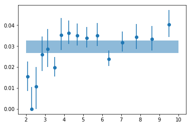


```python
# write results #
txt = ('\ndescriptor en_{0},+- rms_g_{0},+,-\n').format(lcdir)
txt += '\n'.join(['{} {} {} {} {}'.format(*z) for z in zip(en, ene, 
            psd_fit_g16[:,0,0], psd_fit_g16[:,0,2], psd_fit_g16[:,0,3] )])
# total
with open('psd_pars__%s.plot'%lcdir, 'w') as fp: fp.write(txt)
```

---
## Repeat for 24 energy bins


```python
# read light curves #
os.chdir('%s/%s/psd'%(base_dir, timing_dir))
lcdir, ebins, dt = '24l', ('2 2.33 2.67 3 3.33 3.67 4 4.33 4.67 5 5.33 '
                    '5.67 6 6.33 6.67 7 7.33 7.67 8 8.33 8.67  9 9.33 9.67 10'), 128
os.system('mkdir -p %s'%lcdir); os.chdir(lcdir)

Lc, en, ene = read_pn_lc(lc_obsids, dt, ebins, lcdir, '%s/%s'%(base_dir, data_dir), 
                         min_exp=0.1, interp=False)

min_length = np.int(5e3/dt)
rate_all, rerr_all, time_all, seg_idx = lc_to_segments(Lc, min_seg_length=min_length)
```


```python
# psd @ individual energies #
ie_psd, ie_psdb = [], []
for ie in range(len(en)):
    
    r  = rate_all[ie]
    re = rerr_all[ie]
    
    p  = az.LCurve.calculate_psd(r, dt, 'rms', rerr=re, taper=True)
    pb = az.LCurve.bin_psd(p[0], p[1], fqbin, noise=p[2], logavg=True)
    ie_psd.append(p)
    ie_psdb.append(pb)
```


```python
# write files and fit with xspec #
for ip,pb in enumerate(ie_psdb):
    fqL = np.array(pb[-1]['fqL'])
    az.misc.write_pha_spec(fqL[:-1], fqL[1:], pb[1], pb[2], 'psd_%s_%d'%(lcdir, ip+1))
```

    psd_24l_1.pha was created successfully
    psd_24l_2.pha was created successfully
    psd_24l_3.pha was created successfully
    psd_24l_4.pha was created successfully
    psd_24l_5.pha was created successfully
    psd_24l_6.pha was created successfully
    psd_24l_7.pha was created successfully
    psd_24l_8.pha was created successfully
    psd_24l_9.pha was created successfully
    psd_24l_10.pha was created successfully
    psd_24l_11.pha was created successfully
    psd_24l_12.pha was created successfully
    psd_24l_13.pha was created successfully
    psd_24l_14.pha was created successfully
    psd_24l_15.pha was created successfully
    psd_24l_16.pha was created successfully
    psd_24l_17.pha was created successfully
    psd_24l_18.pha was created successfully
    psd_24l_19.pha was created successfully
    psd_24l_20.pha was created successfully
    psd_24l_21.pha was created successfully
    psd_24l_22.pha was created successfully
    psd_24l_23.pha was created successfully
    psd_24l_24.pha was created successfully


```python
# fit the psd's with xspec #
psd_fit_g24 = []
for ip in range(len(ie_psdb)):
    tcl = [
        'tail -n +2 ../fit_psd_tot__flx.xcm > tmp_tot.xcm',
        '@tmp_tot', 'da psd_%s_%d.pha', 'statis whittle2', 'freez 8', 'fit 1000',
        'source ~/codes/xspec/az.tcl', 'az_calc_errors [az_free_params] fit_psd_%s_%dg__flx 1.0'
    ]
    tcl = '\n'.join(tcl)%(lcdir, ip+1, lcdir, ip+1)
    with open('tmp.xcm', 'w') as fp: fp.write(tcl)
    cmd = 'xspec - tmp.xcm > tmp.log 2>&1'
    p = subp.call(['/bin/bash', '-i', '-c', cmd])
    psd_fit_g24.append(np.loadtxt('fit_psd_%s_%dg__flx.log'%(lcdir, ip+1), usecols=[0,1,2,3]))
psd_fit_g24 = np.array(psd_fit_g24)
```


```python
# plot #
plt.errorbar(en, psd_fit_g24[:,0,0], np.abs([-psd_fit_g24[:,0,3],psd_fit_g24[:,0,2]]), 
             fmt='o', ms=6)
plt.fill_between([2,10], [fit_tot[0,0]+fit_tot[0,2]]*2, [fit_tot[0,0]+fit_tot[0,3]]*2, alpha=0.5)
```


    <matplotlib.collections.PolyCollection at 0x7faf13ac76a0>


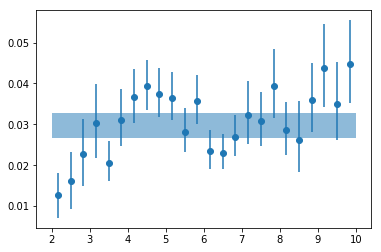


```python
# write results #
txt = ('\ndescriptor en_{0},+- rms_g_{0},+,-\n').format(lcdir)
txt += '\n'.join(['{} {} {} {} {}'.format(*z) for z in zip(en, ene, 
            psd_fit_g24[:,0,0], psd_fit_g24[:,0,2], psd_fit_g24[:,0,3] )])
# total
with open('psd_pars__%s.plot'%lcdir, 'w') as fp: fp.write(txt)
```

<br /> <br />

---

## Light curve simulations
Generate some light curves to test the code


```python
# read light curves #
os.chdir('%s/%s'%(base_dir, timing_dir))
lcdir, ebins, dt = '1b', '2 10', 128
Lc, en, ene = read_pn_lc(lc_obsids, dt, ebins, lcdir, '%s/%s'%(base_dir, data_dir), 
                         min_exp=0.1, interp=True)
nen, nobs = len(Lc), len(Lc[0])

fig = plt.figure(figsize=(12,8))
nsub = np.int(nobs**0.5)
text = ''
for i in range(nobs):
    ax = plt.subplot(nsub, nsub+1, i+1)
    lc0 = Lc[0][i].make_even()
    lc_sim = simulate_like(lc0.rate, dt, 6)
    
    lc = lc0.rebin(8, 'norm', 0.5)
    ltime = (lc.time - lc.time[0])/1e3
    text += '\ndescriptor sim_t_%d\n'%(i+1)
    text += '\n'.join(['%g'%x for x in ltime])
    
    plt.errorbar(ltime, lc.rate, lc.rerr, fmt='-', lw=2, alpha=0.5, color='k')
    for il,l in enumerate(lc_sim): 
        ls = az.LCurve(np.arange(lc_sim.shape[1]), l, lc0.rerr, fexp=lc0.fexp)
        ls = ls.rebin(8, 'norm', 0.5)
        plt.plot(ltime, ls.rate, lw=0.5)
        text += '\ndescriptor sim_r_%d_s%d\n'%(i+1, il+1)
        text += '\n'.join(['%g'%x for x in ls.rate])      
    ax.set_xlim([0,50])
plt.tight_layout()
with open('lc_sim.plot', 'w') as fp: fp.write(text)
```


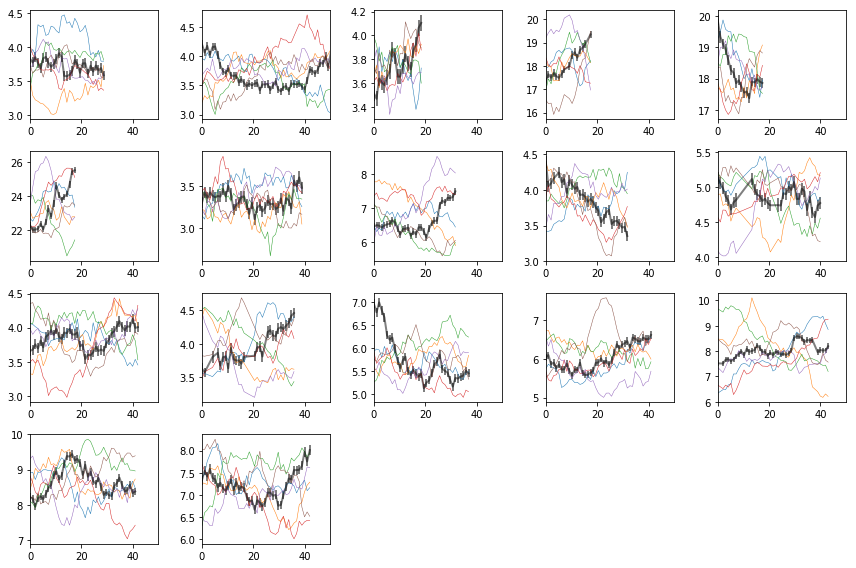


---
---

## Lags
### Lag from total and individual observations
####  8 bins


```python
os.chdir('%s/%s'%(base_dir, timing_dir))
os.system('mkdir -p lag')
os.chdir('lag')

lcdir, suff, ebins, dt = '8l', '8l_indiv', '2 2.4 3 3.7 4.5 5.5 6.7 8.2 10', 128
os.system('mkdir -p %s'%lcdir); os.chdir(lcdir)
indv = [[i] for i in range(len(lc_obsids))]
lcdata = read_pn_lc(lc_obsids, dt, ebins, lcdir, '%s/%s'%(base_dir, data_dir), 
                    min_exp=0.1, interp=False)
en, ene, lag, lagS, ilag, ilagS, extra = lag_en_pipeline(lcdata, fqbin=-1, indv=indv)
plot_ilag(en, lag, ilag, lagS, ilagS)
text = write_ilag(en, ene, lag, ilag, lagS, ilagS, suff)
text = extra[0] + '\n' + text
with open('lag_en_%s.plot'%suff, 'w') as fp: fp.write(text)
    
# read with np.load(..., allow_pickle=True)
dsave = {k:eval(k) for k in ['en', 'ene', 'lag', 'lagS', 'ilag', 'ilagS', 'extra']}
np.savez('lag_en_%s.npz'%suff, **dsave)
```

    prepare data ...
    calculate lag ...
    run simulations ...
    calculating null tests ...


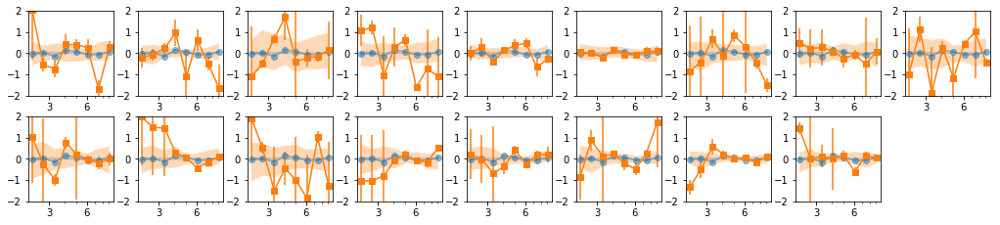


### Find ways of grouping the observations. Use Hardness-Intensity


```python
## Read spectra and get hardness/intensity plots to groups the observations ##
os.chdir('%s/%s/lag'%(base_dir, timing_dir))
from itertools import groupby
lines = open('../../xmm_spec/results/spec/fit_4c.plot').readlines()
grp = [list(v) for k,v in groupby(lines, lambda l: (len(l)==0 or l[0]=='d') )]
labels = [np.int(g[0].split()[1][:-3].split('__')[-1]) for g in grp if 'd1_4c' in g[0]]
grp = [np.array([x.split() for x in g if x!='\n'], np.double) 
          for g in grp if len(g)>4 and len(g[0].split())==4]
grp = [grp[i] for i in np.argsort(labels)]
sdata = [grp[i] for i,io in enumerate(spec_ids) if io in lc_ids]

esoft = [2.5, 3.5]
ehard = [5, 6]
eInt  = [8, 10]

esoft = [2, 3]
ehard = [8, 10]
hri = []
for d in sdata:
    isoft = (d[:,0] >= esoft[0]) & (d[:,0] <= esoft[1])
    ihard = (d[:,0] >= ehard[0]) & (d[:,0] <= ehard[1])
    iInt  = (d[:,0] >= eInt[0]) & (d[:,0] <= eInt[1])
    s, se = np.mean(d[isoft, 2]), np.sum(d[isoft, 3]**2)**0.5 / len(d[isoft,0])
    h, he = np.mean(d[ihard, 2]), np.sum(d[ihard, 3]**2)**0.5 / len(d[ihard,0])
    I, Ie = np.mean(d[iInt, 2]), np.sum(d[iInt, 3]**2)**0.5 / len(d[iInt,0])
    hr = (h-s)/(h+s)
    hre = np.abs(hr) * ((se/s)**2 + (he/h)**2)**0.5
    hri.append([I, Ie, hr, hre])
hri = np.array(hri).T
```


```python
fig = plt.figure(figsize=(8,6))
plt.scatter(hri[0], hri[2], alpha=0.2, s=800, edgecolors='b')
for i, oid in enumerate(lc_ids):
    plt.text(hri[0,i], hri[2,i], '%d'%(oid), ha='center', va='center', color='b')
plt.xlim([0, 0.0025])
```


    (0, 0.0025)


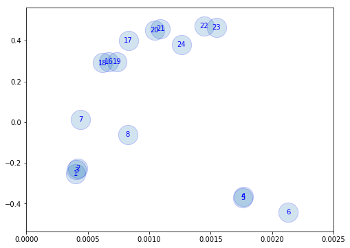


#### Use Kmeans to classify the observations into 5 groups


```python
from sklearn.cluster import KMeans
x_norm, y_norm = hri[[0,2]]
x_norm = np.log10(x_norm)
Nclusters = [2, 3, 4, 5, 6, 7, 8]
fig = plt.figure(figsize=(16,4))
Indv = []
for ic,nc in enumerate(Nclusters):
    clusters = KMeans(n_clusters=nc, random_state=0).fit(np.array([x_norm,y_norm]).T)
    indv = []
    ax = plt.subplot(1, len(Nclusters), ic+1)
    for ii in np.unique(clusters.labels_):
        jj = clusters.labels_==ii
        indv.append(list(np.arange(len(x_norm))[jj]))
        #plt.scatter(hri[0][jj], hri[2][jj], alpha=0.5, s=300)
        plt.scatter(x_norm[jj], y_norm[jj], alpha=0.5, s=300)
    indv = [indv[i] for i in np.argsort([np.mean(x) for x in indv])]
    Indv.append(indv)
plt.tight_layout()
for i in Indv: print(i)
```

    [[0, 1, 2, 3, 4, 5, 6, 7], [8, 9, 10, 11, 12, 13, 14, 15, 16]]
    [[0, 1, 2, 6, 7], [3, 4, 5], [8, 9, 10, 11, 12, 13, 14, 15, 16]]
    [[0, 1, 2, 6, 7], [3, 4, 5], [8, 9, 10, 11], [12, 13, 14, 15, 16]]
    [[0, 1, 2], [3, 4, 5], [6, 7], [8, 9, 10, 11], [12, 13, 14, 15, 16]]
    [[0, 1, 2], [3, 4, 5], [6], [7], [8, 9, 10, 11], [12, 13, 14, 15, 16]]
    [[0, 1, 2], [3, 4, 5], [6], [7], [8, 10, 11], [9, 12, 13], [14, 15, 16]]
    [[0, 1, 2], [3, 4, 5], [6], [7], [9], [8, 10, 11], [12, 13, 16], [14, 15]]


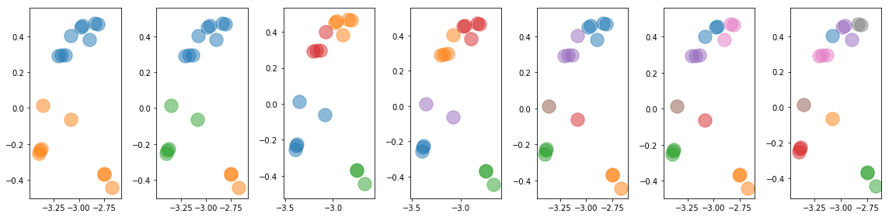


```python
text = 'descriptor iobs id I HR\n'
text += '\n'.join(['{} {} {} {}'.format(i, oid, 
                x_norm[i], y_norm[i]) for i,oid in enumerate(lc_ids)])

# groups #
for ic,indv in enumerate(Indv):
    for ii,jj in enumerate(indv):
        text += ('\ndescriptor iobs_c{1}_g{0} id_c{1}_g{0} I_c{1}_g{0} HR_c{1}_g{0}\n'
                ).format(ii+1, Nclusters[ic])
        text += '\n'.join(['{} {} {} {}'.format(i, lc_ids[i], x_norm[i], y_norm[i]) 
                           for i in jj])
with open('id_hri.plot', 'w') as fp: fp.write(text)
```


```python

```

---
---
### 8 bins: Different groupings


```python
os.chdir('%s/%s/lag'%(base_dir, timing_dir))
lcdir, suff, ebins, dt = '8l', '8l_c%d', '2 2.4 3 3.7 4.5 5.5 6.7 8.2 10', 128
os.system('mkdir -p %s'%lcdir); os.chdir(lcdir)
lcdata = read_pn_lc(lc_obsids, dt, ebins, lcdir, '%s/%s'%(base_dir, data_dir), 
                    min_exp=0.1, interp=False)

text_all = ''
for ic,indv in enumerate(Indv):
    print(indv)
    en, ene, lag, lagS, ilag, ilagS, extra = lag_en_pipeline(lcdata, fqbin=-1, indv=indv, nsim=100)
    plot_ilag(en, lag, ilag, lagS, ilagS)
    text = write_ilag(en, ene, lag, ilag, lagS, ilagS, suff%Nclusters[ic])
    text = extra[0] + '\n' + text
    text_all += '\n' + text
with open('lag_en_%s.plot'%((suff%0)[:-1]), 'w') as fp: fp.write(text_all)

# read with np.load(..., allow_pickle=True)
dsave = {k:eval(k) for k in ['en', 'ene', 'lag', 'lagS', 'ilag', 'ilagS', 'extra']}
np.savez('lag_en_%s.npz'%((suff%0)[:-1]), **dsave)
```

    [[0, 1, 2, 3, 4, 5, 6, 7], [8, 9, 10, 11, 12, 13, 14, 15, 16]]
    prepare data ...
    calculate lag ...
    run simulations ...
    calculating null tests ...
    [[0, 1, 2, 6, 7], [3, 4, 5], [8, 9, 10, 11, 12, 13, 14, 15, 16]]
    prepare data ...
    calculate lag ...
    run simulations ...
    calculating null tests ...
    [[0, 1, 2, 6, 7], [3, 4, 5], [8, 9, 10, 11], [12, 13, 14, 15, 16]]
    prepare data ...
    calculate lag ...
    run simulations ...
    calculating null tests ...
    [[0, 1, 2], [3, 4, 5], [6, 7], [8, 9, 10, 11], [12, 13, 14, 15, 16]]
    prepare data ...
    calculate lag ...
    run simulations ...
    calculating null tests ...
    [[0, 1, 2], [3, 4, 5], [6], [7], [8, 9, 10, 11], [12, 13, 14, 15, 16]]
    prepare data ...
    calculate lag ...
    run simulations ...
    calculating null tests ...
    [[0, 1, 2], [3, 4, 5], [6], [7], [8, 10, 11], [9, 12, 13], [14, 15, 16]]
    prepare data ...
    calculate lag ...
    run simulations ...
    calculating null tests ...
    [[0, 1, 2], [3, 4, 5], [6], [7], [9], [8, 10, 11], [12, 13, 16], [14, 15]]
    prepare data ...
    calculate lag ...
    run simulations ...
    calculating null tests ...


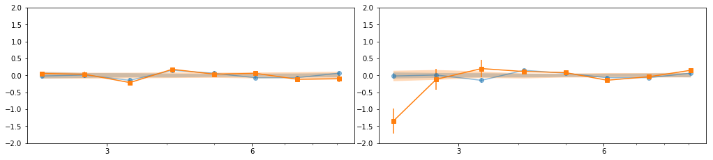


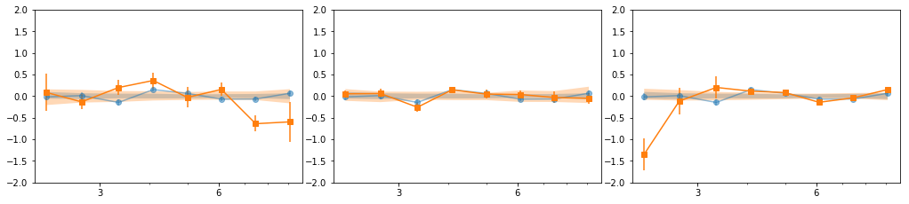


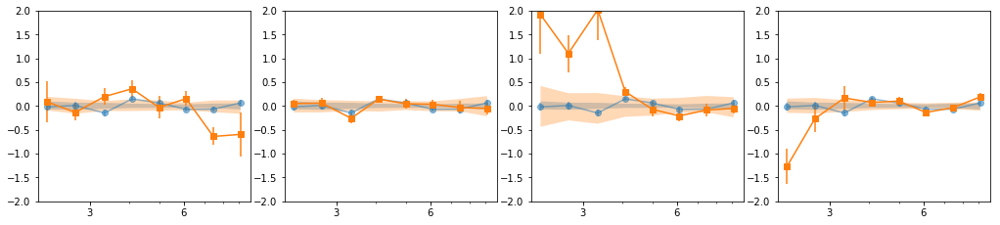


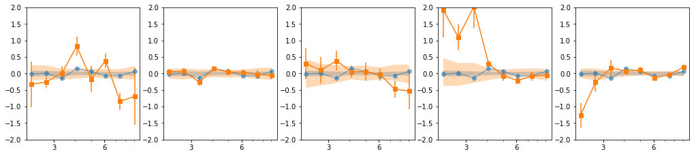


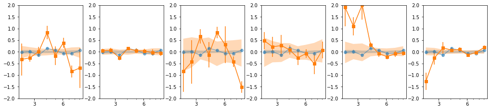


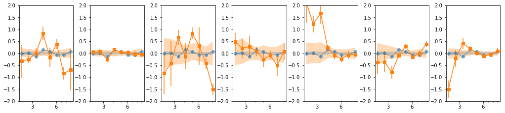


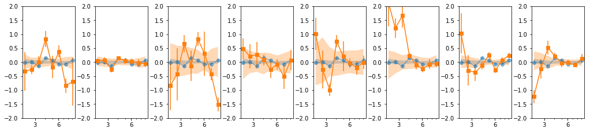


<br /> <br />

- Our base is the grouping with 7 groups: `[[0, 1, 2], [3, 4, 5], [6], [7], [8, 10, 11], [9, 12, 13], [14, 15, 16]]`
- g1 and g3 are similar so we merge them: `[0,1,2,6]`
- We then add groups for old and new data


```python
# custom groups #
#indv = [[0,1,2,6], [3,4,5], [7], [9,12,13], [8,10,11,14,15,16], 
#        [0,1,2,3,4,5,6,7], [8,9,10,11,12,13,14,15,16]]; gsuff = '5g'
indv = [[0, 1, 2, 6], [3, 4, 5], [7], [8, 10, 11], [9, 12, 13], [14, 15, 16],
       [0,1,2,3,4,5,6,7], [8,9,10,11,12,13,14,15,16]]; gsuff = '6g'
print(indv)
print([[lc_ids[j] for j in i] for i in indv])
```

    [[0, 1, 2, 6], [3, 4, 5], [7], [8, 10, 11], [9, 12, 13], [14, 15, 16], [0, 1, 2, 3, 4, 5, 6, 7], [8, 9, 10, 11, 12, 13, 14, 15, 16]]
    [[1, 2, 3, 7], [4, 5, 6], [8], [16, 18, 19], [17, 20, 21], [22, 23, 24], [1, 2, 3, 4, 5, 6, 7, 8], [16, 17, 18, 19, 20, 21, 22, 23, 24]]


---
### groups: 8 bins


```python
os.chdir('%s/%s/lag'%(base_dir, timing_dir))
lcdir, suff, ebins, dt = '8l', '8l_%s'%gsuff, '2 2.4 3 3.7 4.5 5.5 6.7 8.2 10', 128
os.system('mkdir -p %s'%lcdir); os.chdir(lcdir)
lcdata = read_pn_lc(lc_obsids, dt, ebins, lcdir, '%s/%s'%(base_dir, data_dir), 
                    min_exp=0.1, interp=False)
en, ene, lag, lagS, ilag, ilagS, extra = lag_en_pipeline(lcdata, fqbin=-1, indv=indv, nsim=100)
plot_ilag(en, lag, ilag, lagS, ilagS)
text = write_ilag(en, ene, lag, ilag, lagS, ilagS, suff)
text = extra[0] + '\n' + text
with open('lag_en_%s.plot'%suff, 'w') as fp: fp.write(text)

# read with np.load(..., allow_pickle=True)
dsave = {k:eval(k) for k in ['en', 'ene', 'lag', 'lagS', 'ilag', 'ilagS', 'extra']}
np.savez('lag_en_%s.npz'%suff, **dsave)
```

    prepare data ...
    calculate lag ...
    run simulations ...
    calculating null tests ...


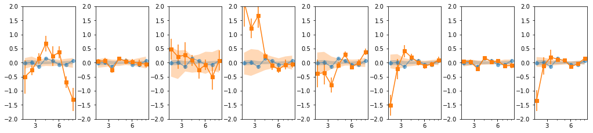


```python
coh = np.r_[[e['coh'][0] for e in extra[1]]]
coh_e = np.r_[[e['coh_e'][0] for e in extra[1]]]
plt.errorbar(en, coh, coh_e, fmt='o', xerr=ene)
plt.ylim([-0.2, 1.2])
```


    (-0.2, 1.2)


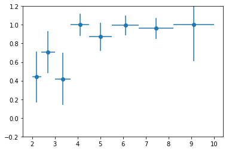


```python
nind = len(extra[2])
fig, ax = plt.subplots(1, nind, figsize=(14,3))
#plt.Figure(figsize=(12,4))
icoh = [np.r_[[e['coh'][0] for e in extra[2][i]]] for i in range(nind)]
icoh_e = [np.r_[[e['coh_e'][0] for e in extra[2][i]]] for i in range(nind)]
for i in range(len(icoh)):
    #ax = plt.subplot(1, nind, i+1)
    ax[i].errorbar(en, icoh[i], icoh_e[i], fmt='o', lw=0.5)
    ax[i].set_ylim([-.2, 1.2])
plt.tight_layout()
```


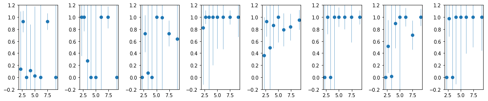


```python
text = '\ndescriptor en_coh,+- coh_tot,+-\n'
text += '\n'.join(['{} {} {} {}'.format(en[i], ene[i], coh[i], coh_e[i]) 
                   for i in range(len(en))])
text += '\ndescriptor %s\n'%(' '.join(['coh_%d_%s,+-'%(i+1, suff) for i in range(nind)]))
text += '\n'.join([' '.join(['{} {}'.format(icoh[i][ie], icoh_e[i][ie]) 
                             for i in range(nind)]) for ie in range(len(en))])
with open('coherence.plot', 'w') as fp: fp.write(text)
```

---
---
### 16 bins


```python
os.chdir('%s/%s/lag'%(base_dir, timing_dir))
lcdir, suff, ebins, dt = '16l', '16l_%s'%gsuff, ('2 2.2 2.4 2.7 3 3.3 3.7 4 4.5 4.9 5.5 6 6.7 '
                                           '7.4 8.2 9 10'), 128
os.system('mkdir -p %s'%lcdir); os.chdir(lcdir)
lcdata = read_pn_lc(lc_obsids, dt, ebins, lcdir, '%s/%s'%(base_dir, data_dir), 
                    min_exp=0.1, interp=False)
en, ene, lag, lagS, ilag, ilagS, extra = lag_en_pipeline(lcdata, fqbin=-1, indv=indv, nsim=100)
plot_ilag(en, lag, ilag, lagS, ilagS)
text = write_ilag(en, ene, lag, ilag, lagS, ilagS, suff)
text = extra[0] + '\n' + text
with open('lag_en_%s.plot'%suff, 'w') as fp: fp.write(text)

# read with np.load(..., allow_pickle=True)
dsave = {k:eval(k) for k in ['en', 'ene', 'lag', 'lagS', 'ilag', 'ilagS', 'extra']}
np.savez('lag_en_%s.npz'%suff, **dsave)
```

    prepare data ...
    calculate lag ...
    run simulations ...
    calculating null tests ...


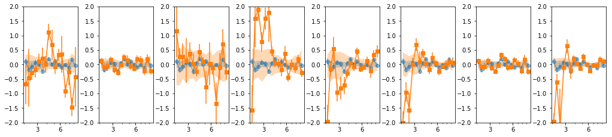


---
---
### 16 bins: overlap = 2


```python
os.chdir('%s/%s/lag'%(base_dir, timing_dir))
lcdir, suff, ebins, dt = '16l', '16lo2_%s'%gsuff, ('2 2.2 2.4 2.7 3 3.3 3.7 4 4.5 4.9 5.5 6 '
                                '6.7 7.4 8.2 9 10'), 128
os.system('mkdir -p %s'%lcdir); os.chdir(lcdir)
lcdata = read_pn_lc(lc_obsids, dt, ebins, lcdir, '%s/%s'%(base_dir, data_dir), 
                    min_exp=0.1, interp=False)
en, ene, lag, lagS, ilag, ilagS, extra = lag_en_pipeline(lcdata, fqbin=-1, indv=indv, 
                                                         overlap=2, nsim=100)
plot_ilag(en, lag, ilag, lagS, ilagS)
text = write_ilag(en, ene, lag, ilag, lagS, ilagS, suff)
text = extra[0] + '\n' + text
with open('lag_en_%s.plot'%suff, 'w') as fp: fp.write(text)

# read with np.load(..., allow_pickle=True)
dsave = {k:eval(k) for k in ['en', 'ene', 'lag', 'lagS', 'ilag', 'ilagS', 'extra']}
np.savez('lag_en_%s.npz'%suff, **dsave)
```

    prepare data ...
    calculate lag ...
    run simulations ...
    calculating null tests ...


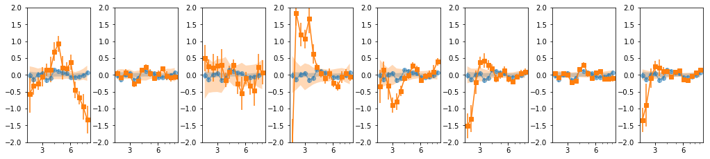


---
---
### 24 bins: overlap = 2


```python
os.chdir('%s/%s/lag'%(base_dir, timing_dir))
lcdir, suff, ebins, dt = '24l', '24lo2_%s'%gsuff, ('2 2.33 2.67 3 3.33 3.67 4 4.33 4.67 5 5.33 '
                    '5.67 6 6.33 6.67 7 7.33 7.67 8 8.33 8.67  9 9.33 9.67 10'), 128
os.system('mkdir -p %s'%lcdir); os.chdir(lcdir)
lcdata = read_pn_lc(lc_obsids, dt, ebins, lcdir, '%s/%s'%(base_dir, data_dir), 
                    min_exp=0.1, interp=False)
en, ene, lag, lagS, ilag, ilagS, extra = lag_en_pipeline(lcdata, fqbin=-1, indv=indv, 
                                                         overlap=2, nsim=100)
plot_ilag(en, lag, ilag, lagS, ilagS)
text = write_ilag(en, ene, lag, ilag, lagS, ilagS, suff)
text = extra[0] + '\n' + text
with open('lag_en_%s.plot'%suff, 'w') as fp: fp.write(text)

# read with np.load(..., allow_pickle=True)
dsave = {k:eval(k) for k in ['en', 'ene', 'lag', 'lagS', 'ilag', 'ilagS', 'extra']}
np.savez('lag_en_%s.npz'%suff, **dsave)
```

    prepare data ...
    calculate lag ...
    run simulations ...
    calculating null tests ...


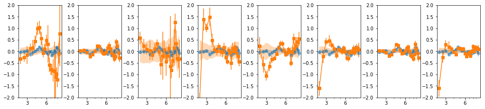


---
---
### 24 bins: overlap = 3


```python
os.chdir('%s/%s/lag'%(base_dir, timing_dir))
lcdir, suff, ebins, dt = '24l', '24lo3_%s'%gsuff, ('2 2.33 2.67 3 3.33 3.67 4 4.33 4.67 5 5.33 '
                    '5.67 6 6.33 6.67 7 7.33 7.67 8 8.33 8.67  9 9.33 9.67 10'), 128
os.system('mkdir -p %s'%lcdir); os.chdir(lcdir)
lcdata = read_pn_lc(lc_obsids, dt, ebins, lcdir, '%s/%s'%(base_dir, data_dir), 
                    min_exp=0.1, interp=False)
en, ene, lag, lagS, ilag, ilagS, extra = lag_en_pipeline(lcdata, fqbin=-1, indv=indv, 
                                                         overlap=3, nsim=100)
plot_ilag(en, lag, ilag, lagS, ilagS)
text = write_ilag(en, ene, lag, ilag, lagS, ilagS, suff)
text = extra[0] + '\n' + text
with open('lag_en_%s.plot'%suff, 'w') as fp: fp.write(text)

# read with np.load(..., allow_pickle=True)
dsave = {k:eval(k) for k in ['en', 'ene', 'lag', 'lagS', 'ilag', 'ilagS', 'extra']}
np.savez('lag_en_%s.npz'%suff, **dsave)
```

    prepare data ...
    calculate lag ...
    run simulations ...
    calculating null tests ...


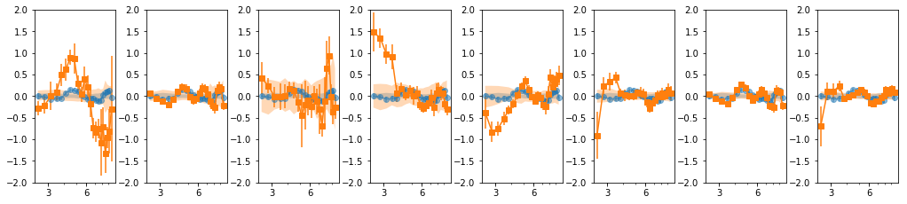


<br /> <br />

---
## Average spectrum per group
put the spectra into a common energy grid


```python
## Read spectra and get hardness/intensity plots to groups the observations ##
os.chdir('%s/%s/lag'%(base_dir, timing_dir))
avg_iref = -1
avg_bin = True
# lcids: [1, 2, 3, 4, 5, 6, 7, 8, 16, 17, 18, 19, 20, 21, 22, 23, 24]
# indv_lc: indv = [[0, 1, 2, 6], [3, 4, 5],  [7], [8, 10, 11], [9, 12, 13], [14, 15, 16],
#       [0,1,2,3,4,5,6,7], [8,9,10,11,12,13,14,15,16]]
indv_spec = [[0, 1, 2, 6], [3, 4, 5],  [7], [13, 15, 16], [14, 17, 18], [19, 20, 21],
       [0,1,2,3,4,5,6,7], [13,14,15,16,17,18,19,20,21], 
             [0,1,2,3,4,5,6,7,13,14,15,16,17,18,19,20,21]]

lines = open('../../xmm_spec/results/spec/fit_4c.plot').readlines()

# read and group the spectral data #
grp = [list(v) for k,v in groupby(lines, lambda l: (len(l)==0 or l[0]=='d') )]
grp = [np.array([x.split() for x in g if x!='\n'], np.double) for g in grp if len(g)>4]

dat = grp[::4][:-1]
mod = grp[1::4][:-1]
modc = [np.vstack((g[:,:4].T, g[:,g.mean(0)>0][:,4:].sum(1))).T for g in grp[3::4]]
mod_spec = [] # model in right array shape to use when calling spec_common_grid
modc_spec = []
for im in range(len(dat)):
    m,d,mc = mod[im], dat[im], modc[im]
    mod_spec.append(np.array(d))
    mod_spec[-1][:,3] = 0
    mod_spec[-1][:,2] = m[:,0]
    mc_spec = [] # similar to mod_spec above 
    for ic in range(5):
        mc_spec.append(np.array(d))
        mc_spec[-1][:,3] = 0
        mc_spec[-1][:,2] = mc[:,ic]
    modc_spec.append(mc_spec)
        

# choose  some reference grid #
iref = avg_iref
if iref == -1:
        ilen = [i for i,d in enumerate(dat) if len(d)%2==0]
        iref = ilen[0]
egrid_ref = np.array([dat[iref][:,0]-dat[iref][:,1], dat[iref][:,0]+dat[iref][:,1]]).T
if avg_bin:
    egrid_ref = np.array([egrid_ref[::2,0], egrid_ref[1::2,1]]).T
    en = ('2 2.1 2.21 2.33 2.45 2.57 2.7 2.84 2.99 3.14 3.31 3.48 '
        '3.66 3.85 4.04 4.25 4.47 4.7 4.95 5.2 5.47 5.75 6.05 6.36 6.69 7.03 7.4 7.78 '
        '8.18 8.6 9.04 9.51 10')
    en = np.array(en.split(), np.double)
    egrid_ref = np.array([en[:-1], en[1:]]).T

# map of spectra and models to the same reference grid #
en_new, spec_new = spec_common_grid(dat, egrid_ref)
_, mod_new = spec_common_grid(mod_spec, egrid_ref)
modc_new = np.array([spec_common_grid(mc, egrid_ref)[1] for mc in np.array(modc_spec).T])
en_new.shape, spec_new.shape, mod_new.shape, modc_new.shape
```


    ((2, 32), (22, 2, 32), (22, 2, 32), (5, 22, 2, 32))


Calculate average spectra per group


```python
# energy #
text = '\ndescriptor en,+-\n'
text += '\n'.join(['{:.5} {:.5}'.format(*z) for z in en_new.T])

# spec_indv #
for ig,ii in enumerate(indv_spec):
    d = np.array([ np.mean(spec_new[ii,0], 0), 
                  (np.sum(spec_new[ii,1]**2, 0)**0.5)/len(ii)])
    m = np.mean(mod_new[ii,0], 0)
    mc = np.mean(modc_new[:,ii,0], 1)
                       
    text += '\ndescriptor d_g{0},+- m_g{0} rat_g{0},+-\n'.format(ig+1)
    text += '\n'.join(['{:.5} {:.5} {:.5} {:.5} {:.5}'.format(
                d[0,i], d[1,i], m[i], d[0,i]/m[i], d[1,i]/m[i]) for i in range(len(m))])
    text += '\ndescriptor ' + (' '.join(['mc%d_g%d'%(ic+1, ig+1) for ic in range(5)])) + '\n'
    text += '\n'.join([' '.join(['{:.5}'.format(mc[ic, i]) 
                        for ic in range(5)]) for i in range(len(m))])

    # do the component ratios #
    text += '\ndescriptor cr_1_2_g{0} cr_3_2_g{0} cr_13_2_g{0} cr_1_23_g{0}\n'.format(ig+1)
    text += '\n'.join(['{:.5} {:.5} {:.5} {:.5}'.format(mc[0, i]/mc[1, i], mc[2, i]/mc[1, i],
                        (mc[2, i]+mc[0, i])/mc[1, i], (mc[0, i])/(mc[[1,2,3,4],i].sum(0))) 
                       for i in range(len(m))])
with open('plots/spec_groups.plot', 'w') as fp: fp.write(text)
```


```python

```
